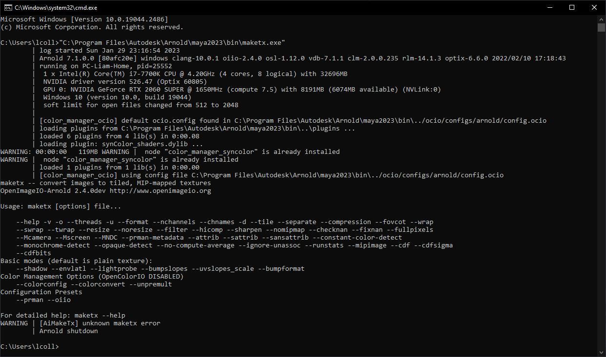

css workbench page
##################

:description: test rst>html + css by providing all possible use-cases.

.. container:: nav-button

    `\< previous page <index.html>`_ `next page \> <index.html>`_

.. contents:: Table Of Contents

According to all known laws of aviation, there is no way a bee should be able to fly.
Its wings are too small to get its fat little body off the ground.
The ``bee``, of course, flies anyway because `bees` don't care what humans think is impossible.
Yellow, black. Yellow, black. Yellow, black. Yellow, black.
*Ooh, black and yellow!*
**Let's shake it up a little.**
``Barry``! Breakfast is **ready**!

-- From https://gist.github.com/MattIPv4/045239bc27b16b2bcf7a3a9a4648c08a

    ":abbr:`LGTM <looks good to me>`" he said, but if only he knew ...

Testing line blocks:

| Each new line begins with a
| vertical bar ("|").
|     Line breaks and initial indents
|     are preserved.
| Continuation lines are wrapped

time to test heading (this h2)
==============================

let's get into it

this should be h3
-----------------

another one bite the dust

and this is h4
______________

keep on digging

do we even have h5 ??
*********************

wow so much nesting

lists
=====

Bullet lists:

- This is item 1
- This is item 2

- Bullets are "-", "*" or "+".
  Continuing text must be aligned
  after the bullet and whitespace.

Enumerated lists:

3. This is the first item
4. This is the second item
5. Enumerators are arabic numbers,
   single letters, or roman numerals
6. List items should be sequentially
   numbered, but need not start at 1
   (although not all formatters will
   honour the first index).
#. This item is auto-enumerated

Definition lists:

what
  Definition lists associate a term with
  a definition.

how
  The term is a one-line phrase, and the
  definition is one or more paragraphs or
  body elements, indented relative to the
  term. Blank lines are not allowed
  between term and definition

links
=====

Regular link: https://github.com/MrLixm/MrLixm.github.io

This is an `interesting website <https://specificsuggestions.com>`_ !

----

Footnote references, like [5]_.
Note that footnotes may get
rearranged, e.g., to the bottom of
the "page".

.. [5] A numerical footnote. Note
   there's no colon after the ``]``.

----

Autonumbered footnotes are
possible, like using [#]_ and [#]_.

.. [#] This is the first one.
.. [#] This is the second one.

They may be assigned 'autonumber
labels' - for instance,
[#fourth]_ and [#third]_.

.. [#third] a.k.a. third_

.. [#fourth] a.k.a. fourth_

Auto-symbol footnotes are also
possible, like this: [*]_ and [*]_.

.. [*] This is the first one.
.. [*] This is the second one.

----

Citation references, like [CIT2002]_.
Note that citations may get
rearranged, e.g., to the bottom of
the "page".

.. [CIT2002] A citation
   (as often used in journals).

----

External hyperlinks, like Python_.

.. _Python: https://www.python.org/

tables
======

A simple table:

=====  =====  ======
   Inputs     Output
------------  ------
  A      B    A or B
=====  =====  ======
False  False  False
True   False  True
False  True   True
True   True   True
=====  =====  ======

A large table:

=================  ===========
name               description
=================  ===========
``authors``        Comma separated list of person who authored the page. See https://developer.mozilla.org/en-US/docs/Web/HTML/Element/meta/name
``keywords``       List of tags matching the page topics
``language``       Language of the page. As standardized by https://developer.mozilla.org/en-US/docs/Web/HTML/Global_attributes/lang and https://www.w3.org/International/articles/language-tags/
``title``          Additional override if the rst file title is not desired. See https://ogp.me/#metadata
``type``           Caracterize the kind of content of the page. As standardized by https://ogp.me/#types
``image``          Relative file path to the image to use as cover for the page. See https://ogp.me/#metadata
``description``    Short, human-readable summary of the page content. See https://ogp.me/#optional
=================  ===========

A grid table:

+------------+------------+-----------+
| Header 1   | Header 2   | Header 3  |
+============+============+===========+
| body row 1 | column 2   | column 3  |
+------------+------------+-----------+
| body row 2 | Cells may span columns.|
+------------+------------+-----------+
| body row 3 | Cells may  | - Cells   |
+------------+ span rows. | - contain |
| body row 4 |            | - blocks. |
+------------+------------+-----------+

code blocks
===========

And now some code:

.. code:: python

    from pathlib import Path
    import OpenImageIO as oiio

    def read_image(path: Path) -> oiio.ImageBuf:
        """
        Read given image from disk as oiio buffer.
        """
        return oiio.ImageBuf(str(path))

    def write_image(
        image: oiio.ImageBuf,
        dst_path: Path,
        compression: str,
        bitdepth: oiio.TypeDesc,
    ):
        if ":" in compression:
            compression, quality = compression.split(":")
            image.specmod().attribute("quality", int(quality))
        image.specmod().attribute("compression", compression)
        image.write(str(dst_path), bitdepth)
        if image.has_error:
            raise IOError(f"Cannot write image to disk: {image.geterror()}")

Or as literal block::

     def read_image(path: Path) -> oiio.ImageBuf:
        """
        Read given image from disk as oiio buffer.
        """
        return oiio.ImageBuf(str(path))

With lines :

.. code-block:: python
    :linenos: table

     def read_image(path: Path) -> oiio.ImageBuf:
        """
        Read given image from disk as oiio buffer.
        """
        return oiio.ImageBuf(str(path))

Overflowing :

.. code-block:: python
    :linenos: table

     def read_image(path: Path) -> oiio.ImageBuf:
        """
        This is hopefully a long enougg line of text so we can test how a code-block will render with a noticeable overflow.
        """
        return oiio.ImageBuf(str(path))

As a doctest:

>>> print("hello world")
Hello world !!! wait, it's not what I asked ?
>>> assert "🐸" + "🧪" == "🏳️‍🌈"

With ``include`` directive:

.. include:: snippet.py
    :code: python

.. include:: snippet.py
    :literal:

directives
==========

.. danger::

   *"Doom Slayer"* would like to know your position. Authorize ?

.. error::

    I tried so hard and got so far, but in the end it doesn't even matter.

.. important::

    ACAB (all cats are beautiful 🐈)

.. attention::

    A computer cannot think so a computer cannot be held accountable.

.. warning::

    You are out of toilet paper.

.. caution::

    Are you sure you want to add x153 "Animal Crossing™ froggy chair" to your cart ?

.. note::

    Maybe I shouldn't had eat that much cheese 😫

.. hint::

    Have you tried turning it on and off again ?

.. tip::

    One matcha-oreo bubble tea is better than a matcha bubble tea.

.. admonition:: And by the way ...

    Have you heard about our lord and savior `Guang Dang <https://www.instagram.com/guangdang005/?hl=en>`_ ?

With custom class:

.. admonition:: 🍕 About pizza
    :class: note

    Pineapple do belongs on them.

More complex:

.. admonition:: ✅ TODO list
    :class: tip

    Don't forget to:

    - **Drink** water
    - **Pat** the cat
    - **Resist** the intrusive thoughts
    - **Take a break** from the human soul curshing machine that is *capitalism*.

    Remember, **you** matter.

custom highlight directive:

.. highlight::
    :class: note

    Will that works without a title ?

.. highlight::
    :class: note

    .. image:: ../.static/images/profile-picture.jpg
        :alt: profile picture
        :target: ../.static/images/profile-picture.jpg
        :width: 64px
        :align: left

    Duh of course it does

images
======

128px width image with target and alt

.. image:: ../.static/images/profile-picture.jpg
    :alt: profile picture
    :target: ../.static/images/profile-picture.jpg
    :width: 128px

Wit no alt and no target:

.. image:: ../.static/images/profile-picture.jpg
    :width: 128px

Now testing align:

.. image:: ../.static/images/profile-picture.jpg
    :width: 128px
    :align: left

.. image:: ../.static/images/profile-picture.jpg
    :width: 128px
    :align: center

.. image:: ../.static/images/profile-picture.jpg
    :width: 128px
    :align: right

.. figure:: ../.static/images/profile-picture.jpg
    :alt: profile picture
    :target: ../.static/images/profile-picture.jpg
    :width: 128px

    Figure with no align set. Some more palceholder text.

.. figure:: ../.static/images/profile-picture.jpg
    :alt: profile picture
    :target: ../.static/images/profile-picture.jpg
    :width: 128px
    :align: center

    Figure with align=center.  Some more palceholder text.

.. figure:: ../.static/images/profile-picture.jpg
    :alt: profile picture
    :target: ../.static/images/profile-picture.jpg
    :width: 128px
    :align: right

    Figure with align=right. Some more palceholder text.

Using scale option:

Using width option:

.. figure:: ../.static/images/cover-social.jpg
    :alt: profile picture
    :target: ../.static/images/cover-social.jpg
    :width: 512px
    :align: center

    Testing *nesting* other content in ``figure captions``:

    - list item 1
    - list item 2
    - list item 3

    .. figure:: ../.static/images/profile-picture.jpg
        :alt: profile picture
        :target: ../.static/images/profile-picture.jpg
        :width: 64px
        :align: left

        figure-ception !

Testing ``.. image-grid::``

.. image-grid::

    ../.static/images/cover-social.jpg
    ../.static/images/profile-picture.jpg

    ../.static/images/profile-picture.jpg some caption that will be displayed under
    ../.static/images/cover-social.jpg the caption can span
        multiple lines if it's too long.
    ../.static/images/profile-picture.jpg

Testing ``.. image-gallery::``

.. image-gallery::
    :left: image1
    :right: label1, image2, label2
    :left-width: 35
    :right-width: 65

    .. image-frame:: image1 label1 ../.static/images/profile-picture.jpg
        :metadata:
            date: 2024-11 early morning
            location: France - Lyon - Parc de la Tete d’Or
            film: 35mm Kodak Gold 200
            lens: Minolta MD 35mm

        some of the text descrption of the image
        that can span multiple lines

    .. image-frame:: image2 label2 ../.static/images/cover-social.jpg
       :metadata:
            date: 2024-11 early morning
            location: France - Lyon - Parc de la Tete d’Or
            film: 35mm Kodak Gold 200
            lens: Minolta MD 35mm

       some of the text descrption of the image
       that can span multiple lines

misceleanous
============

The url-preview directive:

.. url-preview:: https://saulala.discourse.group/
    :title: Saulala | Photography application
    :image: https://www.saulala.com/background.jpg

    Develop your RAW photos with Saulala

.. url-preview:: https://mrlixm.github.io/
    :title: Hey that's me !
    :image: ../.static/images/cover-social.jpg

.. url-preview:: https://mrlixm.github.io/
    :title: Test without an image

.. url-preview:: https://mastodon.gamedev.place/@liamcollod
    :title: Maston - Liam Collod
    :svg: ../.static/icons/mastodon.svg
    :color: var(--color-WW)
    :svg-size: 32

    We test a path to a local svg file.

----

.. topic:: Topic Title

    Subsequent indented lines comprise
    the body of the topic, and are
    interpreted as body elements.

----

Testing transitions with different characters:

::

    ----

----

::

    ~~~~

~~~~

::

    ++++

++++

.. contents:: Table Of Contents

🦎🦎🦎🦎🦎🦎
