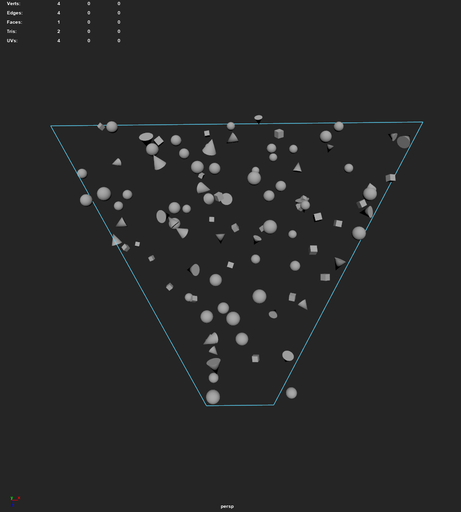
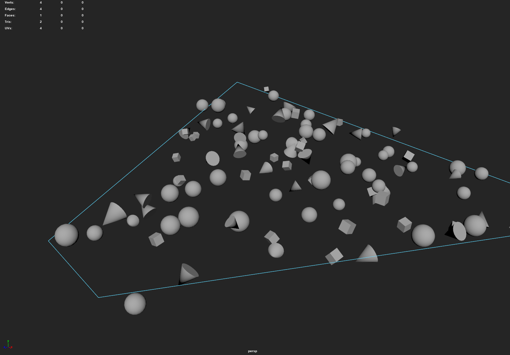
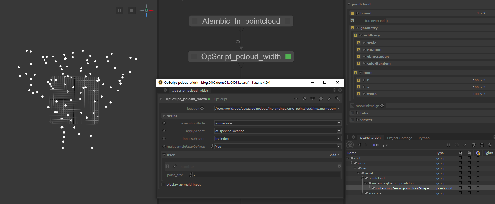
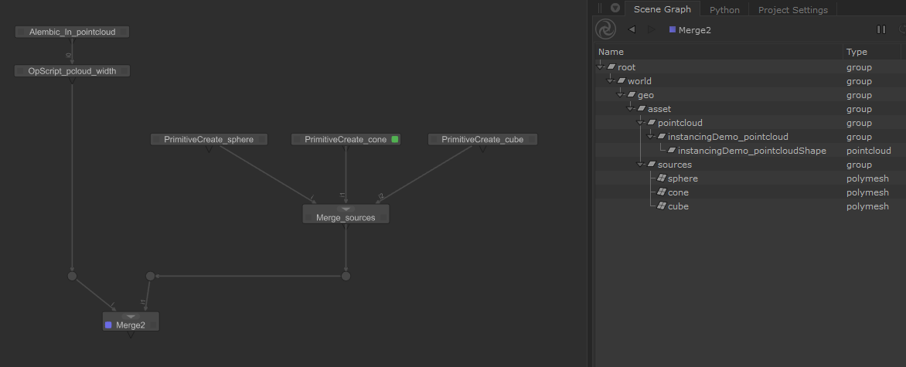
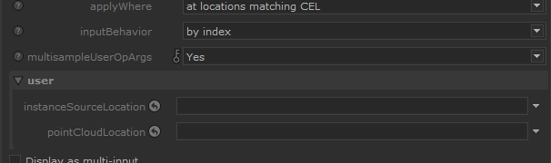
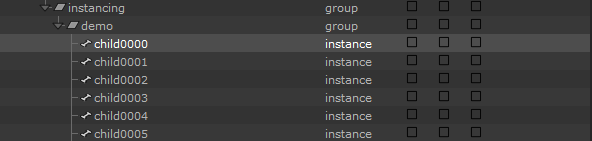
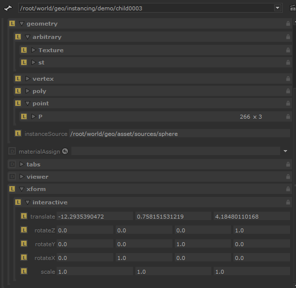
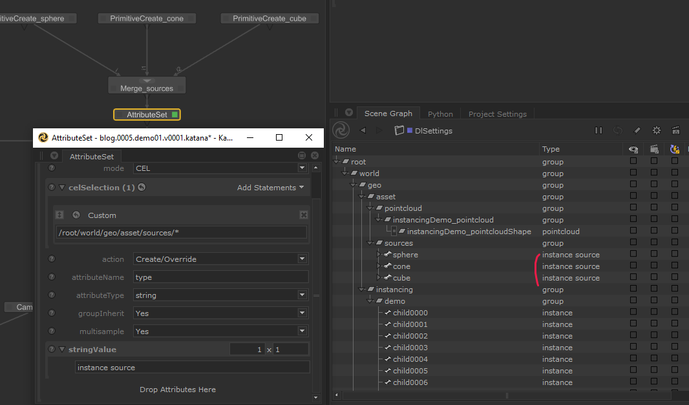
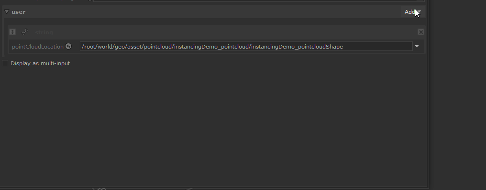
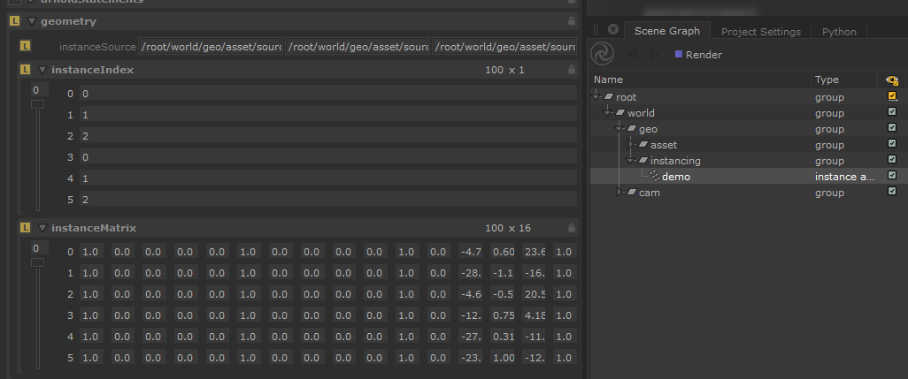

# Instancing in Katana

:description: How OpScript can be used to create a flexible solution for
    instancing.
:image: cover.jpg
:image-alt: A decorative image with the post title.
:date-created: 2022-03-30T20:58
:date-modified: 2025-04-13T15:00
:category: tutorial
:tags: katana, instancing, lua, software
:authors: Liam Collod
:stylesheets: +katana_instancing.css

Katana, as usual, doesn't offer a "ready to go" solution for instancing.
This initial complexity can be overcome by the fact that we can create an
instancing solution that exactly suits our needs. And that is what we
are going to address in this post.
Additionally, I will explain how I tried to create a flexible solution for
instancing called `KUI` so you don't have to !

[TOC]

!!! warning "Disclaimer"
    My explanations reflect the experience I had with this subject and may
    not be accurate in other production contexts. Be sure to contact me
    if you spot big mistakes /  things to improve.

!!! note "Target Audience"
    This post is targeted towards beginners with Katana itself.

    If you are a more advanced user you can check [Katana Uber Instancing](#katana-uber-instancing).

!!! caution "2025 Note"
    USD, which is not mentioned on this page, is also a solution to build
    instancing in Katana and might be worth looking at.

## Intro

As Katana's motto states : *It’s all just a bunch of Attributes.* And it
applies to instances too. They are just a bunch of locations with a defined
list of attributes understood by your render-engine.
You can as such create an instance with a simple
`LocationCreate + AttributeSet` setup *(if you have time to lose)*. But we
will be using OpScripts to do so.

Here is a quick diagram that could resume how an instance is built :


The basic principle is that an `instance` links at least to one
`instance source` (a scene-graph location).
The instance will create a "copy" of this instance source. You can then set
transformations override that will allow the instance to have a different
position, rotation, etc, than the source.
Additional attributes can also be set and used for shading to make the
instance even more different than the source.


## Instancing Methods

Instancing comes in different flavors, that, similarly to all things, have
specific ups and downs. Your render-engine may also supply alternative ways to
produce instances so be sure to check its documentation on the topic.

Here is what the Katana documentation say about this:

.. url-preview:: https://support.foundry.com/hc/en-us/articles/360006999219
    :title: Q100518: Instancing Overview
    :image: https://www.foundry.com/sites/default/files/2021-12/Katana%205.0%20Webpage%20Header%20-%201920x500.jpg


### Leaf-level

*(Never used this one)*

[The Katana documentation](https://support.foundry.com/hc/en-us/articles/360006999259)
is pretty explicit.

<div class="split-50-50" markdown="1">
!!! danger "cons"
    Major drawback is that you can't have a location with children
    locations (to verify),
    and well it seems every render-engine has a way to decide which
    location is the first one to instance 🙂.

!!! tip "pros"
    You just have to set a single attribute.

    You can easily apply modification on a single instance.
    *(ex: a Transform3D)*
</div>

*Would love to know in what case this one can be more pertinent than the other methods.*

### Hierarchical

Each instance = one scene-graph location.

<div class="split-50-50" markdown="1">
!!! danger "cons"
    Too many instances (>~250 000) will lead you to performances
    issues. (pre-render)

!!! tip "pros"
    You can easily apply modification on a single instance.
    *(ex: a Transform3D)*
</div>

### Array

One single scene-graph location where each instance correspond to an index
on each attribute.

<div class="split-50-50" markdown="1">
!!! danger "cons"
    Complicated to get per-instance override.

!!! tip "pros"
    Better performances.
</div>

----

And there is probably some additional pro/cons inherent to your render-engine
so again, check the documentation, and test stuff.
(For example, when I started to explore instancing, Redshift was not supporting
locations with children when using the `array` method (not the case
anymore).)

## Instancing in Practice

To start, there is a nice small example on the 
[official Katana documentation](https://learn.foundry.com/katana/Content/ug/instancing/rendering_instances.html)
. It explains how to create instances using mostly Katana nodes and one small
OpScript to avoid stacking numerous `AttributeSet` nodes.
This approach is pretty basic: we manually set how many instances we want to
create and we need to manually move them. The setup also
takes time to build and is not very scalable.

A more widely used solution depends on `point-clouds`: a type of location
composed of visual abstract "points" in the 3d space that can hold an
arbitrary number of attributes based on the point index.

You use each individual point's attribute to create an instance. For example,
each point can specify what kind of instance source it is representing, ...
Furthermore, its "abstract" aspect makes it very convenient for transferring
data between DCCs.

A convenient way to create scene graph locations based on a source object like
a point-cloud, is to use the [OpScript](https://learn.foundry.com/katana/Content/ug/working_with_attributes/opscript_nodes.html)
feature. It is an entry door to use scripting while
staying in the Katana nodegraph system. Usage of OpScript require to learn
the [lua language](https://en.wikipedia.org/wiki/Lua_(programming_language)).
But don't worry, if you don't want to get your hands dirty you will be able
to use a premade script/node shared in the [Katana Uber Instancing](#katana-uber-instancing)
section.

To create scene graph locations we need to know how they must be structured.
For this what's better than having a look at the documentation :
[AttributesConventions/Instancing](https://learn.foundry.com/katana/4.5/dev-guide/AttributeConventions/Instancing.html). 
You notice that we find the 3 instancing methods described again.

Let's now start building the scene.

### Scene-Preparation

For you to follow the tutorial, I will be providing you a few assets. Actually
only a point-cloud, as to keep it simple, instances sources will be
primitives.

.. url-preview:: https://mega.nz/folder/uooQzJJR#5aguo_c3gLXPrkEnN62ZBg
    :title: Sources Files Download
    :svg: ../../.static/icons/mega.svg
    :svg-size: 64

    15KB folder on mega.nz

You can also download the [pointcloud used in KUI](https://github.com/MrLixm/KUI/tree/main/dev/data/alembics) 
for testing.

This point-cloud has been generated from Mash (see [mash2pointcloud](https://github.com/MrLixm/Autodesk_Maya/tree/main/src/mash2pointcloud))
and contains the most commonly used attributes.

Here is what it looked like in Maya :

<div class="split-50-50">
    
    
</div>

And here is the instances-sources mapping list :

```
0: cube
1: cone
2: sphere
```

Here it is imported in Katana :



I also used a small OpScript that allow me to set the viewer size of the
points. You can [grab the OpScript here](https://github.com/MrLixm/opscripting/tree/main/opscriptlibrary/point_width).

In the `Attributes` tab we can see what are the attributes stored on the
point-cloud. This one has :

- `arbitrary`
    - `scale` : XYZ per-point scale attribute.
    - `rotation`: XYZ per-point rotation attribute
    - `objectIndex`: per-point index to use for instance-source
    - `colorRandom`: per-point random color

- `point`
    - `P` : XYZ per-point transform
    - `v` : per-point velocity
    - `width` : added via the OpScript for viewer size.

All the attributes in the `arbitrary` section don't have a naming
convention. You must know which name corresponds to which type of data for when
you are creating the OpScript that produce the instances.

!!! note "PointCloud Instancing without OpScript"
    Depending on your render-engine , it might actually support directly
    rendering the point-cloud and generating the instances on the fly !
    Like Arnold does [as explained here](https://docs.arnoldrenderer.com/display/A5KTN/pointcloud+and+instance+array). 
    But it excepts specific attributes in the `point` group.

For the instance-sources we will be using simple primitives as detailed above.
You can use `PrimitiveCreate` node to create them. My final "initial"
nodegraph is looking like this :



Now it's time to have a look at OpScripting.

### OpScript-Preparation

We are going to manipulate a lot of inputs and data and at some point, we
will need to see what X variable is equal to, what is the result of X
operation, etc to just be able to know where we need to go scripting-wise. Usually, 
this is done by using the `print()` function. But this is very basic and can lead to
various limitations.

To have a more robust way of debugging OpScripts I made myself a small
logging module in lua. Kind of similar to what Python logging module does.
It adds a bunch of line to your script but will allow more flexibility in the
way data will be displayed to you.

Have a look at this repository to install the llloger module :

.. url-preview:: https://github.com/MrLixm/llloger
    :title: llloger.lua
    :image: https://raw.githubusercontent.com/MrLixm/llloger/main/doc/img/thumbnail.jpg

    A simple lua logging module based on Python one.

All instructions are specified in the [documentation](https://github.com/MrLixm/llloger/blob/main/doc/INDEX.md)
so I have not much to explain here.

We will then be able to use the logger methods to output messages to the
console. *(This just wrap the `print()` function which in Katana, output the
result in the console that should be opened alongside your Katana)*

```lua
logger:debug("any object")
logger:info("any object")
logger:warning("any object")
logger:error("any object")
```

All these steps **are not mandatory** for this tutorial. They just help for
faster debugging. *(And pertinent if you want to write lua code by yourself.)*
Though, the `llloger` module is required for `KUI` to work, so if you plan
to use it, you will need to install it anyways.

----

And by the way, if this is your first time with OpScript, the documentation
can be a bit confusing at first. It is split into multiple "modules" with
different language bindings. The one we use the most often is the
CookInterface :

.. url-preview:: https://learn.foundry.com/katana/4.5/dev-guide/OpsAndOpScript/CookInterface/OpScript.html
    :title: Cook Interface (OpScript).
    :svg: ../../.static/icons/katana.svg
    :svg-size: 60


### Basic Instancing : Hierarchical

For a first try, we will be using the OpScript provided on the Foundry's
documentation. It's the most basic you can do which will be perfect for an
introduction. It's the one for the hierarchical method.

Create an OpScript node and paste the bottom script inside the `script.lua`
parameter

.. include:: opscript.hierarchical.foundry.lua
    :code: lua {linenums="1"}

If you look at the first lines you can see that we are getting some
`OpArg` values. On OpScript nodes this corresponds to `user` parameters.
This means we will need to create two of them.



You should have noticed the first script's limitation, we can only give one
instance-source for now. But let's keep that for later. Set the 2 created user
parameters values with their corresponding locations. *(! the pointcloud is the
location of type `pointcloud`, not its parent "group".)*

We need to provide one last input, the target destination for our instances. For this, 
change the `applyWhere` parameter to `atSpecificLocation` and then in the `location` 
param at the top, submit the desired target location for your instances.
I will be using `/root/world/geo/instancing/demo`.

Now let's view the OpScript node, and expand the target location in the
SceneGraph to see our instances.



!!! info "Instances preview in the Viewer"
    Since **Katana 4.5**, it is now possible to view instances in the Viewer.
    Have a look at the [Instances preview in the Viewer](#instances-preview-in-the-viewer)
    section.

Yay, that was quick to have something working. But check the Attributes on one
of the instance.



If you have a look at the `xform.interactive` attributes, we can see that
only the `translate` attribute has non-default values. This is because our
current OpScript only read the `P` attribute on the point-cloud which
correspond to the instance translations.

You can notice that all the `geometry` attributes from the instance-source
have also been copied. This is because the script copies all the root
attributes of the instance-source :

.. include:: opscript.hierarchical.foundry.lua
    :code: lua {linenums="25"}
    :lines: 25

This would allow having the bounds attribute on the instance, so we have at
least some primitive representation in the viewer. But the `geometry`
attributes are not needed because they are copied from the instance-source
at render-time. To fix this, the instance-source location would need to be a
group with the mesh inside.

Now, what we should not forget, is cleaning the scene for rendering. This
means :

1. Hide the pointcloud (cause you render-engine will probably render the
   points as spheres).
   You can use a `VisibilityAssign` node for this.

2. Hide the instances-sources.
   This can be graciously done by setting the type of the instance-source
   location to `instance source`.
   You can use an `AttributeSet` node for this.

!!! tip ""
    Setting a location type to `instance source` will make it invisible in
    the viewer, in the render and allow to preview the instances in the viewer
    (with Katana >= 4.5).



Annnnd, we can try to fire up a render to see our instancing result.
Nothing very exciting, using primitives doesn't look very impressive. You
can have a try with any asset, just instance it's top-most location. Here is
the result with a "heavy" asset :

<figure class="align-center">
    
    <figcaption>100 x 3.2 mi vertices house asset, 1920x1080, 3Delight</figcaption>
</figure>

And if you need it, here is the Katana file :

.. url-preview:: demo.hierarchical.basic.katana
    :title: Download sources files.
    :svg: ../../.static/icons/katana.svg
    :svg-size: 60


### Basic Instancing : Array

Before trying to go further with hierarchical we are going to have a look at
the `array` method. Keep the same scene, we will only need to change the
OpScript.

And here it is. It's a slightly modified version from the one on
Foundry's website. (better readability + bugs fixed)

.. include:: opscript.array.foundry.lua
    :code: lua {linenums="1"}

You still need to create 2 `user` parameters on the OpScript node, but
this time `user.instancesSourceLocations` must be a string array of scene
graph-locations.



And of course the same `user.pointCloudLocation` one. The `location`
parameter still define where the instance is created but this time it's not
the group holding the instances, but directly the full location of the instance
(array instance is only one scene-graph location).

Make sure the OpScript is running and then check the attribute on the
`instance array` location created.



This time we can use our different instance-sources thanks to the
`InstanceIndex` attribute that specify which instance-source to use per
point. But if we look more closely at the OpScript lua script, we notice the
index are generated mathematically instead of using our point-cloud's
`objectIndex` attribute. This will need to be addressed later of course.

We can also notice that we are not using the traditional "translate" attribute,
but a matrix one. Matrices have the advantages of replacing 5 attributes
with 1 (translations, rotations(X, Y, Z), scale) but are harder to modify
"on-the-fly". In the end choose what suits you best for your workflow.

To know what kind of attributes are supposed to be supported by each
instancing method, we can have a look at the documentation:

.. url-preview:: https://learn.foundry.com/katana/4.5/dev-guide/AttributeConventions/Instancing.html
    :title: Instancing -- Katana Developer Guide
    :svg: ../../.static/icons/katana.svg
    :svg-size: 60

Only the Array method require specific attributes as all instances are
represented by one scene-graph location.

### Full Instancing

Aight' that was a quick first look at instancing, but as mentioned, we were
not using all the exported attributes on our point-cloud. Supporting them
requires extending the basics OpScripts we used but this will be too long
for this blog-post. Instead, I'm just going to give the code logic you could
be using if you want to go down that road. Else you will find a fully working
solution in the [Katana Uber Instancing](#katana-uber-instancing) section 😉.

### Full Instancing : Hierarchical

Hierarchical is using single location per-instance, they can use the commonly
used attributes for locations like `xform`. This transformation attributes
are described in the docs : [dev-guide/AttributeConventions/Transformations](https://learn.foundry.com/katana/4.5/dev-guide/AttributeConventions/Transformations.html). 
So pretty easy to implement, in pseudocode :

.. include:: pseudo_code.hierarchical.01.lua
    :code: lua {linenums="1"}

In the code I wrote in the past, my target was `xform.interactive` but
this is wrong as the xform is not interactive like with a Transform3D ! You
should use `xform.groupN` convention instead.

!!! warning
    `Xform` attributes are very sensitive :

    - You have to make sure the order is respected as followed :
        ``` {linenums="1"}
        translation
        rotationZ
        rotationY
        rotationX
        scale
        matrix
        ```

    - You have to make sure all the above attributes are `DoubleAttributes`. Else you might have surprises at render-time.

If you are now wondering who to determine which instanceSource to use, the
logic is pretty simple :

.. include:: pseudo_code.hierarchical.02.lua
    :code: lua {linenums="1"}

And you could then do the same for arbitrary attributes like `colorRandom`.
The only difference could be the target destination on the instance. You
must check your render-engine documentation for that, but usually, it's :

.. include:: pseudo_code.hierarchical.03.lua
    :code: lua {linenums="1"}


And finally just for ""educational"" purposes, here is the code I used on
a Redshift production. It's not that documented and code have a lot of
mistakes so use it at your own risk. Again I recommend instead having a look at
`KUI`.

.. url-preview:: opscript.hierarchical.liam.lua
    :title: OpScript | Hierarchical | Redshift
    :svg: ../../.static/icons/file-code.svg
    :svg-size: 60


### Full Instancing : Array

Array is in a way more simple, you can just brainless copy the attributes
from the point-cloud to the instance (if they are properly formatted).
Make sure to [check the documentation](https://learn.foundry.com/katana/4.5/dev-guide/AttributeConventions/Instancing.html)
about what kind of attribute is expected. Pseudocode is looking like this :

.. include:: pseudo_code.array.01.lua
    :code: lua {linenums="1"}

Yup, it is that easy if you only need translations.

To add rotations, you will need to split the incoming point-cloud attribute
into X,Y and Z and add the axis direction. Works the same as for hierarchical.
And imagine you are using a matrix instead. Even less code to write.


!!! warning
    All attributes are very sensitive to the way they are build:

    - You have to make sure the order is respected as followed :

        ``` {linenums="1"}
        matrix
        translation
        rotationZ
        rotationY
        rotationX
        scale
        ```

    -
        You have to make sure all the above attributes are `DoubleAttributes`
        (and other attributes like `instanceIndex` also have the correct type
        specified in the documentation).
        Else you might have surprises at render-time.


Anyway here is the solution I used in prod, same "blah blah" as for
hierarchical...

.. url-preview:: opscript.array.liam.lua
    :title: OpScript | Hierarchical | Redshift
    :svg: ../../.static/icons/file-code.svg
    :svg-size: 60


## Advanced workflows

### Time samples and Motion-blur

An important topic that I actually only manage to understand very few time
before publishing this article. To have motion-blur working on your instances
(if there is movement), they need to store on attributes multiples samples that
correspond to the `shutterOpen/Close` values specified in the RenderSettings.
A sample could be considered as a "sub-frame", so with `shutterOpen=-0.25,
shutterClose=0.25` and the `maxTimeSamples` set to 3 you would find 3
time samples at -0.25, 0.0, 0.25 per attribute.

Example with a xform matrix attribute :

```lua
<DoubleAttribute: values=16, samples=3, tupleSize=4> {
  [-0.25] = {{1.0, 0.0, 0.0, 0.0}, {0.0, 1.0, 0.0, 0.0}, {0.0, 0.0,  ... }},
  [0.0] = {{1.0, 0.0, 0.0, 0.0}, {0.0, 1.0, 0.0, 0.0}, {0.0, 0.0,  ... }},
  [0.25] = {{1.0, 0.0, 0.0, 0.0}, {0.0, 1.0, 0.0, 0.0}, {0.0, 0.0,  ... }},
}
```

All the code you saw in the [Instancing In Practice](#instancing-in-practice) section
(except the Basic Array one) doesn't take account of multiple time samples and just gets
the nearest sample at 0.0. And you better know if you need to support
motion-blur before writing anything (I have to rewrite a good chunk of KUI
because of not knowing about it).

The [Katana Attributes documentation](https://learn.foundry.com/katana/5.0/dev-guide/OpsAndOpScript/Attributes/OpScript.html#DataAttribute.getNearestSample)
define all the methods you can use to manipulate time samples but I found it
confusing with not a lot of examples to show how the overall picture is
working. So here is a code snippet showcasing the 2 different options to
manipulate values per time-sample :

.. include:: pseudo_code.time_samples.lua
    :code: lua {linenums="1"}

!!! note ""
    If you try to print the samples, you have to look at the result in the
    RenderLog **(so start a render)**. The nodegraph doesn't evaluate
    motion-blur in live and the result in the console will only be for time
    sample 0.0.

Of course, this adds an additional small loop to process values which increase
code complexity and could also damage performances if not optimized code is
being used.

You can have a look at the lua files in My `Foundry_Katana` GitHub repository
like [attrTypeSwap.lua](https://github.com/MrLixm/opscripting/tree/main/opscriptlibrary/attr_type_swap)
to see more context use of time-samples.

### Instances preview in the Viewer

Since **Katana 4.5**, it is now possible to view **instance array** in the
Viewer :

- You need to set instance-source location `type` to `instance source`.

- Make sure the instance-sources and the instance are set to be viewed in
  the Viewer (location expanded or "eye" checked for all the instance source
  hierarchy).

!!! caution
    Be careful though, as if your instance-sources are heavy meshes, you
    might end up with an un-responsive Viewer.

More details [in this video](https://youtu.be/VYRjWw6biEQ). Or in the
[Katana 4.5 patch-note](https://learn.foundry.com/katana/Content/release_notes/whats_new_4.5.html#PreviewInstancesandRendersintheHydraViewer).

The above also apply to *hierarchical* even if not specified in the notes.
For Katana < 4.5, there is no real solution for *arrays*, but there is one for
*hierarchical* that make use of the `proxies.viewer` attribute :

.. url-preview:: https://learn.foundry.com/katana/4.0/Content/ug/scene_data/proxies_good_data.html
    :title: Proxies and Good Data for Users
    :svg: ../../.static/icons/katana.svg
    :svg-size: 60

    This solution require to have a pre-generated proxy alembic for your
    instance-source.

The attributes have to be set on the instances itself.
But it would be less work to set these attributes on the instance-source and
then make sure your OpScript copies the local attributes from the
instance-source to the instance
( with `Interface.GetAttr("", instanceSourceLocation)`).

Nothing prevent you to also set it on an *array instance*, but this requires
to have already pre-generated an exactly similar-looking alembic.

### Modifying point-clouds | Transforms

You might stumble upon the case where you can't re-generate the point-cloud and
you have to move it in Katana. But we can't use our good old `Transform3D`
friend here because, well, the transformations data is stored in geometry
attributes, and the `Transform3D` only modify the `xform` attribute !

But no need to worry I got u a solution on my GitHub :

.. url-preview:: https://github.com/MrLixm/opscripting/tree/main/opscriptlibrary/xform2P
    :title: PointcloudXform2P
    :image: https://raw.githubusercontent.com/MrLixm/opscripting/main/opscriptlibrary/xform2P/xform2P.gif

    Allow merging xform transformations on a pointcloud location to
    the geometry.point.P attribute.

As mentioned, the OpScript only modify the `P` attribute, meaning only
the `translation` and `rotation` from the `Transform3D` are applied.


!!! note ""
    But you might not need this as your render-engine probably supports the
    use of `Transform3D` on the instance(s). (even if the Viewer preview
    ignores it, in render, the instances are properly transformed.)

### Modifying point-clouds | Culling

Another need would be to prune points to reduce instances. Even if instancing
improve performances , more instances still costs at render-time so you
wanna make sure you are not rendering non-contributing instances.

For this you could try to see Efthymis's OpScript :

.. url-preview:: https://efthymisb.gumroad.com/l/tsrvn
    :title: Frustum Culling OpScript for Katana
    :image: https://public-files.gumroad.com/5ef0iuje5fei5i1sz3as5vkm0znd

    This OpScript creates Attributes based on if the geometry/point is inside the Camera's Frustum Culling.

    - Hide geometry that is outside of the Frustum (from the viewport)
    - Set Visibility Attribute (for render)
    - Create Attributes based on distance from the camera.
    - Create instanceSkipIndex attribute for PointClouds.

The concept is to use the `instanceSkipIndex` attribute, at least for
the `array` method, to specify point index that must not be rendered.

For `hierarchical` you would need to read this attribute and whenever the
current point index you are visiting is in `instanceSkipIndex` you just
don't build the instance and skip to the next point.

I'm planning to ship a solution with KUI to easily cull points using boxes,
but if you are reading this means the feature has not been implemented yet.
So make sure to follow the [issue on the github repo](https://github.com/MrLixm/KUI/issues/1)
to get notified when this is implemented.

## Katana Uber Instancing

As we just saw, instancing can require in some cases quite some work before
having a result. That's why I tried to produce a solution that would be very
flexible with a very straightforward setup.

The goal here was to create an 'uber' instancing node (just a group node
actually) where, using the same parameters, you could conveniently switch
between different instancing methods and have a lot of flexibility on inputs.
(Leaf-level has been excluded as I'm not familiar with it.)

A lot of work has been put into this project, learned a lot about lua and I'm
really happy to share it with you. (Furthermore open-sourced)

The project is available on GitHub here :

.. url-preview:: https://github.com/MrLixm/KUI
    :title: KUI - Github Repository
    :image: https://raw.githubusercontent.com/MrLixm/KUI/main/doc/img/thumbnail.jpg

    Katana OpScripts for flexible instancing setup.

**I let you check the README.md** that is listing all the instructions
necessary to use this tool. There is pretty extensive documentation that
should cover everything you need to know.


## Render-Engines

Even if you are sure your instancing setup is correct, it might actually not
be what your render-engine expect it to be. So golden rule, first read your
renderer documentation carefully to see what is required, then if it's
still not working, you will have to test stuff until it works 😬.

For Redshift, check the section right under, for other renderers, here is
what I found :

- `3Delight`{.txt-dl} AND `Renderman`{.txt-prman} : arbitrary attribute need
  to be `Float` and not `Double`.

- `3Delight`{.txt-dl} AND `Renderman`{.txt-prman} : instance array seems to
  only support instance matrix attribute and not the other TRS attributes.

- `Arnold`{.txt-ai} : Using the TRS instances attributes with `array`
  method led to visually incorrect rotations. You have to use an
  `instanceMatrix` attribute to see the correct result.

- `Arnold`{.txt-ai} : for `array` instancing, arbitrary attributes need to have the
  scope set to `point` to work.

- `Renderman`{.txt-prman} : arbitrary attribute for `hierarchical` need to
  be located at `prmanStatements.attributes.user.<myAttr>.value`.
  See the [Renderman documenation](https://rmanwiki.pixar.com/display/RFK24/User+Attributes).

- `Renderman`{.txt-prman} :  arbitrary attribute for `array` are at the usual
  `geometry.arbitrary` path but scope need to be `primitive`. This mean
  the attribute can be used as a `primvar` in shading.

- `Renderman`{.txt-prman} :  for `array` instancing, the material must be
  assigned on the `instance array` location and not on the *instances
  sources*.


You can check the test scene I used for KUI that should have a working setup
for Arnold, 3Delight and Renderman.

> <https://github.com/MrLixm/KUI/blob/master/main/scenes/kui.tests.katana>


### Redshift

The production where I had to look for instancing was using Redshift,
and unfortunately, it seems that, at that time, the instancing features where
"minimally" implemented and some stuff was missing/broken.
Fortunately, Redshift developer Juanjo was very responsive and very quickly,
fixed all the issues I found. Discussion can be found [in this thread](https://redshift.maxon.net/topic/33461/more-documentation-for-instancing-in-katana?_=1634997159560)
(maxon account required).

Didn't test the latest version, but I think you should now get the same
features other render-engine have. I'm just not sure if arbitrary attributes
still need to be in `instance.arbitrary` or is the commonly used
`geometry.arbitrary` supported ?

## Outro

And that's a wrap. Very happy to have finally published this tutorial that was
hanging around for 4 months already haha. A topic that I could have explored in
this post is USD, which is an additional solution for instancing. But
having no experience at all with the format I will let you do the research.

I really hope this was useful for you because this was
the kind of information I wish I had when starting looking for
instancing !
As always feedback is welcome. If you notice anything let me know
on the PYCO discord (link in the page's footer) or just e-mail me.

.. url-preview:: https://github.com/MrLixm/Foundry_Katana
    :title: GitHub - MrLixm/Foundry_Katana
    :image: https://github.com/MrLixm/Foundry_Katana/blob/main/img/thumbnail.jpg?raw=true

    Collection of resources for Foundry's Katana software.

.. url-preview:: https://discord.gg/Rgn9ucN
    :title: Discord - Foundry Katana (Community)
    :svg: ../../.static/icons/discord.svg
    :svg-size: 100

    A community Discord server for Katana with official Foundry staffs.

.. url-preview:: https://discord.gg/KepWvn8
    :title: Discord - Coding for CGI & VFX
    :image: https://cdn.discordapp.com/icons/718106101773500527/60b10f494eb6b9387462445f0eef58c6.webp

    You can find resources related to scripting in Katana on this server.
