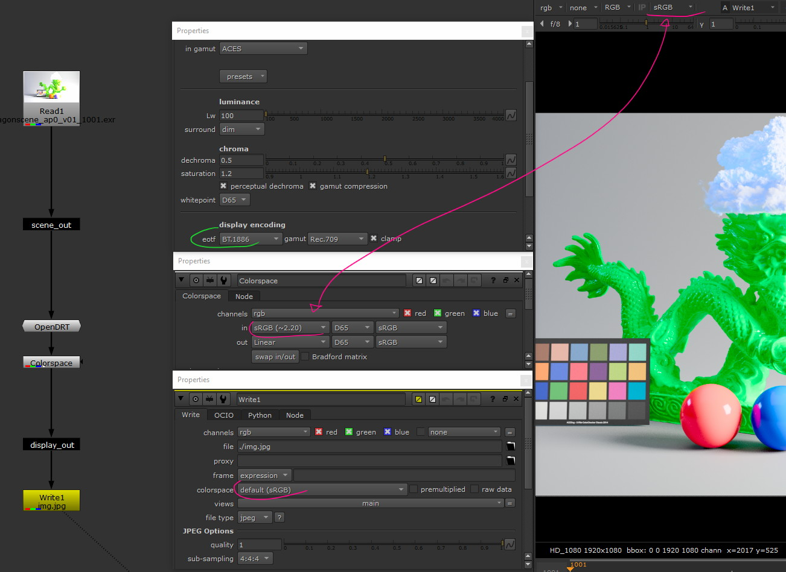
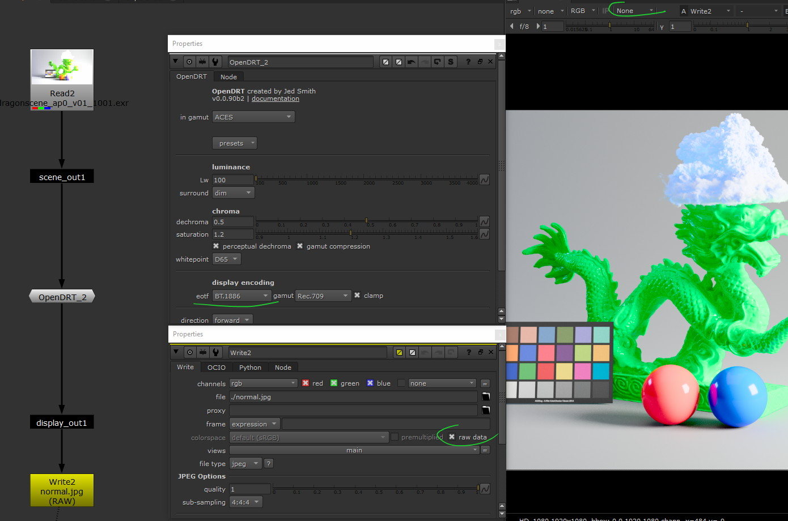
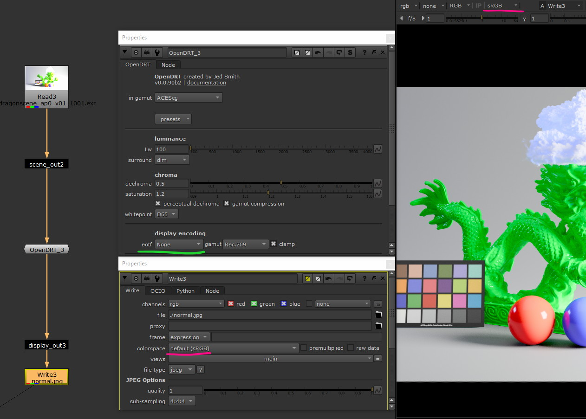
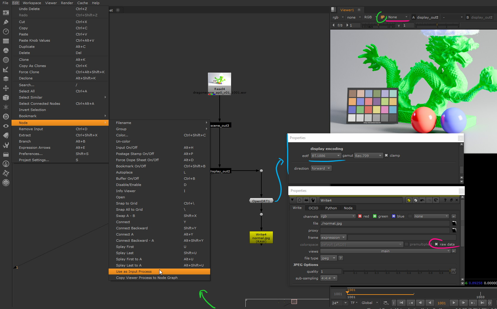

OpenDRT : a cool alternative to ACES
####################################

:description: An open-source alternative to to form images out of high dynamic range data.
:image: cover.jpg
:date-created: 2021-10-25T13:54
:date-modified: 2025-04-11T23:10
:category: tutorial
:tags: nuke, resolve, ACES, tonemapping, color-science
:stylesheets: +opendrt.css

.. role:: warning
    :class: warning-color

.. role:: strike
    :class: strikethrough

With the Academy Color Encoding System (ACES) becoming more and more
omnipresent, it's important to not become lock behind its choices. There is a lot to
discuss on the subject but we will only focus on using the tool for now, and leave the
theory for another day.

If most people get into ACES, it's mainly for its "filmic" looks (provided by
the RRT), rather than its color-management workflow.
And that is understandable, as individual artists, you most of the time, only
care about having the prettiest image possible at the end.

So what if you got a well-formed and pleasing image at the end without having
to go through the complexity of ACES ?

.. admonition:: 2025 update
    :class: important

    The tool has received a major update to 1.0.0 in 2025, this article might be outdated.

.. contents:: Table Of Contents

Who's this for ?
----------------

My post mainly targets the VFX-CGI audience but OpenDRT work on any
open-domain data (see also wide-dynamic-range, scene-linear); which includes photography
and cinematography.

You should be familiar with a "scene-linear workflow":

::

    render (.exr) -> compositing/postprod (linear) -> display output (jpg,mp4,...)

OpenDRT implementation is only available as a Nuke Gizmo and
through Davinci Resolve DCTL feature (on paid licenses) which imply you
are using one of these dccs.

.. admonition:: 2025 update
    :class: important

    OpenDRT is now available as OCIO config directly from `Jed repository
    <https://github.com/jedypod/open-display-transform/releases/>`_ but you can also
    check `Chris Brejon configs <https://github.com/chrisbrejon/OpenDRT-OCIO-Config>`_.

:strike:`No OCIO support, this means you will have with your traditional workflow in
your rendering DCC and only be able to preview the final image in your
post-prod one which is not the most ideal workflow.`

With all of that, I consider my post to be aimed at individual artist doing
personal projects that would like a quick solution for proper SDR-HDR export
(not implying these are OpenDRT goals).

Introduction
------------

It's always a good idea to read the official documentation, the author explain it best
isn't it ? So have a look at the tool repository first:

.. url-preview:: https://github.com/jedypod/open-display-transform
    :title: OpenDRT repository.
    :svg: ../../.static/icons/github.svg
    :svg-size: 64

    Download on github.

Let's just remind the target of OpenDRT:

    The tool has for goal the faithful conversion of open-domain data to a
    closed-domain : the display. This implies its output can look very neutral
    and should be graded.

Node Overview
-------------

As the tool is constantly changing, Jed's documentation is not up to date,
and tneither this post will be.

.. caution::

    All the examples are using OpenDRT version ``0.0.90b2`` which is a legacy version
    as of 2025 !

The first option is to tell the tool in which ``gamut`` your input is.
The input is expected to be linearly encoded.

.. container:: odrt-split

    .. image:: nuke.opendrt.jpg
        :target: nuke.opendrt.jpg
        :alt: OpenDRT global overview
        :scale: 69%

    .. container::

        You then have a bunch of presets that will tweak the knobs for you
        based on your target display encoding.

        ``Lw`` : this is the nits level of the target display and shouldn't be
        used as a creative adjustment.

        .. hint::

            100nits is the value defined as per the
            `ITU-R  BT.2035 <https://www.itu.int/dms_pubrec/itu-r/rec/bt/R-REC-BT.2035-0-201307-I!!PDF-E.pdf>`_
            specifications and should represent the peak-white value of a
            display in a dim surround.

        ``surround`` : the luminance level of the viewing environment.

            - ``dark`` : theatrical viewing environment.

            - ``dim``: "home theater" (low light condition).

            - ``average``: desktop/office average surround.

``dechroma`` : this one is more "subjective", allowing to control
the amount of chrominance compression that should be applied on values
reaching display maximum (R,G,B=1.0). If HDR imagery needs to be
produced, this can be lowered (as the target domain (hdr) has more
volume to express chroma)

``saturation`` : Expand chroma on the bottom values after the compression by
the dechroma.
See more `here <https://community
.acescentral.com/t/proposal-for-resolving-the-conflict-beween-swappable-core
-rendering-vs-doing-everything-in-lmt/4012/9>`_ .

``whitepoint`` : (from doc) Sets the creative whitepoint. This allows
you to creatively set the whitepoint of your display rendering if
you want it to be different than the technical whitepoint of your
display device. For example, if you set this to D55, neutral colors will
be rendered as a warmer hue compared to the default D65.

``display encoding`` : *see below explanations*

    - The ``eotf`` should correspond to the transfer-function used by the
      targeted display.

      .. hint::

          `BT.1886 <https://www.itu.int/dms_pubrec/itu-r/rec/bt/R-REC-BT.1886-0-201103-I!!PDF-E.pdf>`_
          , the default value, correspond to a 2.4 power function,
          which is the standard for Rec.709. For the average of user display you should use ``sRGB Display``.

    - The ``gamut`` correspond once again to the gamut that the targeted display
      is calibrated to (reminder that sRGB use the same gamut as Rec.709).

To adjust these settings properly **you have to know the targeted display**
**+ user** :

The issue is that with today range of displays, this is a rather difficult one
to average (until you have the full-control on the display the image is
going to be viewed on).

| In the case of web publishing, for example, the average user will probably
 have a SDR display, sRGB encoded, with an average white peak of 100 nits and
 used in an office environment that can be brighter than a ``dim`` surround.
 If we add smartphones to the equation, thing will get messy ...
| I'm still digging on the subject trying to gather more info and as such will
 close this topic.

So for now, using the presets is, I think a good practice.

Nuke Installation
-----------------

1.
    `Download the .nk file <https://raw.githubusercontent
    .com/jedypod/open-display-transform/main/display-transforms/nuke/OpenDRT.nk>`_
    (Right click on the page > save as > save it somewhere)

2.
    Import the .nk file: File > Insert Comp Nodes

Or alternatively :

1.
    `Open the .nk <https://raw.githubusercontent
    .com/jedypod/open-display-transform/main/display-transforms/nuke/OpenDRT.nk>`_
    file and copy all of his content ``(ctrl+a, ctrl+c)``

2.
    Paste in Nuke ``(ctrl+v)``

.. note::

    I am only showing how you to use it in Nuke as I don't have access to
    a Resolve License.

Usage in Nuke
-------------

Things will now get a bit complicated at first. The issue is that has the
OpenDRT handle the scene -> display conversion, this will collide with Nuke
that try to do the same in the view-transform.

I found 4 different solutions that achieve the same result. I think the last
one is recommend to use but it's good to have other example that might help to
understand how everything works.

.. warning::

    I didn't test any of these solutions with HDR display-encoding so
    further investigation needs to be done.

.. note::

    I will keep the defaut ``BT.1886`` value for the eotf, but to match the
    nuke's default config I should have use ``sRGB Display``.

#1 Revert Display
_________________

We let the DRT handle everything (with display-encoding), then we apply the
invert transform that applied by Nuke:

Writing the data is as before. You just have to be sure that the ``Colorspace``
node has the same ``in`` parameters as the ``colorspace`` one on the write node.

#2 Nuke Display-encoding disable
________________________________

We disable Nuke's handling of the display-encoding. The DRT is the last step.

This means the Nuke view-transform is always off which can be incovenient
when you need to preview a node upstream.

#3 OpenDRT no Display-encoding
______________________________

One good solution: the OpenDRT doesn't handle the display
encoding but output closed-domain data ready for the display.
Nuke apply the display-encoding as usually, writing data is the regular
workflow.

Be careful as OpenDRT still handle the gamut conversion from the input to the
output. Write node colorspace need to be choosen with this is mind.

#4 OpenDRT with Viewer Input Process (recommended)
__________________________________________________

This is probably the best solution;

OpenDRT handle everything, we disable Nuke view-transform but we will be
using its `input process feature <https://learn.foundry.com/nuke/content/
getting_started/using_interface/
guides_masks_modes.html#InputProcessandViewerProcessControls>`_.

This will allow to always have the OpenDRT active no matter what node we are
previewing :warning:`(this can be inconvenient when viewing scalar data like
alpha, think to disable the input-process in that case)`.

We don't actually need the node used as input-process to be connected to
anything but here **I'm making sure it's connected before the write node**, so
OpenDRT get baked in at export.

As OpenDRT handled the display encoding we can turn it off on the write node
by checking ``raw data``.

Conclusion
----------

If you tried to compare the result to an ACES processed image you would have
probably notice that the image-formation produce much more "excepted" result,
among others, in strong colored highlights, which make OpenDRT a solid
candidate at better image-formation and a peak of what could be used in the
future.

.. hint::

    You can compare OpenDRT rendering against ACES using https://mrlixm.github.io/picture-lab-lxm/.

Even if it's current form kind of break the purpose of a consistant
color-managed system across DCCs, it is a nice solution for individuals and
looks very promising.

⭐ Make sure to star `Jed's repository <https://github.com/jedypod/open-display-transform>`_
on Github !
