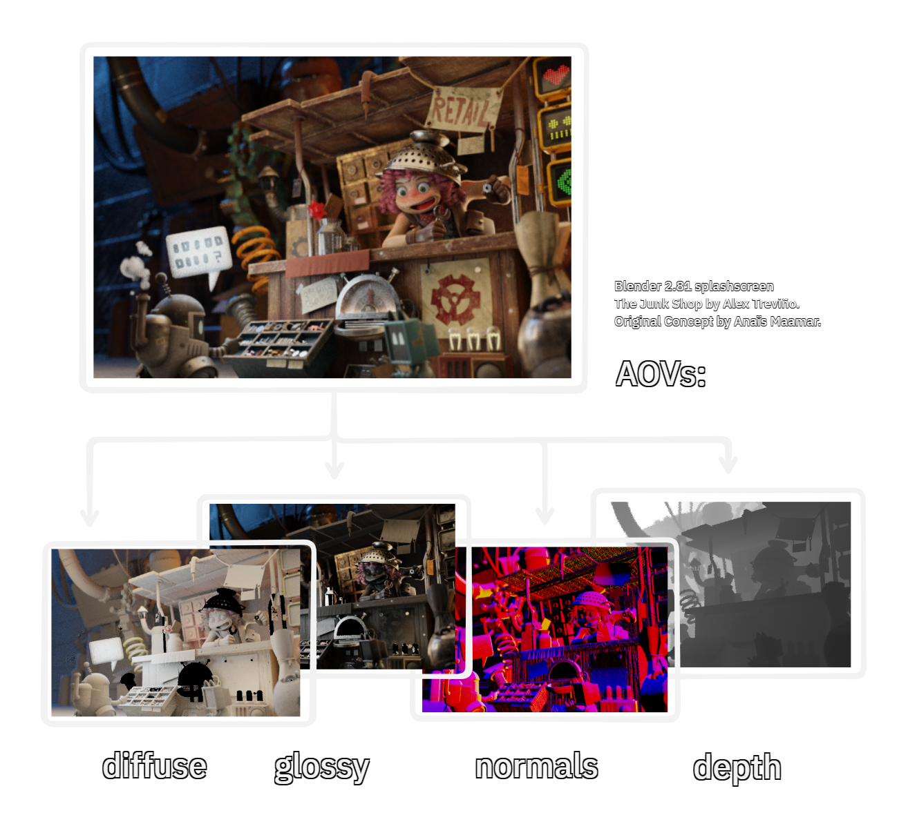
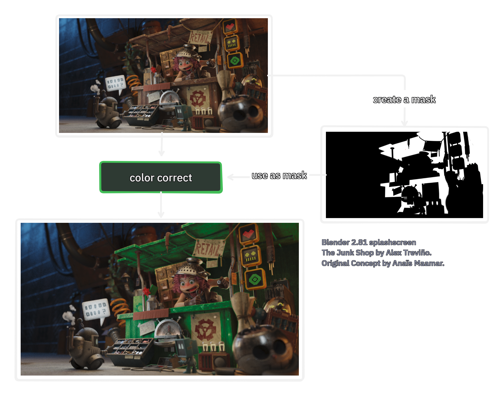
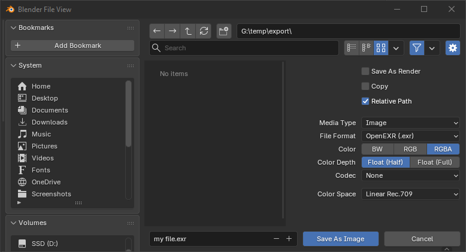
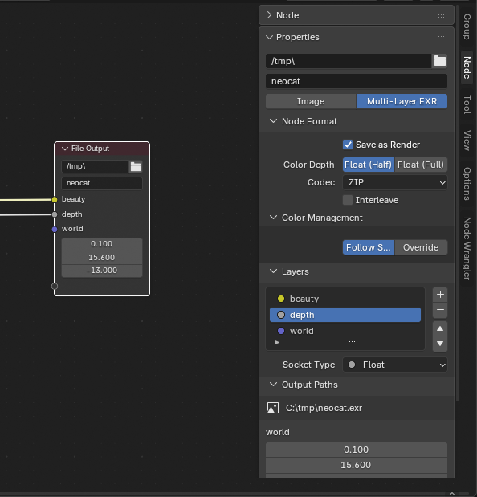

# Reviewing OpenEXR in 2026

:description: Where we have a look at the core image format of the vfx industry and benchmark its compression algorithm.
:image: TODO
:date-created: 2025-12-28T18:37
:category: experimentations
:tags: vfx, image-processing
:authors: Liam Collod
:stylesheets: +openexr-2026.css
:status: unlisted

[TOC]

!!! warning

    WORK IN PROGRESS BLOG POST

!!! caution "reader expectations"

    This article tries to stay accessible to a majority of computer-toucher :emoji:(neocat-laptop-owo).
    Some concepts mentioned are technically complex but are not necessary to understand
    for fully appreciating the other explanations. 
    I expect the main audience to be vfx artists that are already aware of the 
    file format, but people totally outside this field
    could also hopefully enjoy the explanations.

    I assume you are at least familiar with [the basics](<https://xkcd.com/2501/>) on 
    how digital images are structured (2D pixels layout, RGB model).

!!! hint "vfx ?"
    
    In this context "vfx" refers to the visual effect industry, which rely on
    computer generated imagery, for the realisation of movies and video-productions.
    We tend to split this industry as "vfx" and "animation", the first one relying
    on cgi to extend live-action footage, and the latter using only cgi (note the
    border is thin nowadays where some movies like Avatar are more animated movie
    than live-action).


If you put your nose into the file structure of any visual effect project, you
would very quickly find some `.exr` files. Yet, I think outside of this industry field
not a lot of people are aware of its existence.
This could make sense, being an image file format, it's obvious people mastering the 
craft of (animated) pictures have developed technologies going in this direction.
But pretty much everyone of any field work with images at some point, so what's the deal ?

Its clearly not features, [OpenEXR](https://openexr.com) is full of them:

- can store an arbitrary amount of "color" channels
- can store an arbitrary amount of metadata fields
- you like pictures ? what if you could store pictures within pictures ? that's called
  "multi-part" and mip-mapping which is supported.
- you can define the area that is supposed to be viewed, different from the area of pixel that is stored  (data vs display window).
- supports for [stereoscopic](https://en.wikipedia.org/wiki/Stereoscopy) workflows
- pixel data can be stored as "tiles" or "scanlines" allowing to optimize the read/write
  depending on the context.
- it provide 10 different compression algorithms to optimize file sizes
- it's a high bitdepth format offering either 16-bit float or 32-bit float encodings

It's neither its access to it, OpenEXR is one of the oldest open-source software
of the vfx-industry (2003), currently maintained by the [ASWF](https://www.aswf.io/), and 
provides API through C++,C and Python[^1]

!!! note "origin story"

    I recommend to have a look at the origin story 
    which was published in 3 parts over on the ASWF website (in short interviews form): 
    [part1](https://www.aswf.io/news/aswf-deep-dive-openexr-origin-story-part-1/),
    [part2](https://www.aswf.io/news/aswf-deep-dive-openexr-origin-story-part-2/),
    [part3](https://www.aswf.io/news/aswf-deep-dive-openexr-origin-story-part-3/).

Well a part of the answer is in the last bullet point: it's a format to store 
high dynamic range imagery in a floating point encoding. What this mean ? Well if we are
pedantic we aren't really storing images with OpenEXR, but rather an intermediate state 
of them. Expanding on this topic is a rabbit-hole in itself that I cannot handle for now
so the really short explanation is that we are not storing image that are ready to be 
displayed yet.

So viewing a `.exr` file is actually quite confusing, you never just blast the pixel value to 
the display, there must always be some form of interpration to perform, which depends on
the initial context the pixel data was generated from.

<div class="column-split">
<figure>

<figcaption>
this is an exr whose pixels are directly sent to the monitor with no color transformation.
</figcaption>
</figure>
<figure>

<figcaption>
this is an exr whose pixels have been converted to the correct colorspace (sRGB standard).
</figcaption>
</figure>
<figure>

<figcaption>
this is an exr whose pixels have been converted with the same transform it was authored with.
</figcaption>
</figure>
</div>

In the above, the second and third example required to know in which colorspace
the data was encoded with, and the third example required to know what was the transform,
and a reading software capabale of re-applying the transform.

> But why are we even't bothering with this intermediate state ? Can't we just get the 
final image in a very high quality format ? 

There's 2 reason I can think of:

- our field relies a lot on trying to reproduce the physical world, and we need to 
  manipulate physical quantities instead of more finite "display-bound" quantities.
- any image ready to be displayed means it's optimized and bound to a specific display,
  we want to deffer this step as much as possible.

Some people likes to call OpenEXR as the "raw" format of 3D (in parallel to photography),
and as you may know a raw photographic file is no more an image than an Excel sheet is. 
It's merely an intermediate file that store the raw energy recording of the camera's sensor.

So that's why OpenEXR is so niche, and you will probably never see it supported by
a web-browser or mentioned as an alternative to jpg or png. It serves a different purpose.

Yet this format is an incredible piece of technology which packs so much features, and
by reviewing them I hope will make you appreciate all their subtelties.

## bitdepth

OpenEXR support 3 of them [^5], but we can really only use two: 

- 16bits float (half)
- 32bits float (float)
- 32bits integer (uint32)

The integer bitdepth has been implemented to support [deep](#deep) images [^9]
and is never exposed in any application interface. So the choice is mostly between
the 2 floating points formats.

!!! hint "some bitdepth basics"

    If you are not familiar with bitdepth or "color depth" for images, it's a parameter
    which drive the "amount" of color you can store in an image. Where the "amount"
    is indicated by a number of bits. Bits are mostly a power of 2 (8,16,32).
    Alongside this number there is two ways of expressing a value:

    -   with _integers_ (3,4,5,...).
    -   with _floats_ (0.25,0.2536,1.23,156.3, ...). 
 
    Both have a maximum and a minimum value, the difference being the step possible
    between each value. We will focus on floats because that what OpenEXR was designed for.

    One important point to remember being that mathematical floats can have an 
    infinite decimal representation (like π (pi)), yet
    we need store numbers in the computer within finite bounds. Which is why we have
    designed [a clever system](https://en.wikipedia.org/wiki/IEEE_754) allowing us to
    represent a lot of float values efficiently, but not all ! With 32bit of precision
    we can store `0.5` perfectly, but cannot store `0.6`, only `0.600000023841857910156`
    :emoji:(neocat-googly).

    Here is a quite dense cheatsheet breaking down how floats encoding works, but 
    *you don't need to understand it* at all for this post:

    <div class="diagram">
    <a href="diagram-bitdepth-encoding-dark.svg">
    .. include:: diagram-bitdepth-encoding-dark.svg
    </a>
    </div>

    You can use <https://float.exposed> to get a live breakdown for any float value.

    If you really want to properly explore the bitdepth topic I cannot recommend enough 
    [this (paid) zine by Julia Evans](https://store.wizardzines.com/products/how-integers-and-floats-work)
    or this [great post about floats by Bartosz Ciechanowski](https://ciechanow.ski/exposing-floating-point/).


The choice between float and half-float is the same as answering the question "how much
data to I need to store". And if we even have to make the choice it's because 32bit cost
us quite some space on disk, while 16bit will take less space + read and write faster.

However as much simple the question is, I find it rather hard to provide clear guidelines
and indication to when the difference of bitdepth matters. If the difference between
integers and floats is pretty clear, the nuance between 2 flavors of floats is harder
to put in context.

The most obvious limitation is the maximum value which for the half-float format caps 
to 65504.0. And if you think you have no image that can reach such range, it's 
possible to find such high values in sunny HDRIs [^6] or even depth buffer (zdepth) 
of very large scenes. Yet we can agree this is pretty rare.

But the more subtle limitation is precision, where _half_ have less "gap" between each
possible code value than _float_ (and remember that float fomats have more decimal 
precision closer to 0, which get worse as you get further from it).

<figure>
<div class="diagram">
<a href="diagram-bitdepth-values-dark.svg">
.. include:: diagram-bitdepth-values-dark.svg
</a>
</div>
<figcaption>
In the above diagram, we can see that half-float allow to express 15360 steps between
the 0 and 1 range. While the 32bit float bitdepth allow ~ 1 billions steps. If we
compare 16bits float to its integer counterpart we can see that we have 4 times less 
possible values if our data is between the 0-1 range.
</figcaption>
</figure>


!!! warning "log encoding"

    And the above diagram is why you DON'T want to store log-encoded data (usally from
    cameras) in an half exr. Because log encoding limit the data to the 0-1 range but
    most of it actually fit in an even narrower range. Here's an example using the
    ["Helen & John" image](https://www.arri.com/en/learn-help/learn-help-camera-system/camera-sample-footage-reference-image#tab-294302) from ARRI.

    

    In the above the data mostly fit in the 0.09 - 0.45 range, using [float.exposed](https://float.exposed)
    we can calculate that this range have about 2414 code values available at _half_ 
    bitdepth! [^13]
    Which is way less than the 4096 values available when using 12bits integers bitdepths.
    And for comparison 32bit _float_ would have ~ 19 millions code value available. [^14]

    So you could still store log-data in a 32bit float exr file. Not that it's 
    recommended because OpenEXR was designed for storing linear data, but you could
    get away with it (mind the pitfalls). [^15]


!!! tip "as a vfx artist"

    -   usually for textures:
        - albedo/base-color/specular-roughness/masks: `16bit float`
        - normal/displacement/height: `32bit float`
    -   for AOVs:
        - make sure z-depth/normals/p-ref/p-world/cryptomatte are `32bit float`
    -   if you receive an exr with a log and 16bit encoding, warn the sender it must
        at least be `32bit` or a 12bit+ integer format.


## compression algorithms

OpenEXR comes with a shit-ton of compression algorithm, 10 of them, with 2 new algorithm
that got added in September 2025. Offerring choice is fantastic, but it's very easy to
lost the user with too much. Why is there even so much choice ?

File compression is a trade-off between size of the file on disk, time took to 
read and write, and loss of data. In short, you cannot get light files, short time to 
read/write and no loss of data (more on [Wikipedia - Data Compression](https://en.wikipedia.org/wiki/Data_compression)).
And balancing those 3 parameters is one reason we have so many choices.

Among those 10 contenders we can split them in 2 categories: lossless and lossy.
Where lossless means it possible to compress and uncompress with retrieving the exact
same data that were initially compressed. While lossy is the opposite and means *some*
of the original data will be lost, but it's acceptable because it does not have
an important visual impact.

<div class="diagram">
<a href="diagram-compression-dark.svg">
.. include:: diagram-compression-dark.svg
</a>
</div>

For the contenders I am just going to list their names, and let you refer to [the
OpenEXR documentation](https://openexr.com/en/latest/TechnicalIntroduction.html#data-compression) 
if you want the algorithm behaviour description:

- `rle` (lossless)
- `zips` (lossless) (can specify a compression amount)
- `zip` (lossless) (can specify a compression amount)
- `piz` (lossless)
- `htj2k256` (lossless)
- `htj2k32` (lossless)
- `pxr24` (lossy)
- `b44` (lossy)
- `b44a` (lossy)
- `dwaa` (lossy) (can specify a compression amount)
- `dwab` (lossy) (can specify a compression amount)

As for which one to choose now, we will get hints by summoning the dark art of 
statistics.

### compression benchmarks

Nerd time :emoji:(cat-nerd), let's warm up the computer and crunch the numbers.

Those benchmarks were realised in the following configuration:

- we rely on the [exrmetrics tool](https://openexr.com/en/latest/bin/exrmetrics.html) provided with the OpenEXR library version 3.4.4; compiled by myself.
- each compression is tested in an individual call to exrmetrics (even if the tool can test them all at once).
- each operation is run 3 times (`--passes 3`) and we use the median result
- the machine used runs on Windows 10 and was left inactive during the runs
- all ratios are caculated relative to the results with no compression

The whole generation and plotting workflow is wrapped in python script that you can
find at <https://github.com/MrLixm/benchmark-openexr>.


## storing multiple layers

One of the most convenient feature of OpenEXR is allowing you to store as much pixel
data as needed. You are not limited to R,G,B and a potential Alpha channel. Thus, you
can reduce how much individual files you have to manage by packing it all in one.

The main usage for vfx is storing AOVs, which are alternative representation of your scene.
Those representations are usually provided by the 3d render-engine and allow to fine
tweak the image in 2d space without having to wait for expensive 3d calculations.
You can see AOVs like "layers" of the final combined image.



So now imagine you have 3 layers of pixel data you want to store, for a total of 8 channels:

1. final image (R,G,B,A), 
2. depth buffer (one grayscale channel) 
3. normals buffer (3 channels for x,y,z)

How can you achieve this with OpenEXR ?

### multi-file

You store each layer in a separate OpenEXR file, for a total of 3 files. 

```yaml
myimage_main.exr:
  channels: R,G,B,A
myimage_depth.exr:
  channels: Z
myimage_normals.exr:
  channels: X,Y,Z
```

### multi-channel

You add as much channel as you need, so let the file have 8 channels. To properly
separate the channels you named them using the same prefix for each layer
(conventions use the dot as separator [^3]).

```yaml
myimage.exr:
  # each channel name is separated by a comma
  channels: R,G,B,A,depth.Z,normals.X,normals.Y,normals.Z
```

That way when the software reads the channels, it can just group together
the channels that starts with the same prefix, thus "reconstructing" the layer. 

*(this method is sometime also called multi-layer)*

### multi-part

You split the data by logical groups using the "part" feature. A *part* in OpenEXR
is literally an image in an image, and you can have as much as you need (shallow). If we
represent our previous example with this logic:

```yaml
myimage.exr:
  part1:
   channels: R,G,B,A
  part2:
    channels: depth.Z
  part3:
    channels: normals.X,normal.Y,normal.Z
```

Each part can also have as many channels as it needs. In the above example we also kept
the prefix convention in channels names, but we could just have renamed the part
with the layer name, and kept channels names one letter long.

### multi-file, multi-channel or multi-part?

As you can see we have a lot of flexibility. However there is actually only one solution
that really matters for our use-case. 

*Multi-file* is fine, but you have to manage as much
files as you have layers. And it's totally possible we reach the hundred of AOVs by image
on some productions ! Quite complicated to import and manage so much files in our "reading software".

*Multi-channel* has one massive drawback which is performances. When reading the file,
the software MUST read all the channels, to then be able to group them by layer using their names.
Imagine you have 100 AOVs with at least 3 channels for each ...

*Multi-part* is the actual solution. By splitting your layers in parts, you allow the 
reader to only read one part at a time when needed. 

!!! hint ""reader""

    In this context the software that reads the OpenEXR file, relying on the OpenEXR API.

!!! note

    There is a possibility the reader implementation just choose to always read all the 
    parts at once thus providing no gain. What is sure is that with a 
    multi-channel file, it has no choice
    to always read all the channel to reconstruct the layers.

Lastly, one important part of context is that multi-part was only introduced later in OpenEXR
lifetime (v2.0 in 2013 [^2]). Meaning that before v2.0, multi-channel and multi-file were
the only method possible. But nowadays, it is safe to assume that every software 
supporting OpenEXR uses an API version that is more recent than the v2.0.

Hopefully this make it clear as why multi-part is the best solutions in most cases. 
I *most-cases* because multi-file can still be preferred. Some software doesn't allow
you to write a multi-part file AND allow each part to specify a different bitdepth or
compression algorithm, or it simply does not support multi-part or even multi-channel 
at all (hello Photoshop :emoji:(cat-weeee)).

!!! warning

    Be careful when reading a multi-channel/part exr as the reading options usually applies 
    the same on all part/channels. For example the colorspace conversion, which you
    don't want on non-color managed channels.


### mip-mapping

One use-case for wanting to store multiple images inside one image is [mipmapping](https://en.wikipedia.org/wiki/Mipmap).
That's really a need specific to 3D where for optimization reasons, we recursively store
images smaller than the previous one.

With OpenEXR, you could store each mipmap in an individual part, where the first part
is the orginal image in full resolution, and each subsequent part is smaller.

But it's also possible to store multiple mipmap for each individual part (only if the data 
is stored in a tiled layout [^4]) !


However, as an artist it's probably something you will never have to do, being a rather
automated process handled by the render-engine. See [Maketx - Arnold User Guide](https://help.autodesk.com/view/ARNOL/ENU/?guid=arnold_user_guide_ac_textures_ac_textures_maketx_html)
for example.

## tiles and scanlines layouts

Those 2 attributes describe how the pixel data is stored in the file. They specify
how the original area is split in "chunk" of pixels before being stored:

-   `scanlines`: the area is split in rows of 1 pixel height
    -   this is the default layout for all images
-   `tiles`: the area is split in smaller areas of an arbitrary size
    -   this is the only layout compatible with [mipmapping](#mip-mapping) [^8].

<div class="diagram">
<a href="diagram-layout-dark.svg">
.. include:: diagram-layout-dark.svg
</a>
</div>

The purpose of those chunks is optimizing the reading step. Depending on the context
you might not want to read all the image pixels at once, but only some portions to 
speed up the process.

<figure>
    <video controls width="100%">
      <source src="./nuke-scanlines-demo.mp4" type="video/mp4" />
    </video>
    <figcaption>
    Here is an example with Nuke which works best with scanlines layout. For the first read
    we force it to read all the image, and Nuke take about 2s to read this 8K image from top
    to bottom. For the second read we let Nuke optimize the read, which become nearly
    instant. If we pause the viewport and zoom we can indeed see that only some scanlines
    of the source image are loaded.
    </figcaption>
</figure>

!!! tip "🎨 as an artist"

    The choice mostly depends on which software will read your exr. Scanline
    is a safe default. It doesn't even matter for 3d render-engine because they
    rely on their own intermediate texture format (eg, .tx, .tex) which already
    encode the original in the proper optimized layout.

## unusual formats

OpenEXR versatility made it a pretty good candidate for supporting new ways of
storing image-related data. So along the year of its existence it implemented
2 new formats that covered very specific needs of vfx productions. 

### cryptomatte

Imagine you have a 3d scene with hundreds of objects, everything get baked into 2d
during the process of rendering, and you now have a 2d image of your scene from a 
specific camera angle. Yet it's usually not the end of the craft-cycle for the image, 
and there is still additional artistic modification steps performed after. But obviously
those steps happens in 2D space: merging and mixing other medias, 
color-correcting elements, adding flavor and globally polishing the image to make it 
pretty until we can consider it "[final](https://www.reddit.com/r/funny/comments/33idlc/every_designer_in_the_world/)".

What if in this 2D space you need to perform specific adjustement to a very specific 
object of the scene that is rendered ? This mean you need a mask of the object, 
basically an image with pixel values of 1 where is the object, and 0 where it's not.

<figure markdown="span">
    
    <figcaption>Example where we change the [scene](https://download.blender.org/archive/gallery/blender-splash-screens/blender-2-81/) stand's wood color to green.</figcaption>
</figure>

How do you create that mask ? And to go even further how could you make sure to have a
mask for every object in the scene ? There are methods that would involve rendering a 
second image where 3d objects are shaded with a constant uniform color that you could
extract in 2d, but this is legacy and the actual solution that have become standard in 
those past 20 years is *cryptomatte*.

.. url-preview:: https://raw.githubusercontent.com/Psyop/Cryptomatte/master/specification/IDmattes_poster.pdf
    :title: Fully automatic ID mattes with support for motion blur and transparency
    :image: https://github.com/Psyop/Cryptomatte/blob/master/docs/nukeScreenshot.jpg?raw=true

    SIGGRAPH 2015 poster

Cryptomatte is a mapping of your scene object collection to each pixel of the rendered 
image. Each object receive a unique ID, which is then set on all the pixel the object
is visible. This allows very human-friendly operation such as 
"create a mask for every object whose name starts with a `Background` prefix". Keep in
mind those operations relies on the proper definition of a *manifest*. Because we can
only store numbers in pixel values, the manifest take care of mapping the pixel value
to a string of text.

<figure>
    <video controls width="100%">
      <source src="./nuke-cryptomatte-demo.mp4" type="video/mp4" />
    </video>
    <figcaption>
    Example of creating masks using cryptomatte in Nuke.
    We can individually pick objects on screen, or type expressions to select
    multiple object at once.
    </figcaption>
</figure>

We can usually find 3 types of cryptomatte:

- "object": each scene mesh have a unique ID.
- "asset": meshes are grouped using a common parent which receive a unique ID.
- "material": objects with the same material have the same ID.

But it's basically up to the 3d render-engine to decide how to split/group objects in 
the scene, cryptomatte is just [a standard](https://github.com/Psyop/Cryptomatte/blob/master/specification/cryptomatte_specification.pdf)
that say how to encode and decode those information.

And speaking of encoding, if cryptomatte files are standard OpenEXR files that could 
be read by any OpenEXR reader, you would still need a specific plugin implementation
to *meaningfully* read the data (we use a special node in the previous Nuke example).
Because traditional image-processing operations relies on the numbered value in each 
pixel, here pixel values doesn't make sense until you map them with their corresponding 
"text".

Here's how cryptomatte are encoded in an OpenEXR file:

<figure markdown="span">
<div class="diagram">
<a href="diagram-cryptomatte-encoding-dark.svg">
.. include:: diagram-cryptomatte-encoding-dark.svg
</a>
</div>
<figcaption markdown="span">
Cryptomatte works with a rank system where each rank is a different "depth" of
transparency. Each rank need 2 channel of data, meaning we use the 4 standard RGBA
channels to encode 2 ranks for optimization of space.
Then we rely on the OpenEXR [multi-channel](#multi-channel) feature to store as much
ranks as we need (default is 6)[^12].
</figcaption>
</figure>


!!! Note "💡"

    This is why previewing the cryptomatte channels from an exr looks weird. The values
    of the pixel have very wild ranges and the different RGBA channels have no
    relation between each others.

It could really have been its own independent file format, but because we could qualify
it as an AOV (a different representation of the same scene and frame), it was 
probably more convenient to store it in the same file format as the other AOVs: OpenEXR.
Thus also making it easier for software to implement its support, without having to add 
a new external dependency to their stack [^10].

!!! tip "🎨 as vfx artist"

    -   make sure cryptomatte channels are encoded with 32bits (float) [^11].
    -   make sure cryptomatte channels are not color-managed when written/read [^11].
    -   as long as you ensure the 2 previous points, you don't have to store the cryptomattes
        in a separate exr file. But sometimes the render-engine doesn't give you the 
        choice to use different bitdepth by channel so it become the only solution.
    -   the `manifest` which allow to pick "names" instead of float values can either be
        stored fully in the metadata, or in a sidecar file next to the exr. In the later
        case make sure it's not missing.
    -   cryptomatte support transparency but not refraction (glass-like materials).
    -   most render engines don't support volumetrics objects in cryptomattes.
    -   a last limitation to be aware of: _"Because the depth ordering, transparency and 
        color of each object is not stored, objects isolated using Cryptomatte will 
        have contaminated edge colors and incorrect alpha values."_ [^11]

If cryptomatte have quickly raised itself as a must-have in the compositor toolbox,
you might want to have a look at the next section about deep, which did bring its own
batch of improvements on solving the matte problem.

### deep

TBD

## manipulating .exr files

Until now, we have seen a lot of theory, assumed to be applied in your 
DCC of choice. But what could actually be those DCCs ?

### reading .exr files

As of 2026, it's not that rare anymore to find a software which can read a basic exr file
(suprisingly Apple system have native support for it since the beginning [^7]). 
However finding a software that can read the full spectrum of OpenEXR configurations AND
allow you to post-process it to get back the original image intended for display is harder.

I cannot list all the image-viewers with OpenEXR support, but I have gathered a small 
list of the free ones I have strongly heard about, or at least tried a few times:

| name                                                            | support quality | description                                                                                                                             | issues                               |
|-----------------------------------------------------------------|-----------------|-----------------------------------------------------------------------------------------------------------------------------------------|--------------------------------------|
| [DJV](https://grizzlypeak3d.github.io/DJV/)                     | +high (OCIO)    | a long-standing vfx artist favorite to read EXRs                                                                                        |                                      |
| [mrv2](https://github.com/ggarra13/mrv2)                        | +high (OCIO)    | a recently developed, vfx specific image-viewer                                                                                         |                                      |
| [OpenRV](https://github.com/AcademySoftwareFoundation/OpenRV)   | +high (OCIO)    | a pillar of the vfx industry; robustness in its clunkyness                                                                              | require compilation                  |
| [xSTUDIO](https://github.com/AcademySoftwareFoundation/xstudio) | +high (OCIO)    | a recently and studio developed vfx-focused image viewer                                                                                | require compilation                  |
| [CineSync](https://www.cinesync.online/)                        | -high (OCIO)    | a commercial and professional media viewer with a free plan                                                                             | closed-source; no multi-part support |
| [hdrview](https://github.com/wkjarosz/hdrview)                  | high            | a research-oriented image viewer with high-dynamic range support; even have [web-browser support](https://wkjarosz.github.io/hdrview/). |                                      |
| [tev](https://github.com/Tom94/tev)                             | high            | an image viewer with high-dynamic range support                                                                                         |                                      |
| [Oculante](https://github.com/woelper/oculante)                 | basic (RGBA)    | a small cross-platform image-viewer                                                                                                     |                                      |
| [PureRef](https://www.pureref.com/)                             | basic (RGBA)    | a image whiteboard popular with artists                                                                                                 |                                      |

And special mention to [Nuke](https://www.foundry.com/products/nuke-family), which is a
whole paid compositing software, but it has a free non-commercial version and provides 
a very good OpenEXR support.

### programmatic conversion with OIIO

If you ever had an .exr file, but wish you had another file format. Or the opposite !

We are going to use the [OpenImageIO](https://openimageio.readthedocs.io) library which
have first-class support for OpenEXR, and nowadays is pretty straightforward to install.
However, those instructions assume you are familiar with [command line programs](https://en.wikipedia.org/wiki/Command-line_interface).

The first option will be to use their command line tool `oiiotool`. The tool is provided
with the python wheels so if you are not really into c++ library compilation, we can 
rely on the python ecosystem to get it. On my side I'll be using [uv](https://docs.astral.sh/uv/)
to retrieve it without having to even bother installing python:

```bash
uv pip install OpenImageIO --target /any/directory
```

And then the `oiiotool` executable is in `/any/directory/OpenImageIO/bin`. 

`oiiotool` already have an [extensive documentation](https://openimageio.readthedocs.io/en/v3.1.8.0/oiiotool.html)
but let's check a few example.

#### oiiotool - convert from exr

The most basic oiiotool command to convert from one format to another:

```bash
# oiiotool {input path} -o {output path}
oiiotool "image.exr" -o "image.jpg"
```

!!! hint "compression"

    You can control the jpeg compression by setting attributes before writing:

    ```bash
    # have a high-quality jpeg with not a lot of compression:
    oiiotool "image.exr" --compression "jpeg:90" --attrib "jpeg:subsampling" "4:4:4" -o "image.jpg"
    ```


However, this command doesn't perform any color-management and our not-display-ready
image will be directly dumped into a format that is assumed to be display-ready. 
Fortunately we can fix it, but as always this require us to know what kind of data
we put in the exr and how it's supposed to be displayed.

In my case it's a linear-sRGB exr and if I want a display-ready sRGB image I will just
need to apply the transfer function:

```bash
# oiiotool {input path} --colorconvert {src colorspace} {dst colorspace} -o {output path}
oiiotool "image.exr" --colorconvert lin_srgb srgb_display -o "image.jpg"

# in the above we are using oiiotool default OCIO config, you can check the available
# colorspace with:
oiiotool --colorconfiginfo
```

Have a look at the [oiiotool documentation](https://openimageio.readthedocs.io/en/v3.1.8.0/oiiotool.html#oiiotool-commands-for-color-management)
to check the other options for color-management.

---

Next use-case, what if we wanted a particular layer of our exr to be saved to the jpg ?
By default, only the RGB channels are saved (jpg have no alpha).

If our exr is multi-part, you need to know the name/index of the part to keep:

```bash
# get the number of subimages
# you can add -v to have the subimage names
oiiotool --info -a "image.exr"

# take subimage 2 and write it to the jpg
oiiotool "image.exr" --subimage 2 --colorconvert lin_srgb srgb_display -o "image.jpg"
```

If our exr is multi-channel, you need to know the name of the channels to keep:

```bash
# get the channel names
oiiotool --info -v "image.exr"

# extract specific channels to the jpg
oiiotool "image.exr" --ch "R=diffuse.red,G=diffuse.green,B=diffuse.blue" --colorconvert lin_srgb srgb_display -o "image.jpg"
# ⚠️ make sure the channel names are correct because there will be no warning if they are incorrect !
```

And if you are wondering how to get each part written as a separate file, [the oiiotool
documentation](https://openimageio.readthedocs.io/en/v3.1.8.0/oiiotool.html#split-a-multi-image-file-into-separate-files)
already have an example you can check.


#### oiiotool - convert to exr

And for the other way around, pretty much the same logic and problematics:

```bash
# oiiotool {input path} -o {output path}
oiiotool "image.jpg" -o "image.exr"
# if we check the default exr configuration:
oiiotool --info -v "image.exr"
# ... 3 channel, half openexr
#     channel list: R, G, B
#     compression: "zip"
#     ...
```

The above is incorrect because again there is no proper colorspace conversion. We need
to at least linearise the jpeg input before storing it in the exr.

```bash
# oiiotool {input path} --colorconvert {src colorspace} {dst colorspace} -o {output path}
oiiotool "image.jpg" --colorconvert srgb_display lin_srgb -o "image.jpg"
```

And how we can fine-tune our exr configuration:

```bash
# we want a tiled float exr, with dwaa compression
# ! this a kind of "mix-it-all example" which is not optimized
oiiotool "image.jpg" --compression "dwaa:30" -d float --tile 16 16 --colorconvert srgb_display lin_srgb -o "image.jpg"
```

### with Blender !

Because everyone and their grandmother have heard about Blender, and you [can just get
it for free](https://www.blender.org/download/). If Blender is quite capable, do
not expect advanced capabilities and keep in mind Blender will mostly cover the OpenEXR 
basics.

!!! caution

    The explanations below assume Blender 5.0 and may change in the future.
    Older version are not recommended either because 
    [5.0 added](https://developer.blender.org/docs/release_notes/5.0/pipeline_io/#images)
    multi-part OpenEXR support for writing, and brings improvement to the Compositor worflow.

#### Blender - reading

To view OpenEXR file with Blender, you will need to use [the Image Editor](https://docs.blender.org/manual/en/latest/editors/compositor.html).

- open the Image Editor from the editor type menu (in the top-left of a panel).
- open an exr file by clicking "Open" (top-center of the panel, folder icon).

<figure>

<figcaption>
You can change the currently visible layer and channels from the top right menus. If
the image is multi-part you will get an extra menu to pick the part to display.
</figcaption>
</figure>

However, make sure that the file is properly color-managed:

<figure markdown="span">

<figcaption markdown="span">
Open the right hiden panel by pressing `N`, then go the `Image` section. You can select
the colorspace that match your file encoding.
</figcaption>
</figure>

By defaut the Image Editor is not synchronized with the scene global color-management.
If you need more control on how the image is rendered you might want to check `View as Render`
in the image panel you opened previously with the `N` key. Once this is checked you can
go to the `Color Management` properties of the global scene (Render panel on the right then scroll down). 
The default transform in Blender is `AgX` but your exr file have probably 
been authored with a different transform. 
If you don't need a transform, select "Standard" (which is the transform used when `View as Render` is unchecked).

!!! tip "color picking"

    If you want to color pick a value on the image, you can just press left or right click
    and a band with the value at cursor position will appear at the bottom.

#### Blender - writing

There's 2 method to export an exr out of Blender:

1. use the `Save As` menu next to an image (external or a scene render)
2. use [the Compositor](https://docs.blender.org/manual/en/latest/editors/compositor.html).

The first one is pretty straightforward, you get a file export dialog, you pick OpenEXR
as a file format, tweak the encoding options according to what we explained before
and you are done. 



!!! caution

    If you are saving a Blender render with AOVs or re-encoding an existing
    OpenEXR you may want to change the "Media Type" to "Multi-Layer EXR" else only the 
    usual RGBA channels will be writen !

The second method is where we need more explanations, but give us more control to build
our file:

- open the Compositor from the editor type menu (in the top-left of a panel).
- create a nodegraph by clicking "New" (top-center of the panel).
- delete the default "Render Layer" node that is created

!!! warning

    Make sure there is no "Render Layers" node in the nodegraph, else when rendering
    the nodegraph, a 3d render of the scene will also be triggered !  (You can also
    just mute the node with `M`).

If we create an exr file means we need some initial pixel data to store. So we have to 
import some existing images, but you could totally create some data directly
from Blender using the nodes ! 

<figure>

<figcaption>
A simple import/export+preview example with a silly emoji from <a href="https://volpeon.ink/">Volpeon</a>
</figcaption>
</figure>

!!! hint "Previewing streams"

    In the above example, the Viewer setup is optional, but if you still want to preview
    the image data you can:
    
    - create a Viewer node if you don't already have one
    - connect it to the pixel stream you want to preview
    - optionA: enable the `Backdrop` button on the top-right of the panel (use `Alt` + MMB to move the backdrop).
    - optionB: open a new "Image Editor" panel, on the top-center menus click on the left picture icon, then select "Viewer Node".

To import an image you can create an `Image` node (RMB > Add > Input > Image) and click
the `Open` button on the node. If you import an OpenEXR image with multiple layers you
will notice:

- the parts can be selected from a new "Layer" dropdown on the Image node
- the channels are grouped by layer and assigned an output port on the node

<figure>

<figcaption>
The top node is multi-part and have a "Layer" menu while the bottom node is multichannel and have 5 output ports.
</figcaption>
</figure>

!!! caution "Colorspaces"

    You may notice that the colorspace dropdown will affect ALL channels and parts
    which may not be desireable if some channels have non-color-managed data. The
    solution is to use a non-color-managed colorspace (`Non-Color` is the Blender default)
    for the Image node, and then create a `Convert Colorspace` node for each channel 
    that need to be color converted. Or you may also not want any color-conversion
    at all if you just want to import and export the data without editing it.

    <figure>
    
    <figcaption>
    Here is an example where we convert linear-sRGB color channel to ACEScg before writing.
    </figcaption>
    </figure>

And lastly, to actually export an exr file, we will create a "File Output" node 
(RMB > Add > Output > File Output). In opposite to most nodes which can be tweaked
in the nodegraph, this one require you to open its Node Properties panel: press `N` to
open the right side-panel, then go into the "Node" tab. There we can:

<div class="column-split" markdown="1">

<div markdown="1">
-   pick an output directory.
-   pick a filename (you don't need to put the file extension suffix).
-   pick the type of image to export:
    - `Image`: one image on disk for each layer.
    - `Multi-Layer`: layers are saved in the same multi-part or multi-channel exr file.
-   configure the image format encoding options.
    - if `Interleave` is checked, you will get a multi-channel exr, else a multi-part exr is created.
-   configure the layers to exports (see below).

> Make sure to check [the node documentation](https://docs.blender.org/manual/en/latest/compositing/types/output/file_output.html) 
> for a detailed breakdown.
</div>
</div>


!!! tip

    File paths in Blender can contains tokens which are replaced when rendering, you can
    get the full list of them here: <https://docs.blender.org/manual/en/latest/files/file_paths.html>.

When we talk about layer in the File Output context, we refer to a group of multiple
related pixel channels. They are represented by a single stream in the nodegraph, 
going from port to port on nodes.
The File Output node allow to create [3 different types](https://docs.blender.org/manual/en/latest/compositing/compositor_system.html#type)
of layers. Those basically represent the amount of channels in a layer but also have
some implifications of the encoding configuration in the exr file:

| type   | channels | suffix in exr        | forced bitdepth | color-managed |
|--------|----------|----------------------|-----------------|---------------|
| float  | 1        | `.V`                 | float           | no            |
| color  | 4        | `.R`,`.G`,`.B`,`.A`  | no              | yes           |
| vector | 4        | `.X`,`.Y`,`.Z`,`.W`  | float           | no            |

The name you give to the layer will be used to prefix the channel names, and if you
export a multi-part exr, it will *also* be set for the part's `name` attribute.

!!! admonition "Metadata"

    Unfortunately the Compositor doesn't let you modify metadata. The only control
    you have is adding specific keys in the _Output Properties_ of the scene (panel on the right).
    There is [a Metadata section](https://docs.blender.org/manual/en/latest/render/output/properties/metadata.html)
    which mostly allow to add or not some specific 
    information about the scene. **You probably want to uncheck all the metadata options
    if you are not exporting a Blender render**. 
    The only "free" field is the "Note" which will be
    saved with the same name in the exr metadata.

    When exporting a multi-part exr, only the first part will have this extra metadata.

Once your nodegraph is configured as desired, you can write the image by starting a
render (`F12` key or `Render > Render Image` menu at the top left). 
The "Blender Render" window will open but will display
an empty image. However, if you check the export directory, our exr file will be writen. 
Yes this is not intuitive :emoji:(neocat-googly).


## closing words

This post took much time before coming to life, and I am relieved it is now. 
It started from the initial idea that it would be cool to benchmark and compare various
file formats used in vfx. Idea wich I had since deep-diving the first time in OpenEXR,
back in 2020. It's only in 2024 that I started to do some first benchmarks around OpenEXR,
but relied on `oiiotool` for writing and tried to benchmark Nuke for reading.
Without a commercial license, the project just ended-up in the bin of unfinished project.
But around the same time I gave it up, OpenEXR devs released `exrmetrics` and it's only
during those 2025 Christmas holiday I finally had time to have a play with it. Crazy how 
"productive" people become if you gave them free time instead of work time :emoji:(cat-think) ?

*[AOVs]: Arbitrary Output Variables
*[API]: Abstract Programming Interface
*[DCC]: Digital Content Creation (software)
*[compositor]: person doing compositing (the artistic 2D step after rendering)
*[MMB]: middle mouse button (scroll-wheel click)
*[RMB]: right mouse button (right-click)

[^1]: The provided Python API has limitations and you would rather use the Python bindings
    of other libraries like [OpenImageIO](https://openimageio.readthedocs.io/).
[^2]: <https://openexr.com/en/latest/news.html#april-9-2013-openexr-v2-0-released>
[^3]: <https://openexr.com/en/latest/TechnicalIntroduction.html#channel-names>
[^4]: <https://openexr.com/en/latest/ReadingAndWritingImageFiles.html#scan-line-based-and-tiled-openexr-files>
[^5]: <https://openexr.com/en/latest/TechnicalIntroduction.html#image-channels-and-sampling-rates>
[^6]: page 69 (5.8.3 Maximum Range) <https://blog.selfshadow.com/publications/s2016-shading-course/unity/s2016_pbs_unity_hdri_notes.pdf>
[^7]: last Florian's quote <https://www.aswf.io/news/aswf-deep-dive-openexr-origin-story-part-1/>
[^8]: <https://openexr.com/en/latest/TechnicalIntroduction.html#scan-lines>
[^9]: <https://openexr.com/en/latest/DeepIDsSpecification.html#deep-id-basics>
[^10]: mostly personal speculations; also see (page 3; section 2.2) <https://dl.acm.org/doi/epdf/10.1145/3233085.3233086> 
[^11]: <https://openexr.com/en/latest/DeepIDsSpecification.html#cryptomatte-comparison>
[^12]: page 2 (Channel contents) <https://github.com/Psyop/Cryptomatte/blob/master/specification/cryptomatte_specification.pdf>
[^13]: 0.09(exponent=11,significand=451); 0.45(exponent=13,significand=819); (13-11) * 1023 - 451 + 819
[^14]: 0.09(exponent=123,significand=3690988); 0.45(exponent=125,significand=6710886); (125-123) * (2<sup>23</sup>-1) - 3690988 + 6710886
[^15]: [Nick Porcino on ASWF Slack](https://academysoftwarefdn.slack.com/archives/CMLRW4N73/p1698333341750709)
[^17]: can't find back the source of this meme but if you don't get it sand=silicon=computer