# Color-management in Substance Painter with OCIO

:description: The long-awaited OCIO feature is here, now we gotta find how it works.
:date-created: 2021-12-08 19:03
:date-modified: 2023-02-01 21:31
:image: cover.jpg
:image-alt: A decorative image that shows the meet-mat character in front of a monitor displaying a rainbow-colored pattern.
:cover: cover.jpg
:cover-alt: A decorative image that shows the meet-mat character in front of a monitor displaying a rainbow-colored pattern.
:category: tutorial
:tags: substance-painter, color-science, OCIO, ACES
:authors: Liam Collod
:stylesheets: +substance-painter-color-management.css

[the one from CAVE academy]: https://caveacademy.com/product/cave-cg-animation-aces-ocio-config/
[Emmanuel-Xuân Dubois]: https://www.artstation.com/ashimara

It's there ! After so much time, Substance-Painter finally saw itself getting
a shiny new color-management system with OCIO support. We're going to dive
deeper inside and see how it works.

The article is divided into two parts.
You got first a theoretical part that will try to explain how
color-management works. This can help you debug issues and just not tweak
settings like a blind machine. This part is not mandatory though. You can
skip straight to the [Substance Setup & Workflow](#substance-setup--workflow) 
section if desired.

!!! important
    OCIO was introduced in [Substance-Painter version 7.4](https://substance3d.adobe.com/documentation/spdoc/version-7-4-223053247.html)
    This is the version used through this article; meaning some features might have
    changed at the time you are reading this.

    An update has been done following the 7.4.2 update from 08 March 2022.

.. url-preview:: https://substance3d.adobe.com/documentation/spdoc/color-management-223053233.html
    :title: Official Documentation
    :image: https://helpx-prod.scene7.com/is/image/HelpxProd/banner-cm-doc?$pjpeg$&jpegSize=200&wid=650

[TOC]

## Color-managed Workflow

!!! note
    This part is aimed at beginners, but introduce a topic too vast for this
    article. I recommend reading
    [Chris Brejon article's section about colorspaces](https://chrisbrejon.com/cg-cinematography/chapter-1-color-management#rgb-colorspace-and-its-components) 
    first, to be sure you understand
    some of the technical vocabularies employed.

We can break the workflow into 4 sections : 
`Input`, `Workspace`, `Display` and `Output`

.. include:: diagramA.svg
    :literal: class="center-block"

You transfer `data` between each of these section. Data that must be
potentially decoded and then encoded, depending on what the section required.
In Substance Painter this `data` is most of the time pixels, encoded
using the RGB color model.

All of these data-transfers allow me to introduce the most important rule:
*you always need to know where you start to know where you are
going*{.text-green}.
As an example, in the above diagram, to convert the `Input` data to the
`Workspace` data, we need to know how the `Input` data is encoded (in our
case, which colorspace).

### Data types: Color and Scalar

"Where you start" means first, what type of data are you manipulating ?

There are only two types : `color` and `scalar`.

It is important to know which one your data belongs to because the scalar
one doesn't require your data to be color-managed and as such skip a
complex part.

#### Scalar

Scalar data has no means to be displayed directly, the data store numbers
that can be used to drive other types of data. We are only interested in the
original value of these numbers and as such this kind of data **must never
be altered by color-transformations.**

To get to more concrete examples scalar data include but is not limited to:
roughness, normals, masks, displacement, vectors, ...

!!! warning
    This is not because the data, when displayed, is not grayscale, that it
    is color data. For example normal maps, even if colored, ARE scalar data.

#### Color

Everything that is not scalar. Values stored are intended to be displayed
directly. These values are always encoded in some colorspace and require to be
decoded properly.

This includes but is not limited to: diffuse/albedo/base-color, subsurface
color, specular color, refraction color, every image displayed on the web, ...

#### In Substance

In Substance you will find this separation depending on the channel you
are working on. 
[The full list of color-managed channels is available here.](https://substance3d.adobe.com/documentation/spdoc/color-management-223053233.html#section5)

As Substance is aware if the channel needs to be color-managed, some operations
will be adjusted/skipped. An application of this is the `view transform`
that will be disabled when viewing a scalar channel.

This notion will be also applied by yourself when needed to specify the
colorspace encoding of a resource (images, alphas, materials, ...).
If you import a roughness texture, as it is scalar data you will have to
specify the "colorspace" as "raw", so no special decoding is applied.

### Workflow Sections

.. include:: diagramA.svg
    :literal: class="center-block"

#### Input

Data that need to be processed, can be anything but in our case it is
pixel data, like an image texture, a brushstroke, a procedural noise, ...

If it is scalar, we don't need to decode it. We must specify that we don't
want color-transformations by specifying for example the colorspace="raw".

If it is color this means that **the data has been mandatorily encoded in a given
colorspace**. You can hope that this encoding is specified somewhere, like in
the name, in the metadata, ... But as color-management is a big mess still in
2021 most of the time we will assume that it's in sRGB colorspace with
a transfer-function depending on the file format used.

In Substance Painter the Input section can be found on the image slot of each layer.
See [Input Setup in Sp](#input-setup-in-sp).

#### Workspace

Everything you create, modify go through it. We define how it is configured
so we can always know "where to go" when transforming an Input.
In sp this is the "Working color space". In OCIO term it corresponds the
`scene_linear` role (also the `reference` one).

Even though sp doesn't support OCIO role, it read the
`scene_linear` one to use it as the Working Colorspace.

#### Display

Once the data has been processed through the Workspace you might want to
preview it. To do so, everybody will be using some kind of hardware display,
usually a computer monitor. This might sound dumb but it is a critical step.
So here we need to convert the Workspace data to Display data, and there is a
lot to do here.

We can see the Workspace as an "open-domain", where data can
be stored in some fancy colorspaces, reach some very high values, ... (it
can also be closed with data being already closer to the Display domain).
We can then see the Display as a "closed-domain", it except a kind of
particularly encoded signal and has limits clearly defined. Knowing the
source (Workspace) we can define the transformations required to convert it
to the target (Display). This involved at his core, colorspace primaries
conversion (if Workspace colorspace is different from the Display ones),
transfer-function encoding/re-encoding (to convert a linear Workspace to
a Display requiring the sRGB transfer-function), and at a more advanced stage,
a dynamic-range conversion (still if required). This last step is usually
called "tonemapping" where we try to make the open-domain that is the Workspace
fit into the Display closed-domain.

Damn that's a complicated one, but anyway, what you have to keep in mind is
we are encoding data for a delimited domain defined by the display you are
using.

In sp the Display section is handled by the `view-transform` dropdown, that
you can find at the top-right of your viewport.
See [Display Setup in Sp](#display-setup-in-sp) .

#### Output

But isn't the Display the Output ? Yes, it can be, if you are at the end of the
chain. But here in sp, the end of the chain is our exported texture files. The
Display only allow us to have a preview of how they could look.

So here, we will encode the Workspace data, has it is required for the next
pipeline step. Encoding will depend on what you need in the next step and what
container (image format) you chose.

In sp the Output section happens during the textures export process.
See [Output Setup in Sp](#output-setup-in-sp) .

#### Example

To illustrate the theory here is a diagram representing a section of a
potential VFX-pipeline. I hope this will not confuse you more than this topic
already is.

<figure class="align-center">
    <a href="diagramB.jpg">
    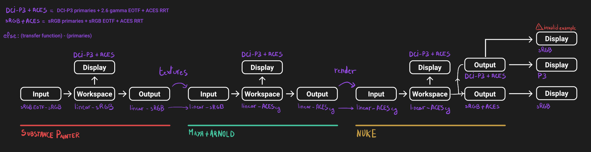
    </a>
    <figcaption>
    Example of a color-managed pipeline with various colorspace configuration used for each section.
    </figcaption>
</figure>

- I voluntarily chose different colorspace across departments and sections to
  accentuate potential transformations.

- It has been chosen to work with ACES for the color-management.

- Let's assume all the users working on this pipeline have access to the
  same display which is a DCI-P3 calibrated monitor.

!!! danger "Substance Painter"
    If we look at the Substance Painter department, we can see that our workspace
    is `linear - sRGB`. The artist decided to not bother working with `ACEScg`
    colorspace but instead is using `sRGB` primaries.
    This means that for the Display, the chain of color-transformation is the
    following :

    ```
    linear - sRGB > linear - ACES 2065-1 + ACES RRT > 2.6 gamma - DCI-P3
    ```

    <div class="sp-split">
        <figure class="align-center">
            <a href="sp-odt-p3.jpg">
            
            </a>
            <figcaption>Located at the top-right of the viewport</figcaption>
        </figure>
        <p>
        And all of these transformation are magically handled by the OCIO
        config, the artist only specify what display is he using by
        modifying the view-transform colorspace.
        </p>
    </div>

    We finally export the textures in the same Workspace colorspace.

!!! hint "Maya"

    Now we are in Maya. We need to apply the textures on the asset and the
    end goal is to create a render out of it.
    The Workspace is now `ACEScg` .
    This mean we need to convert our texture which are in sRGB to this
    colorspace. The Display is the same, only the source colorspace
    change, which is now ACEScg.
    Let's skip quickly to the last department.

!!! warning "Nuke"
    Nuke keep the same Workspace as Maya, as our Input render is already in ACEScg
    we don't need conversion. As this is the end of the pipeline we have a few
    more possibilities here for the Output. Here we want to also be able to
    see the composited render on an sRGB Display. As such this mean the
    Output needs to be encoded for an sRGB Display, we cannot use the Output
    encoded for a DCI-P3 Display.

You made it yay ! Color-science is a complex topic, so don't worry if you
don't get everything the first time. You will find additional resources to
continue your exploration at the end of this article.

Now, let's put into practice the theory ...


## Substance Setup & Workflow

<a href="sp-project-legacy.jpg">
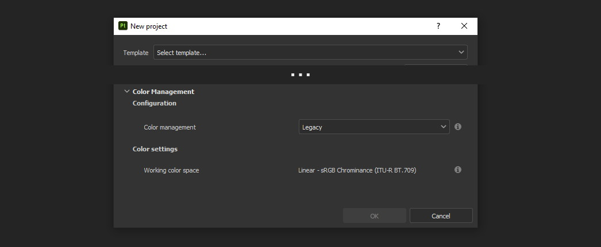
</a>

Color-management is not application-dependent but project-dependant.
As such, you will not find any options in the applications settings but in
project ones.

### New Project

The first occurrence of these new options can be found on the `New project`
window. You will find a `Color Management` sub-menu at the bottom.

<a href="sp-project-cm-options.jpg">
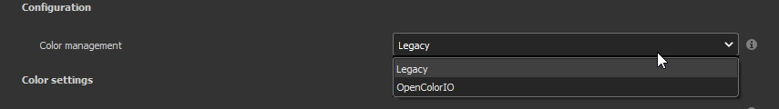
</a>

!!! note
    You can change all the color-management settings at any moment in
    the project settings. Keep in mind that big changes could break your
    project though.

You will be offered between two modes `Legacy` and `OpenColorIO`.
`Legacy` corresponds to the pre-release way sp was working with. We will
skip this mode as it is not useful anymore.

!!! note
    Even if you don't need to use any specific OCIO config, substance offer a
    default one for the sRGB workflow which made **the OCIO mode recommended
    to use.**

### OCIO config

<a href="sp-project-OCIO-01.jpg">

</a>

But wait, wait ... what is OCIO ? Why should I use it ?

[OCIO](https://opencolorio.readthedocs.io)
is a color-management solution developed originally by Sony Picture Imageworks
aiming at enforcing color-management consistency between DCCs.
I recommend [having a read at the documentation](https://opencolorio.readthedocs.io/en/latest/concepts/overview/overview.html).

OCIO itself only define standards of utilisation and give you the tools to work
but the core of the system is the **OCIO config** (a `.ocio` file).
This is where all the color-transforms and options are defined.
For example, ACES is a color-management system on his own but ship a version
through OCIO.

The main advantage is that OCIO is supported by most software (even if the
implementation wildly differs between each 😬 ) so you could get the same look
through all of your DCCs (in theory).

----

For our convenience sp already ships with 3 OCIO configs :

- Substance
- ACES 1.0.3
- ACES 1.2

You can find them in the sp installation folder like this one :

```
C:\Program Files\Allegorithmic\Adobe Substance 3D Painter\resources\ocio
```
Honestly, I don't know why did they include two ACES versions, only the last
one was needed, but it is awesome to have a default "Substance" config.

Lot of flexibility here. First option is to use the shipped configs.
In my opinion only the `Substance` config is interesting here.
The 2 ACES ones are the "default" dev configs with the hundred of
colorspaces you will never need. It is better to use a lightweight ACES
config like [the one from CAVE academy][]. 
(see [ACES Workflow](#aces-workflow) section)

The `Substance` config will be a good fit if you are using the traditional
sRGB linear workflow and do not wish to use an OCIO config in every DCC.
You will still have enough control to have a proper color-managed workflow.

Let's now see how you could load a custom OCIO config.

#### Custom config

<a href="sp-project-ocio-custom.jpg">
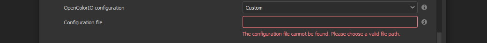
</a>

The first option is to use the `Custom` option and manually look for
the path to the `config.ocio` file on your disk.


!!! warning "Only a reference to the config path is saved in the project."
    When submitting a OCIO config through the `Custom` option, **the
    config is always loaded live from the disk**.
    This means if you share a substance project with
    someone that doesn't have the OCIO config at the exact same path, you will
    see this message pop up :

    <a href="sp-project-ocio-custom-error.jpg">
    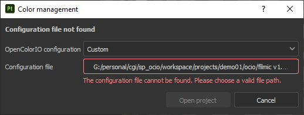
    </a>

See the bottom section [Substance parameters for OCIO configs](#substance-parameters-for-ocio-configs)
to continue the setup.

#### Environment variable

The above might be enough for individual artists but being in a pipeline
environment requires other ways to set OCIO automatically.

!!! note
    If the OCIO environment variable is present and has a valid configuration
    file it will take over to override and disable the UI settings.

On Windows you have 2 ways to set environment variables :

##### Global Settings

<a href="ocio-env-global.jpg">
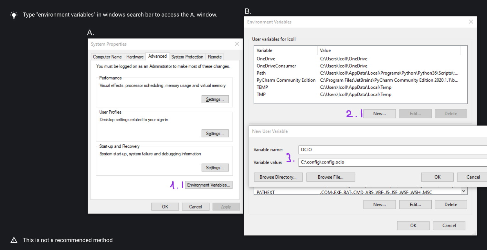
</a>

You create a new variable named OCIO with the path to the config.
This variable will be used by ALL software that can read it. (unless
overridden).

This is not a recommended solution as you pollute your environment variable + if you
decide to switch the config for another one all your previous project will be broken.

##### Set locally at startup

You defined the environment variable in a start-up script.
This is the cleanest way to do it but means you can't use the Windows shortcut
to start your software:

We use a `.bat` to configure and launch the software. Here is a basic `.bat`
that will set the OCIO variable and then launch sp.

```batch
set "OCIO=C:\aces_1.1\config.ocio"

start "" "C:\Program Files\Allegorithmic\Adobe Substance 3D Painter\Adobe Substance 3D Painter.exe"
```

!!! tip
    To create a `.bat` just create a new `.txt` file, paste the above code,
    modify it with the path to your config, save it, and then just replace
    the `.txt` with `.bat` in the file's name.

This means that to launch Substance you will have to always use this .bat.
No "double-clicking" on file to open them either.
You can have a look on internet at 
[how to pin a .bat to the taskbar](https://superuser.com/questions/656611/how-to-pin-a-batch-file-to-the-taskbar-quicklaunch/656649).

But this guarantees a very robust software configuration per project.

#### Substance parameters for OCIO configs

<figure class="align-center">
    <a href="sp-project-ocio-options.jpg">
    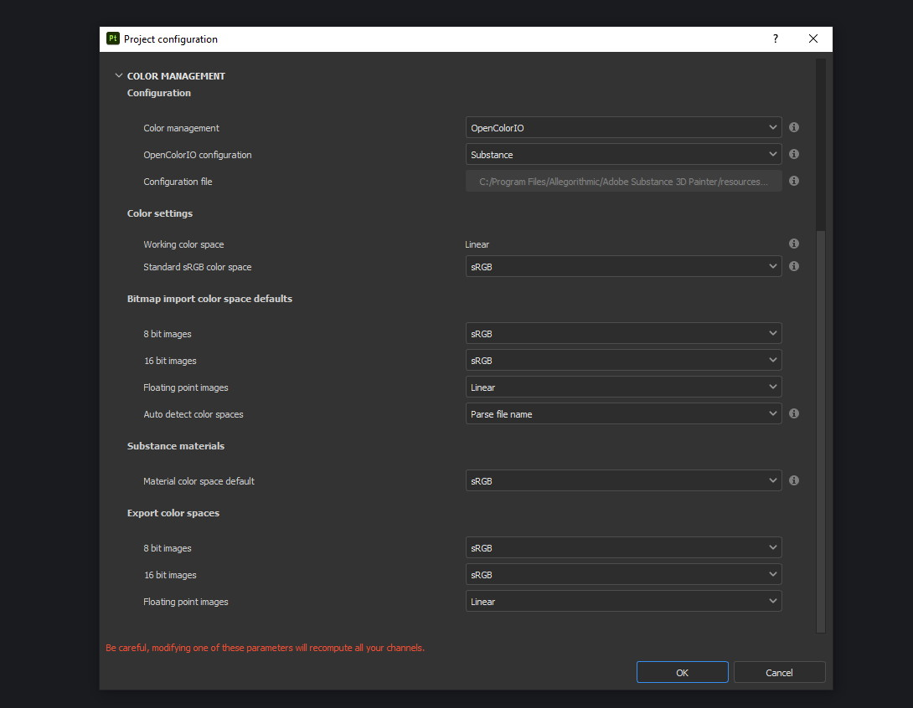
    </a>
    <figcaption>OCIO with Substance config default settings.</figcaption>
</figure>

It corresponds to all the sections below the color-management mode. It allows
to configure how inputs react with the OCIO config, i.e. which colorspace is
being assigned by default.

Usually, in other software, this section is configured using the 
[OCIO roles](https://opencolorio.readthedocs.io/en/latest/guides/authoring/overview.html#roles) 
defined in the OCIO configuration.
*But currently sp support only its own OCIO roles.*{.text-danger} Which mean
*you might have to manually setup this section*{.text-danger} to get a correct
result with the auto settings OR make sure the OCIO config you are using
have the OCIO roles supported by Sp.

If you look at the above image, this is how it is supposed to look when picking
the Substance config. As the Substance config have the supported OCIO roles
defined, the parameters are properly configured.

But if you are loading a custom config, make sure these options are properly
configured with the intended colorspaces for each format if you want all the
`auto` options to work properly. Most of them (except Export ones) can be
changed in context in last resort.

Visit the [ACES Workflow](#aces-workflow) section to find how this should be considered 
if you are using the ACES config.

----

Since 7.4.2 you can also find a new `Standard sRGB color space` parameter
which is a very nice add for having UI elements properly managed. If the name
doesn't look clear, it corresponds to the `sRGB - Display encoded`
colorspace. From the documentation, it is used :

- To convert color set in the hexadecimal field of the color picker.
- To save and load color swatches within the color picker.
- To be listed as a Display in the color picker list.

This update also adds support for specific OCIO role which are the following :

```
substance_3d_painter_bitmap_import_8bit
substance_3d_painter_bitmap_import_16bit
substance_3d_painter_bitmap_import_floating
substance_3d_painter_bitmap_export_8bit
substance_3d_painter_bitmap_export_16bit
substance_3d_painter_bitmap_export_floating
substance_3d_painter_substance_material
```
Check [the Substance's OCIO documentation](https://substance3d.adobe.com/documentation/spdoc/color-management-with-opencolorio-225969419.html#section3) 
for more details but make sure your OCIO config have these
fellas set with the corresponding colorspace if you want it to be properly read in Sp.

### New Project : Conclusion

Alright, to recap everything for a new project you need :

1. Change the color-management mode to OCIO
2. Choose the OCIO config (already chosen if env variable set)
3. Check the OCIO options to have the correct default colorspaces working.

And of course, setting the other parameters related to your texturing.

Now you are good to start the texturing workflow. The workflow will be
divided into the same sections explained in the theoretical part of this
article (see [Color-managed Workflow](#color-managed-workflow)).

### Workspace Setup in Sp

The Workspace, in software is actually an "abstract" section. It just
represents the colorspace used as a reference, target or source for every color
transformation. It is defined in the OCIO config and cannot be changed outside
of it.

!!! hint
    In the OCIO config it corresponds to the `scene_linear` role.

<figure class="align-center">
    <a href="sp-project-ocio-workspace.jpg">
    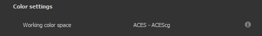
    </a>
    <figcaption>
    Visible in the Project's Color-management section (Using the ACES 1.2 OCIO config here)
    </figcaption>
</figure>

It is just good to know what is the colorspace being used here.

### Display Setup in Sp

<a href="sp-odt-default.jpg">
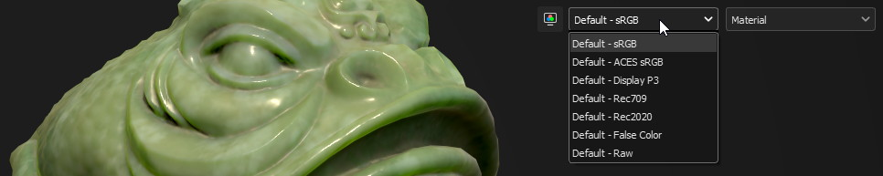
</a>

A good first step before working is to make sure the Display part is
properly configured so you don't start texturing while viewing the wrong
colors. This Display part can be configured using what we usually called a
`view-transform` menu. In sp, you can find it at the top-right of your
viewport.

What you have to remember is that *you need to choose the option
that corresponds to your display.*{.text-green} If your display is calibrated to the
Display P3 colorspace (Apple displays), choose the Display P3 option.

But what if I don't know what my display is calibrated to ?

> A safe choice would be to assume you are using an sRGB-like display.

I see some people using Rec.709 instead of sRGB, why ?
{#the-rec709-transfer-function-issue}

> sRGB and Rec.709 share the same primaries, so you can use both without
> seeing color-shift due to different primaries. What does change is the
> transfer function being used. But fasten your seat-belt, here comes the
> mess : Rec.709 only defined an OETF
> which is intended for camera signal encoding, not data display encoding !
> For display encoding with the Rec.709 colorspace, one should use the
> [BT.1886](https://www.itu.int/dms_pubrec/itu-r/rec/bt/R-REC-BT.1886-0-201103-I!!PDF-E.pdf)
> standard which can be resumed as a simple 2.4 power-function.
>
> So how to know which one of these two is being used ? Simple, if when
> compared to sRGB, the image looks darker, it's the OETF, if it's looking
> less contrasty, it's BT.1886.
>
> If you do the test, the Substance config use the OETF (which should not
> be used), while the ACES config uses BT.1886.

*[OETF]: opto-electrical transfer function
*[power-function]: usually incorrectly called "gamma"

You didn't answer my question !? I'm just more confused now !

> As written previously, you need to choose the option that corresponds to
> your display, so if your display is not calibrated to Rec.709+BT.1886
> don't use it. But some people like the look of it, being less contrasty,
> that's why it's being chosen. But the display should not be a creative
> choice. If you like a less contrasty look, you should apply it in the Look
> (see under).
>
> Just to add more confusion, the BT.1886 difference with sRGB can
> actually be used as a viewing environment compensation. So it can actually
> justify why using Rec709+BT.1886 instead of sRGB.

Anyways, I'm going too far from the subject, and someone already
wrote about this topic, I let you read this mind-blowing article from
Chris Brejon [OCIO, Display Transforms and Misconceptions](https://chrisbrejon.com/articles/ocio-display-transforms-and-misconceptions/).

#### Displaying Color and Scalar data

Sp will handle it for you automatically, depending on the channel you
are previewing.

[The full list of color-managed channels is available here.](https://substance3d.adobe.com/documentation/spdoc/color-management-223053233.html#section5)

For example, selecting the Roughness channel for preview will disable the
view-transform :

<a href="sp-odt-off.jpg">

</a>

#### Custom User Channels

If you are using a custom `User` channel, you will have to manually
specify if the channel is color-managed. (By default they are not)
This is achieved by clicking on the gear icon > `Color channel`.

!!! warning
    As of today (8.2.0), user channel are buggued in the interface
    (color-picker + color thumbnail, viewport is fine).

    I describe the issue and provide a workaround in this 
    [post on the Adobeforum.](https://community.adobe.com/t5/substance-3d-painter-bugs/color-managed-user-channel-are-not-considered-as-such-by-the-interface/idi-p/13546584#M420)

### Input Setup in Sp

Texturing is all about mixing already existing images, with some carefully
crafted paint stroke, and funky procedural resources. All of these, if they
are color-data, have been created and saved with a specific colorspace.
We will need to know and then specify this colorspace to sp so the OCIO
processor can know if it needs conversion to the Workspace colorspace.

#### Shelf Resources

In Sp this manipulation takes place, weirdly, on the images slots of each
layer. You will not find any option to specify the colorspace in the shelf.

<div class="split-50-50">
    <figure class="align-center">
    <a href="sp-in-bobross-7.4.2.jpg">
    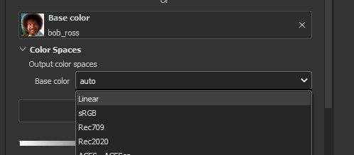
    </a>
    <figcaption>Updated menu design on versions 7.4.2 +</figcaption>
    </figure>
    <figure class="align-center">
    <a href="sp-in-menudisplay.jpg">
    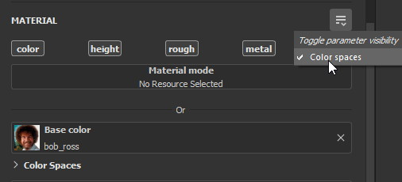
    </a>
    <figcaption>If the menu is not visible, you can toggle it just above.</figcaption>
    </figure>
</div>

By default, it is set to `auto`, which will use the settings specified in
the project color-management menu explained above.
([Substance parameters for OCIO configs](#substance-parameters-for-ocio-configs)).

I recommend always modifying this option to the proper colorspace to be sure
the resource is properly color-managed.

Another option is to have the source colorspace specified in the file name.
That's in my opinion a bit messy because the colorspace has to be the exact
name used in the config. If 2 configs used a different name, your image will
only work for one. If I take for example a colorspace name used in the ACES
config this could give: `bricks_wall_albedo_Utility - Linear - sRGB.exr` (which also means
the filename include whitespaces which are to avoid).

#### The color-picker

!!! note
    7.4.2 update changed the behavior of the color-picker with huge
    improvements :

    - Swapped working and display space for the widgets, the `eds` is now
      expressed in the display space specified by the `tcd` and you can
      have a look at the working colorspace value just under.

    - Color-picker behavior is more consistent overall .

    - You will also notice that the `tcd` disapear when picking color in a
      scalar channel/role (which is logic).

    The following section has been updated to reflect the change and **will
    not be valid for version under 7.4.2**

<div class="sp-split" markdown="1">
<a href="sp-colorpicker.jpg">
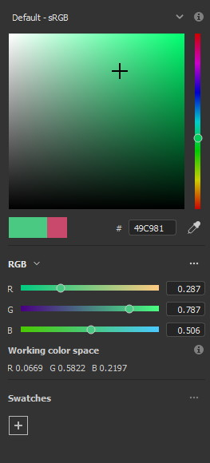
</a>
<div markdown="1">
As used as feared by artists. It never reacts how the artist wants
and looks to be made out of dark magic (at least in Mari 🙃 ).
Did the sp implementation bring any good news ? Let's see.

Abbreviations used:

- `tcd` : top colorspace dropdown
- `eds` : editable sliders, where you can manually enter your color
    components.

A good feature is the little info icon, giving explicit
info on how the widget works. If we have a look at the info message
next to the `tcd` we can read :

> Color mixing space, this is the space in which a color is edited
> before being converted into the working color space. It usually
> matches the monitor to be easily viewed.

Which means the values in the `eds` are in the colorspace
specified by the `tcd`, then they are converted to the working
colorspace. (you can check the result of this conversion just under.)

This is a valid workflow, which allow you to get the same color seen
in the UI on the final textures.
</div>
</div>

But keep in mind that you have to be careful on the color
you are chosing, the fact that it looks as you want (perceptual)
doesn't mean the scene-refered values (working colorspace) have a
physically plausible value. For exemple, in an ACES workflow you might want
to make sure that no channel's value goes up to 1.0, which mean you are
reaching the boundary of the ACEScg gamut which is comparable to a laser's
color.


!!! note
    Ideally the `tcd` and the view-transform should use the same
    colorspace. This is especially true if you are using the actual picker.
    Unless you need to enter specific value you already know
    which colorspae they are encoded in.

    Luckily, this is already done automatically. Change the
    view-transform and you will see the `tcd` update to reflect the change !

What about the actual picker ?
{#picker}

> The picker will pick the value at display, so with the view-transform
> applied (if not disabled). Consider this as the input, and will convert
> from the `tcd` colorspace to the working colorspace. You then get
> back "nearly" the same value (with some math precisions issue ).
>
> What I recommend though, is to change the view-transform to a
> "no-operation" colorspace (usually called `raw`), pick the color, and
> re-apply the previous view-transform. This will avoid the
> potential colorspace invertibility and imprecisions issues.
> 
> <figure class="align-center">
> <a href="sp-colorpicker-picker.gif">
> 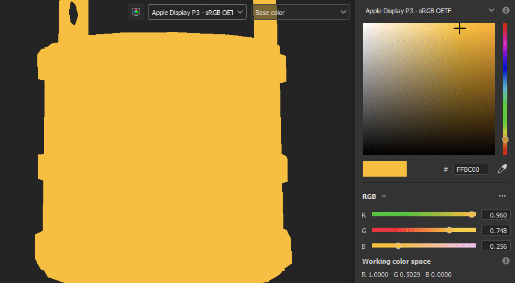
> </a>
> <figcaption>Using Filmic config, original value is RGB(1,0.5,0).</figcaption>
> </figure>


!!! note
    The color-picker is unfortunately clamped between the 0-1 range, which is
    at the same time ok because for texturing you usually want to avoid
    values to goes outside this range, but also means color-picking operation
    are clamped which create inconsistency for some of them yielding result
    above 1.

!!! warning
    Sometimes, when switching colorspaces in the `tcd`, some UI elements
    like the  `eds` will not update and you might have to move the sliders
    slightly to force an update.

!!! note "Hexadecimal"
    If you need to enter hexadecimal values, the field will assume they are
    `sRGB-Display` encoded and use the `Standard sRGB color space` defined
    in the config to convert it to the working color-space.
    (Field that seems to be bugged, I can't edit it, only copy/paste
    value inside).

!!! warning "OCIO v2 issue"
    Seems the OCIO v2 feature called "shared views" is not supported properly
    by the color-picker. If you use a "colorspace" (actually a `display
    view`) which make use of a shared view (using `<Views>`), the widget
    displaying the working colorspace values will disapear.

!!! note "Swatches"
    You can save colors as swatches for easier re-use. Quoting from the
    [swatches documentation](https://substance3d.adobe.com/documentation/spdoc/color-picker-220857079.html#section7):

    > Swatch color are managed and saved as sRGB colors, whatever the current
    > color management configuration is set to.

    The steps are as follow :

    - `saving` : `working colorspace` converted to `sRGB standard
      colorspace` then converted to hexadecimal.
    - `importing` : `sRGB standard colorspace` converted to `working colorspace`

    No matter how the `tcd` is set this is how it works EXCEPT if the `tcd`
    is set to a scalar colorspace (`isdata=true` in the config). In that case
    and as expected the swatch is imported without conversion so straight
    hexadecimal to RGB values (which doesn't looks like the original color of
    course.)


<figure class="align-center">
<a href="sp-colorpicker-infograph.jpg">
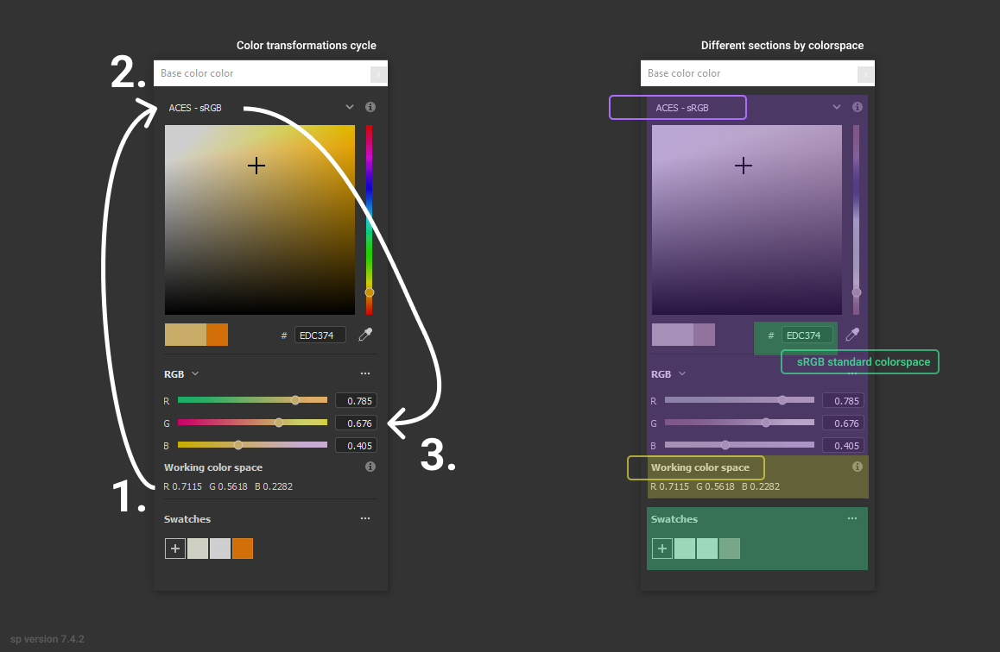
</a>
<figcaption>Small infographic to resume colorspace transformations.</figcaption>
</figure>

So I must say that the latest update have greatly improved the color-picking
experience which behave a bit more as you would except. Cool stuff !
Looking forward to next updates to reach the perfect color-picking
experience haha.

#### Environment

*There is no direct option to modify the environment image colorspace.*{.strikethrough}

From 7.4.2 + you can find an option in the `Display Settings` Menu, to change
the environment colorspace being used.

For the other versions you still have the following options:

- Modify the default `Linear` colorspace in the project settings. The
  environments maps will use it.

- Include the source colorspace in the name of the HDRI. It has to be the
  **exact same name** as defined in the config. Example :
  `myhdri_ACES - ACEScg.exr` (you can find an example in [ACES - Environment](#aces---environment)).

!!! note
    The pre-integrated HDRIs are encoded with a `linear - sRGB`-like colorspace.

#### Masks

When you right-click on a mask you have the option to `Export mask as File`.
Don't worry, mask seems to always be considered as scalar and exported
without any treatment.

### Output Setup in Sp

The Export Textures window didn't got much new. We doesn't have any options
to apply a color-transformation at export time in the Window. The only options
are the one available into the project settings.

<a href="sp-project-export.jpg">
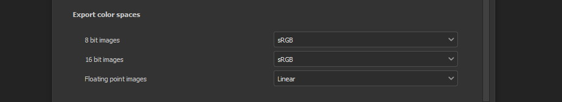
</a>

Basically, integer format should be sRGB display encoded. Floating point format
should use the same working colorspace.

What's new though is the `$colorspace` token in the Output Templates tab.

<a href="sp-export-template.jpg">
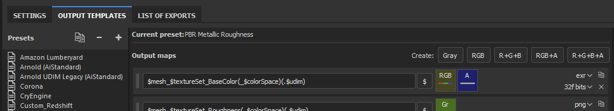
</a>

Which is simply replaced by the colorspace defined in the project settings.
(You can have a preview of the file name in the `LIST OF EXPORT` tab).

I'm personaly not fan of this option as this might introduce special characters
in the file's name, depending on how the colorspace is named. It is, I think,
a better option to have the texture name without the colorspace, but exported
in a directory with the colorspace name.

For scalar channels, sp will not apply any color-transformation
and consider them using the colorspace `raw` (no matter the config).
Interstingly, this colorspace `raw` doesn't get written into the
`$colorspace` token as it should. *(fixed in 7.4.1)*

## ACES Workflow

I'm not going to get into the what and the why, only the how. Let's keep the
rest for a next (potential) article ?

### ACES - Config setup

You could use the one shipped with Substance but I wouldn't recommend so.
They are the ones with the hundred colorspaces that will just slow you down
when you need to choose one.

Instead, it would be smarter to use a config with only what you need like
[the one from CAVE academy][].

Then you will need to configure the default colorspaces. Using the Cave config
(which have the same nomenclature as the official ACES ones) here is what I
recommend :

<a href="sp-aces-project.jpg">
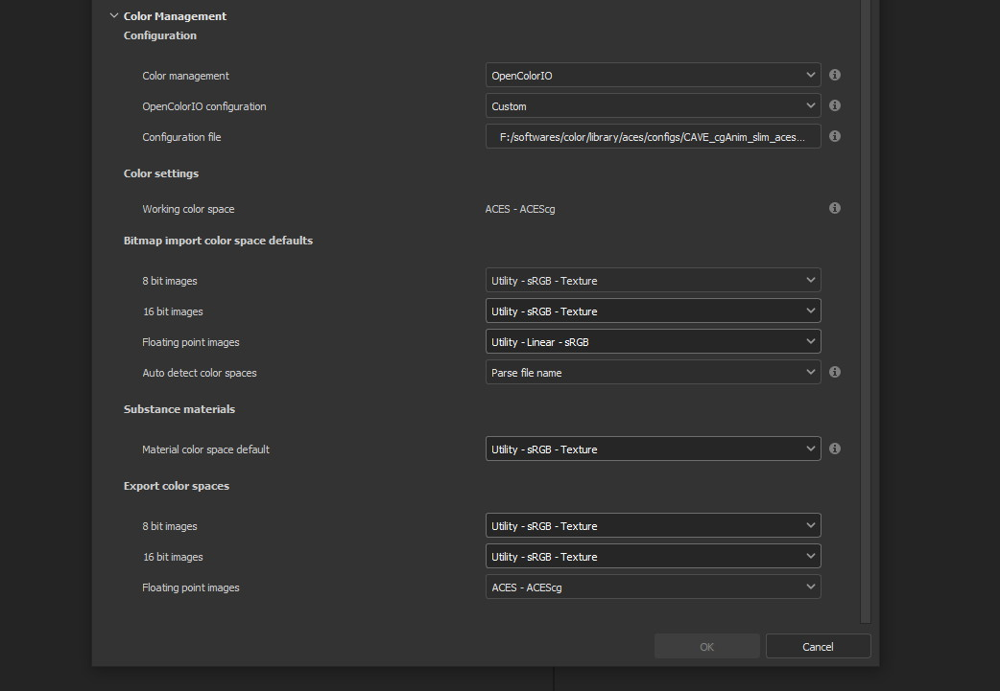
</a>

Import settings are the usual stuff, most of the 8bit texture, if not all
are sRGB display encoded files so `Utility - sRGB - Texture` correspond.
Floating point images like EXRs should always be linear so the alternative
version `Utility - Linear - sRGB` is the right choice. Remember these options
are just applied by default (with the `auto` colorspace) but can be
changed anytime.

I choose `Utility - sRGB - Texture` for `Substance materials` because
it seems the output is always sRGB display encoded as the screenshot under
show. (colorspace options can be modified on the material anyway).

<figure class="align-center" markdown="1">
<a href="sp-mat-colorspace.jpg">
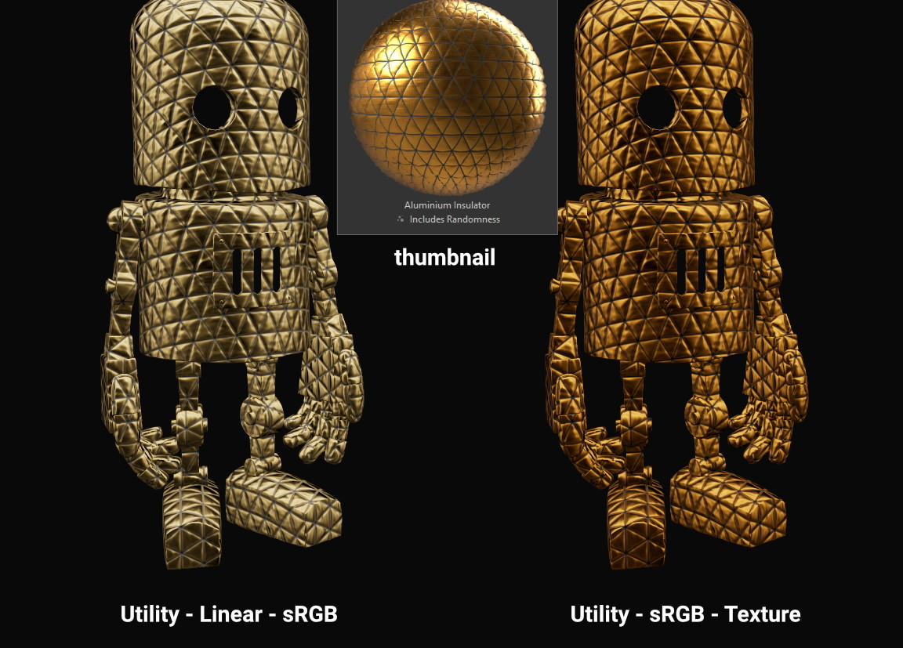
</a>
<figcaption markdown="1">Model by [Emmanuel-Xuân Dubois][]</figcaption>
</figure>

Now for the output my choice is not the only option. To me, you shouldn't
export ACEScg 8bit files, that why I re-encode them back to sRGB by using
`Utility - sRGB - Texture`. The right option is to export EXRs (floating
point images) in the same working colorspace: ACEScg. And don't worry for
scalar channel they will be handled automatically at export. These options
are the only ones that can't be modified per-case though; this is the only
place you can change them.

### ACES - What to do when working

I'm only going to give detailed explanations when something is specific to
ACES. Meanwhile the explanations given in [Substance Setup & Workflow](#substance-setup--workflow) still
apply so make sure you properly understood this section.

#### ACES - Display

Not much new, use the view-transform that correspond to the display you are
using. (In my case `ACES - sRGB`, that behind the scene, uses `Output -
sRGB`)


#### ACES - Inputs

For every external resource you import, you need to assign the correct
input colorspace if the automatic one doesn't correspond. The usual rules
for the ACES workflow apply.

<a href="diagram-aces-idt.jpg">
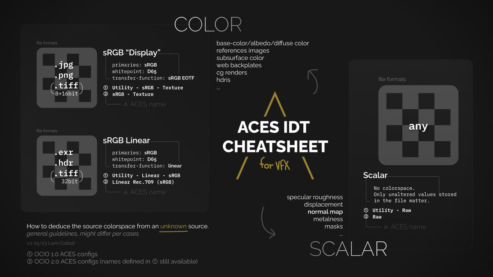
</a>

##### ACES - Environment

*There is unfortunately no direct options to change environment's
colorspace.*{.strikethrough}

From 7.4.2+ you can find an option in the `Display Settings` Menu, to change
the environment colorspace being used.

Environment follow default colorspace rules. Being floating point image
, they will use the pre-defined `Utility - Linear - sRGB` colorspace.
So as long as they are `sRGB - linear`-like encoded, they will be properly
displayed.

If that not the case you can use the mentioned override option, but
in the case you are using an older version here is my previous solution :

But what if I want to import an already converted ACEScg HDRI ?

> There is a way to have it working. You can specify the colorspace in the
> file name. The colorspace has to be **the exact same name** as the one
> defined in the config. An example would be: `myhdri_ACES - ACEScg.exr`.
>
> Left one is sRGB encoded, middle and right ACEScg encoded. Right one
> doesn't get properly converted and looks shifted.
>
> <figure class="align-center" markdown="1">
> <a href="sp-aces-hdri-comparison.jpg">
> 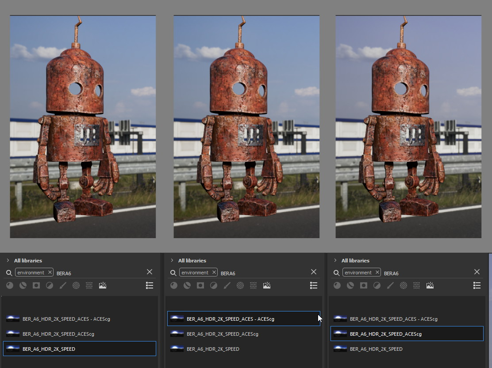
> </a>
> <figcaption markdown="1">Model and texturing by [Emmanuel-Xuân Dubois][]</figcaption>
> </figure>


#### ACES - Colorpicker

!!! note
    The screenshots in this section have not been updated to reflect change
    in the 7.4.2 update. Explanations still apply.

Everything in [The color-picker](#the-color-picker) section applies here. You can just except
more odd behavior as a wider-gamut and more complex view-transform will not
play well with it. The first potential issue that came to my mind is the
combinaison of 0-1 clamping + ACES ODT : If you are picking a pure value of
RGB(1,1,1) considered encoded as `Output - sRGB`, you would usually get back
a scene-referred value of RGB(16.2,16.2,16.2). But the color-picker is
clamped between the 0-1 range so you will end up with just RGB(1,1,1).

Then consider the following example :

<figure class="align-center" markdown="1">
<a href="sp-aces-colorpicker.jpg">
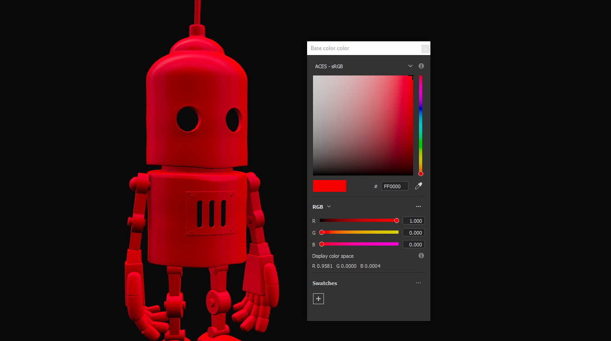
</a>
<figcaption markdown="1">Model by [Emmanuel-Xuân Dubois][]</figcaption>
</figure>

I have an ACEScg value of (1,0,0) which is damn too saturated
and no object except laser are that saturated.

!!! warning
    This mean you have to be careful
    when picking values, and always keep a look at the scene-refered ACEScg
    values.

What if I want to apply a color we gave me as hexadecimal ?

> Consider my brand's green picked from <https://coolors.co>.
>
> <a href="sp-aces-colorpicker-hex.jpg">
> 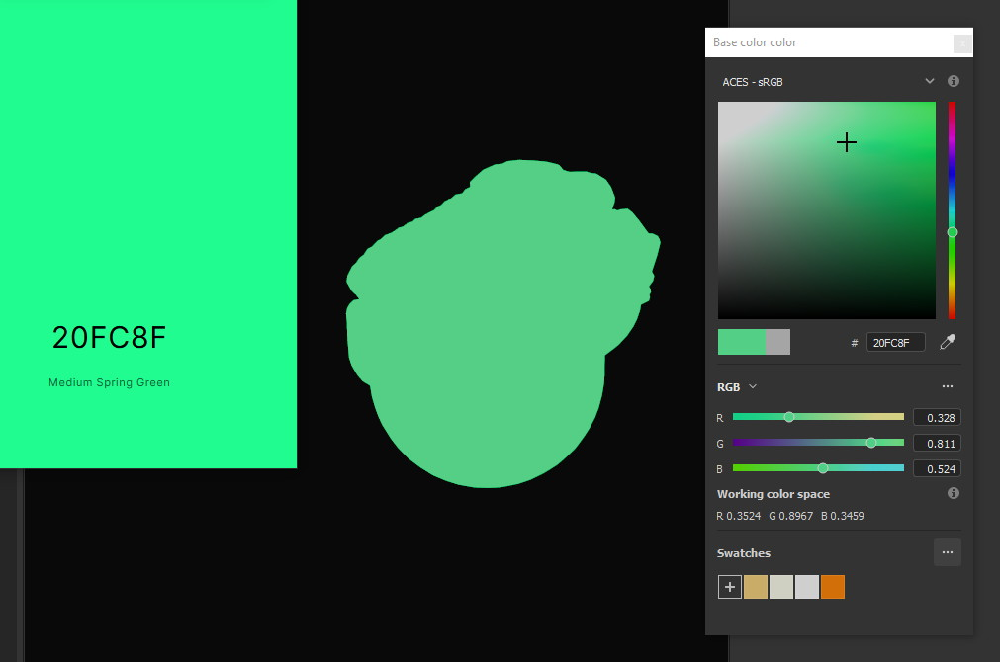
> </a>
>
> Well ... the less brain-damaging solution would be to just eyeball the
> color.
>
> Luckily, the 7.4.2 update made thing easier for us. The hexadecimal color
> will assume to be encoded in the `sRGB standard colorspace` and converted
> to the working colorspace. So just copy/paste your color in the hexadecimal
> field and you should have your color converted.
>
> Even with this, you might notice that the color is still not similar to
> the sRGB one. This is normal and inherent to the ACES ODT which apply a
> "creative" and "technical" transformation on display.
>
> So keep this in mind: *you will never be able to match the look
> of the sRGB workflow with the ACES workflow.*{.text-green} (unless cheating).
>
> I'm not going to dive into further explanations as there is 
> [enough ACES central threads](https://community.acescentral.com/t/preserving-logos-and-graphics-in-aces/2861)
> on this subject and Chris
> [is also explaining it here](https://chrisbrejon.com/cg-cinematography/chapter-1-5-academy-color-encoding-system-aces/#inverted-odt-workflow).

#### ACES - Output

Do yourself a favour here and only care about EXR. 
[You don't need anything else](https://skientia.co/cgi/image-formats) 
and this is the file format recommended by the Academy for ACES data encoding.

If you choose EXR, you have nothing to care about. Color channel will be
exported in `ACEScg` while scalar channel will bypass any
color-transform encoding. Simple as that.

<figure class="align-center">
<a href="sp-aces-export.jpg">
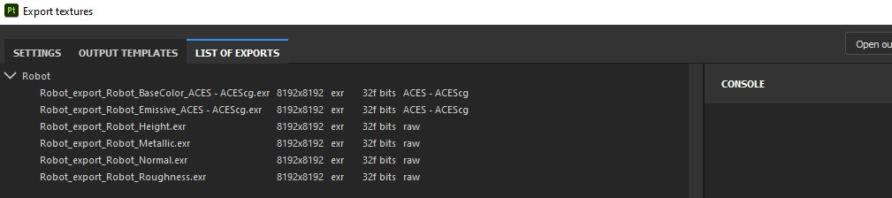
</a>
<figcaption>You can check the LIST OF EXPORTS tab to see how it's going to be exported.</figcaption>
</figure>

Reminder that you can choose to remove the `$colorspace` token in your
export template map name to avoid unwanted special characters in your file
name. (and instead export the textures in a folder named ACEScg)

## OCIO Implementation Issues

!!! note
    The goal here is not to denigrate the dev team's works but rather to offer
    explanations and solutions for improving the software.

    The team actually did a fantastic job in the latest updates by adressing some of
    the issues I mentionned !

### Display Issues

These explanations were made possible thanks to the Chris Brejon's article
[OCIO, Display Transforms and Misconceptions](https://chrisbrejon.com/articles/ocio-display-transforms-and-misconceptions/).

#### Display components mismatch

OCIO divide the Display section into 3 components :

- `Display` : the physical hardware you are using (monitor, TV, phone, ...).
- `View` : a way to encode the data for a specific viewing purpose.
- `Look` : a creative layer of modification on the data. ex: a grade.

Why do I explain you this ? Because these components are often mismatched
or forgotten. Unfortunately, Substance makes no exception here.

<a href="sp-odt-default.jpg">

</a>

If you look at the view-transform screenshot above, you can see that each
option has the `Default` prefix.
If we have a look at the `config.ocio` file from the Substance config,
we can see why :

<a href="config-substance-displays.jpg">
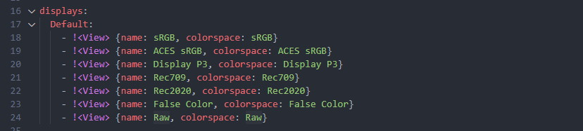
</a>

What should be a `display` or a separate `view` is actually all merged
into a single `view` component !

Here is how it should look:
{#substance-config-displays-fixed}

```yaml
displays:
  sRGB:
    - !<View> {name: Display, colorspace: sRGB}
    - !<View> {name: ACES, colorspace: ACES sRGB}
    - !<View> {name: False Color, colorspace: False Color}
    - !<View> {name: Raw, colorspace: Raw}
  Display P3:
    - !<View> {name: Display, colorspace: Display P3}
    - !<View> {name: False Color, colorspace: False Color}
    - !<View> {name: Raw, colorspace: Raw}
  Rec709 :
    - !<View> {name: Display, colorspace: Rec709}
    - !<View> {name: False Color, colorspace: False Color}
    - !<View> {name: Raw, colorspace: Raw}
  Rec2020 :
    - !<View> {name: Display, colorspace: Rec2020}
    - !<View> {name: False Color, colorspace: False Color}
    - !<View> {name: Raw, colorspace: Raw}
```

Here is the result of the above in Substance Painter :

<a href="config-substance-fixed-sp.jpg">
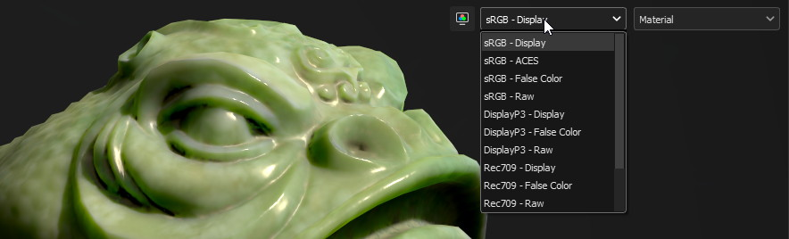
</a>

Using OCIO v2 there are other ways to improve how the config is built.
Heads up to [Improving the Substance OCIO config](#improving-the-substance-ocio-config) 
to see how.

But even with this fix, it's not very friendly to have a long list of merged
(display + view) while you would only need one Display most of the time. **The
best solution here would be to have 2 dropdowns** :
One to choose the Display, and one to choose the corresponding available View.
We should even get a third one for looks as we are going to see in the next
section :

#### Partial Look support

In above explanations where I mention OCIO Display is build with
3 components, we now see that I didn't mention the last one yet: Looks.

Looks is a color-tansformation performed in any colorspace aimed at
modifying the data in a creative way. This would allow for example the
artist to have a first look at how its renders could look like after the
DI pass.

*[DI]: Digital Intermediate process (= grading process)

Usually, Looks are defined similar to colorspaces, as a list, but you can also
make a Look available in a display's view:

```yaml
displays:
    sRGB:
        - !<View> {name: Display, colorspace: sRGB-Display}
        - !<View> {name: Display Grade A, colorspace: sRGB-Display, looks: gradeA}

looks:
- !<Look>
  name: gradeA
  process_space: rclg16
  transform: !<FileTransform> {src: look_A.cc, interpolation: linear}
```

In the best case, we should have a dropdown menu that would allow us to combine
the current `view-transform` with any Look defined. A good example of this
is Blender :

<figure class="align-center">
<a href="blender-cm.jpg">
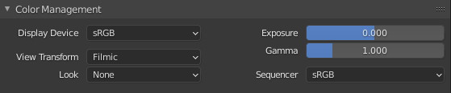
</a>
<figcaption>Notice how it respects the 3 components of an OCIO display.</figcaption>
</figure>

Unfortunately, sp didn't implement this feature yet. So we can only rely
on merging the look in a display view for now.

A good way to test this is using the [Filmic](https://github.com/sobotka/filmic-blender) 
OCIO config by Troy Sobotka.
The filmic encoding is correctly available in a `View` but require an
extra step to be correctly displayed. By default, it is a flat log
representation, and require choosing a Look with the desired contrast amount.

To have it working in sp, it is required to merge the Look in a new `View`.

```yaml
displays:
    sRGB:
        - !<View> {name: sRGB OETF, colorspace: sRGB OETF}
        ...
        - !<View> {name: Filmic Very High Contrast, colorspace: Filmic Log Encoding, look: +Very High Contrast}
        ...
```

Which in sp, if we kept all the contrast amount, give us a very long list of
cropped name 😬 But at least it's working.
{#sp-odt-name-cropped}

<a href="sp-odt-filmic.jpg">
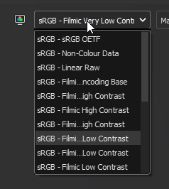
</a>

### Improving the Substance OCIO config

The Substance OCIO config is an OCIO v1 configuration. I don't know
what is the reason they decided to not use the v2 for their config because
it could really helped having a cleaner and better config (even if the artist
wouldn't see that much of a difference).

By curiosity I tried to put my hand on OCIO v2 and create a config that could
be a substitution of the Substance config. Documentation was pretty straight
forward and I manage to build a nice config using python. You can find the
result here :

.. url-preview:: https://github.com/MrLixm/OCIO.Liam
    :title: OCIO.Liam
    :image: https://repository-images.githubusercontent.com/433153908/03fa53a5-a654-4728-a5ed-60ab1ac6babd

    Personal OCIO resources, including configs.

I called it `Versatile`. It only misses the `false color` view from the
Substance config. Have a look at the
[config.ocio](https://github.com/MrLixm/OCIO.Liam/blob/main/versatile/config/config.ocio)
file to see the new features.

### Issues Recap

This list aim at helping the potential Substance dev team members reading
this, addressing the issues.
*Keep in mind that this is my personal opinion, i'm not a color-scientist
nor a profesional developer.*

- Substance OCIO config:
    - uses the wrong Rec.709 display encoding. (see [the rec709 transfer-function issue](#the-rec709-transfer-function-issue))
    - miss simple P3 colorspaces while it offers a Rec2020 one (who would use it ??)
    - `displays` key is not properly built. (see [substance-config-displays-fixed](#substance-config-displays-fixed) )

    - could overall, benefits from using OCIO v2 features.

- *OCIO roles are not supported, as such default configuration for
  projects is wrong and can confuse artists.*{.strikethrough}
  (implemented on 7.4.2 !)(see [Substance parameters for OCIO configs](#substance-parameters-for-ocio-configs))

- The view-transform dropdown is too small in width. When selecting long
  `display` names, they got cropped (see [sp-odt-name-cropped](#sp-odt-name-cropped)).

- The view-transform dropdown could be split into 2 dropdowns. One for
  Displays and one for Views.
  (see [substance-config-displays-fixed](#substance-config-displays-fixed))

- Colorspace on resources (images, ...) should be performable from the shelf
  and not from a layer's slot. A resource doesn't have its original
  colorspace changing depending on where it's used !

- *There is no direct option to change the environment image colorspace.
  Having the above suggestion implemented would solve this one too.*{.strikethrough}
  (implemented on 7.4.2 !)(see [Environment](#environment) )

- *Color-picker : modifying the top colorspace should affect the
  editable values. Where the top colorspace represents the colorspace used
  to enter values so they can be converted to the working colorspace
  behind the scene.*{.strikethrough} (implemented on 7.4.2 !)

- *With the above, add a way to see what values are being used in the workspace.*
  {.strikethrough} (implemented on 7.4.2 !)

- Color-picker is broken. It reacts differently depending on the OCIO
  config version used.
  (see [picker](#the-color-picker) section for details).
  Update: it is less broken in 7.4.2 but there is still no some issues.

- No options to set a specific colorspace for textures at export time.

- When use the following OCIO v2 colorspace name token, an error is logged:
  ```
  [ColorManagement] Error while creating OpenColorIO colorspace transform: Color space '<USE_DISPLAY_NAME>' could not be found
  ```
  But displays still manage to work without issues.
  EDIT: This actually affect the color-picker who doesn't seems to supports
  shared-views.

- custom user channels doesn't behave as color-managed in the interface 
  (see [Custom User Channels](#custom-user-channels))

## Conclusion

Damn that was a long one. Congrats if you stick to the end, I hope you
now have an idea of how you could use OCIO in SubstancePainter. If not,
don't hesitate to [contact](/contact) me to suggest how this
article could be improved. (you can also join the discord, click on the purple
button at the bottom of this page)

If you like this post and wish to support me you could buy some of my
scripts on [my Gumroad](https://app.gumroad.com/pyco) or check my ko-fi at
the bottom of this page.

*I see you in the next one that would probably be on the same topic but on
Mari 👋*{.strikethrough} (2025 and still not there 💀)

## Resources

.. url-preview:: https://hg2dc.com/
    :title: The Hitchhiker's Guide to Digital Colour
    :image: https://hg2dc.files.wordpress.com/2019/12/hg2dc-header-1.png

    The step by step guidebook for digital pixel pushers trying to get a firm
    grasp on colour to get sh*t done…

.. url-preview:: https://chrisbrejon.com/cg-cinematography/chapter-1-color-management
    :title: Chris Brejon's Book
    :image: https://i0.wp.com/news.umbc.edu/wp-content/uploads/2016/02/mantis-shrimp.jpg?resize=1920%2C768&ssl=1

    CG Cinematography Color Management is about this beautiful yet annoying
    and essential topic of gamut. Definitely not the easiest way to start.


.. url-preview:: https://community.acescentral.com/
    :title: ACES Central
    :image: https://community.acescentral.com/uploads/default/original/2X/c/cd5dcf316e1618c7bff0c0e4bd3b01825010b554.png

    ACES Community Forum

.. url-preview:: https://cinematiccolor.org/
    :title: Cinematic Color
    :image: https://pbs.twimg.com/profile_banners/75077867/1516422798/1080x360

    This paper from 2012 presents an introduction to the color pipelines
    behind modern feature-film visual-effects and animation.

## Changelog

- `17-12-2021`: fixed [The color-picker](#the-color-picker) section. 
  [Discussion available here](https://community.acescentral.com/t/aces-and-substance-painter/2299/42)

- `09-03-2022`: Updated article following 7.4.2 update.
    - [Substance parameters for OCIO configs](#substance-parameters-for-ocio-configs) : updated
    - [The color-picker](#the-color-picker) : whole section re-wrote
    - [Environment](#environment) : updated
    - [ACES - Colorpicker](#aces---colorpicker) : updated
    - [Issues Recap](#issues-recap) : updated

- `01-02-2023`: added precision for custom user channels
    - [Custom User Channels](#custom-user-channels) : section created