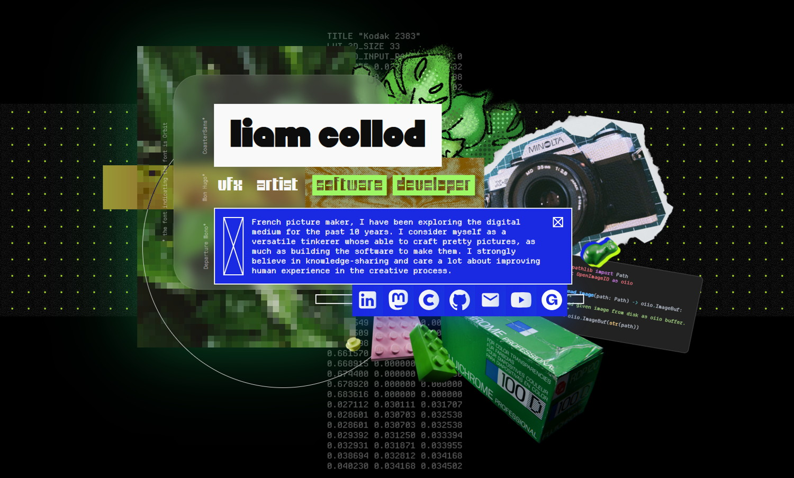
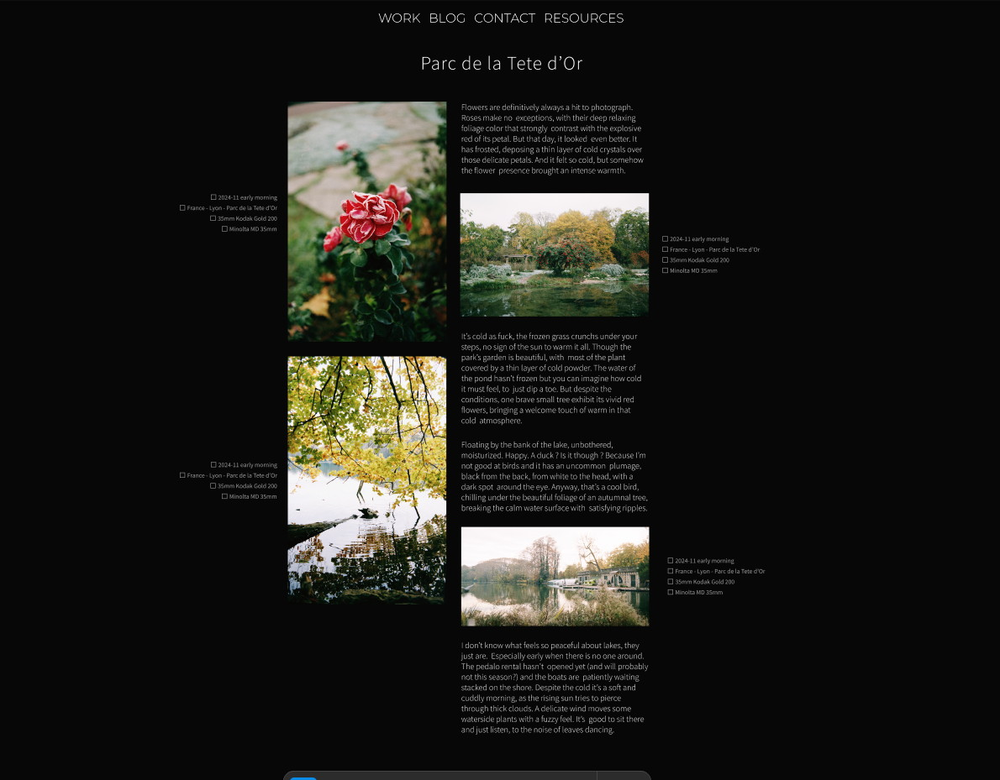
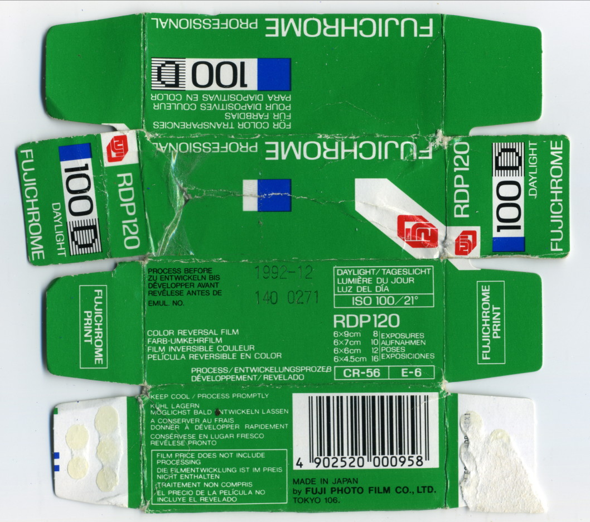
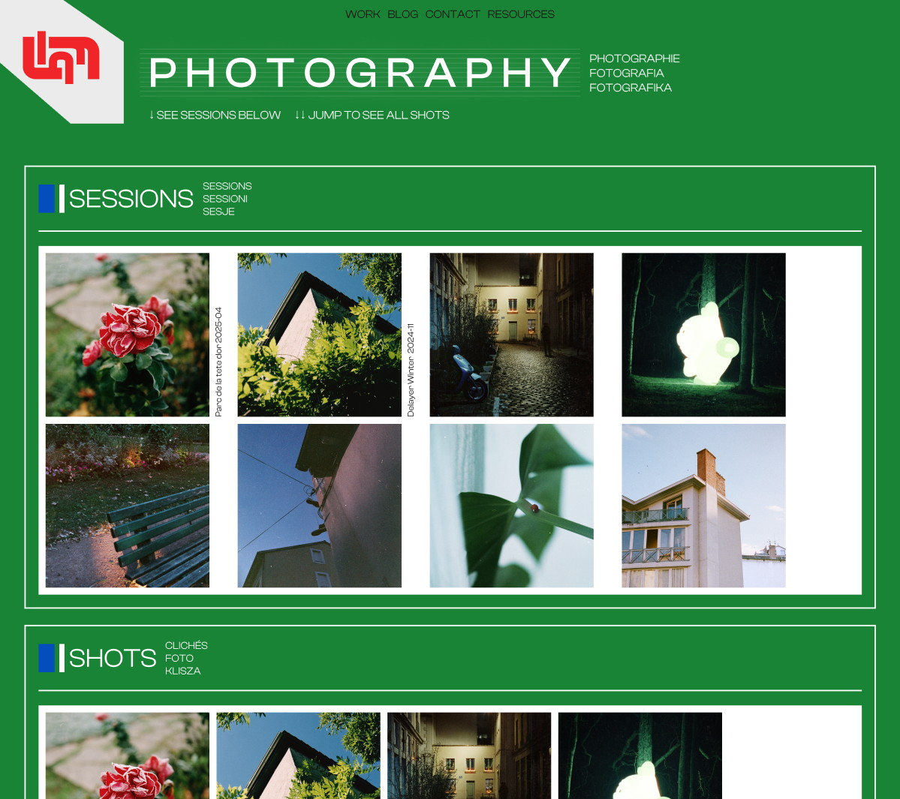
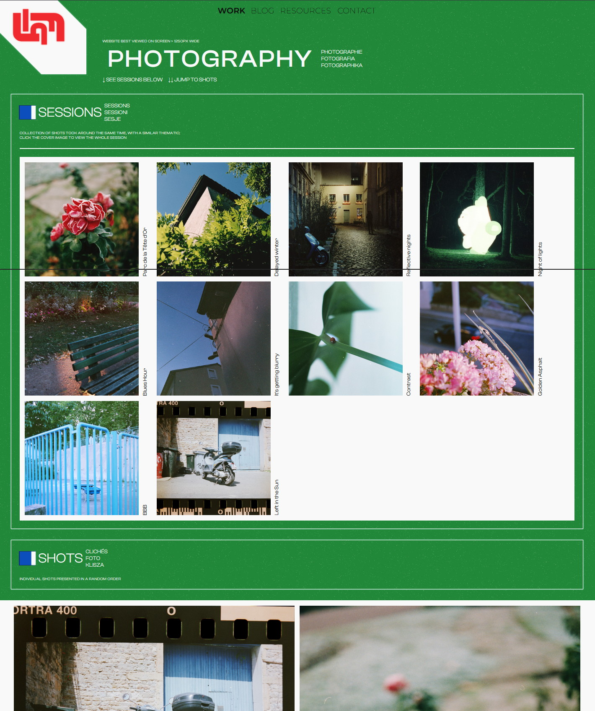
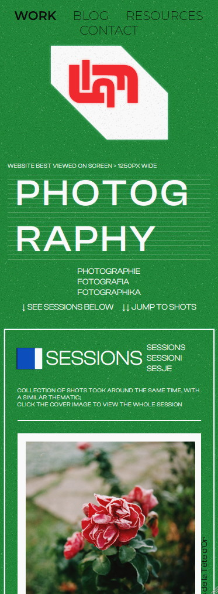
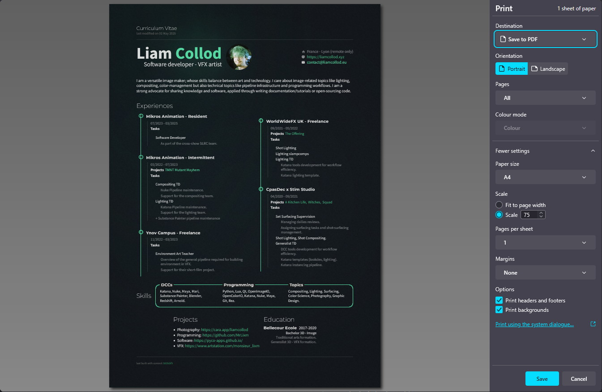

# Renovating this website (2025)

:description: New year, new (http) me.
:image: screenshot-new-index.jpg
:date-created: 2025-06-06T19:12
:date-modified: 2025-07-03T21:10
:category: meta
:tags: web-design, gafam
:authors: Liam Collod
:stylesheets: +website-redesign-2025.css,
    ../../.static/fonts/0xA000/0xA000.css,
    ../../.static/fonts/Barlow-Elastic/Barlow-Elastic.css,
    ../../.static/fonts/BBBManifontGrotesk/BBBManifontGrotesk.css,
    ../../.static/fonts/ClashDisplay/ClashDisplay.css,
    ../../.static/fonts/CoasterSans/CoasterSans.css,
    ../../.static/fonts/DepartureMono/DepartureMono.css,
    ../../.static/fonts/Escabeau/Escabeau.css,
    ../../.static/fonts/FerriteCoreDX/FerriteCoreDX.css,
    ../../.static/fonts/FT88/FT88.css,
    ../../.static/fonts/Georama/Georama.css,
    ../../.static/fonts/IndieFlower/IndieFlower.css,
    ../../.static/fonts/MonHugo/MonHugo.css,
    ../../.static/fonts/Montserrat/Montserrat.css,
    ../../.static/fonts/Orbit/Orbit.css,
    ../../.static/fonts/PubliFluor/PubliFluor.css,
    ../../.static/fonts/SourceCodePro/SourceCodePro.css,
    ../../.static/fonts/SourceSansPro/SourceSansPro.css,
    ../../.static/fonts/Tiny5/Tiny5.css,


[TOC]

This April 2025 I lost my job due to the [Technicolor collapse](https://variety.com/2025/artisans/global/technicolor-collapse-shockwaves-vfx-1236326607/)
, left with an impressive amount of time I decided to tackle a long standing
project of mine: entirely renovating this website.

Why though ? I already had a pretty decent website. Well as much as moth are attracted
by your bedroom lights, programmers are attracted to writing new code over and over again,
or doing thing their own way. Anyway I got bored and a bit frustrated of what I
designed back in 2021 and wanted a change: It's my website I can do whatever the fuck
I want :emoji:(yes-cool).

And I'm insanely happy with the result. I'm confident and confortable editing my
wesbite to shape it as I like. But it's not just a backend change, it's also a
change of direction. My website is a more personal experience; it feels funkier; it's
clearly political. There's no more restraint.

## The before

In 2021 I decided to base my whole website on the [Pelican](https://docs.getpelican.com/en/latest/)
framework: "a static site generator, written in Python". At that time I mainly wanted a
blog, and I was familiar with Python (not that you need to know it for Pelican)
so it was all I needed to get started. It's a
really great tool because if you don't know the basics of the web, everything is abstract
as python config and .rst/.md files. And it's decently extendable.

Pelican propose "themes" to style your website, I initially went with <https://mcss.mosra.cz/>
because it looked like a pretty well-rounded solution that also extended the Pelican
framework with a lot of useful features. I then slowly added my own css to further
customize the website with my own sauce.

For hosting the website I went with [GitHub pages](https://pages.github.com/) because
I was started to get familiar with git at the time and it's just free. Because I was
getting familiar with it, the workflow was quite messy for some time. Especially
the branchs where I swapped multiple time the source pelican website branch and the
published html website branch, not knowing which one should be `dev` or `main` (and
found out later that we usually put the html in a `gh-pages` branch).

As for the site design I aimed for something that feels polished, serious and
professional. There was not that much unique content, mostly a blog, a custom index
and a contact page.

.. url-preview:: https://web.archive.org/web/20250130103944/https://mrlixm.github.io/
    :title: Wayback Machine - https://mrlixm.github.io/
    :image: https://upload.wikimedia.org/wikipedia/commons/thumb/0/01/Wayback_Machine_logo_2010.svg/500px-Wayback_Machine_logo_2010.svg.png


## Starting over

The long-standing project was always to drop Pelican, it's a great tool for what it is
designed, but I had a bigger scope, I wanted more freedom and I wanted fine control.
Obviously because I'm a developer "I can write it better for myself" ! Which is true,
making a software for public usage requires a lot of trade-off.
But if you also think for the future, having a website with too much dependencies make
it less reliable to still work as easily in 10years. If I write the code, I can
maintain it myself and don't depend on others (which could also be argued as a disadvantage).

But before designing anything I tried to think at what do I actually need, all software
are driven by specific needs, forgetting them and you just write code to write code which
is the open-door to [unecessary complexity](https://grugbrain.dev/#grug-on-complexity).
I wouldn't drop Pelican to build something more complex than it right ?

So what I want is a website, i.e. share information on the web.
For doing so you just need to write HTML files, maybe a bit of css, and put that on a server.
That is the most simple need.

- For the server-part it was initially handed by GitHub pages,
  and I don't want to deal with that yet. I can
  [version-control](https://en.wikipedia.org/wiki/Version_control)
  my code and publish it for the web at the same place and that is good for me now.

- For HTML files, the idea of just not bothering with complexity and just straight writing
  HTML files is tempting. But writing long blog post and tutorials with HTML syntax is
  really painful. Which is why the Pelican design to use an human-friendly source format
  like RestructuredText or Markdown and translate it to HTML is a great idea. And I want
  to keep it. *But I still want to be able to just write a whole page in HTML if I wanted
  to.*

!!! admonition "restructuredText or Markdown ?"
    I still needed to make a decision on which format I would write my long-form
    content in. Pelican offers both but I can only stick to one and have less code to
    maintain. The choice was already made because I picked rst with Pelican, which was
    preferred by the m.css extension I was using.
    However, you are going to see later that I endedup-changing my mind after finishing
    the redesign: I dropped the RestructuredText syntax for Markdown.

!!! admonition "What about dynamic web pages ?"
    Pelican and m.css showed me that static sites are fine for my need. I don't need
    Javascript or any other language to dynamically generate content on my website.
    Whatever I publish on my side is what the user will see. I don't need the
    extra-complexity (and I don't want to learn Javascript).

## Building the code library

With that formalized, I knew what "destination" to code to, there was still the "how do
I get there" to solve. This involved quite a bit more of research, trial and errors
but I am too lazy to write a whole chapter about it so I'll be skipping that whole part
:emoji:(cat-sleepy-bb).

You can get more information on the finished result by checking the [documentation](../../.doc/index.html)
or the [Github repo](https://github.com/MrLixm/MrLixm.github.io/tree/main/libs/lxmsite).
You will notice I share a lot of concepts with Pelican, but I implemented those my way.

!!! tip ""
    There not a single line of Javascript used in the implementation ! The only places
    that got some of it are the search function and the 404 page 😏.

One of the hardest part was understanding the `docutils` library. I would qualify the
code as not very readable and not very-well documented which made it very hard to
understand how to implement my own features. Seeing how complex the code is makes me
wonder if picking rst as file format was the right choice ?
I'm very tented to write my own markup syntax but that's not an exercice I already
done and will probably become another rabbit-hole. Instead I think I will (at a later time)
just have a look at other file-format and their parsing libraries to find something
that have decent code that I'm confident in understanding. *( :emoji:(cat-nerd) UPDATED: see section below)*

Then after a few tests on a very small version of my website I was satisified
with the workflow and started re-building the website content. This was mostly
copy/pasting and fixing all the previous website content so it all works with the new
workflow.

And only when the port was over that I started bulding new stuff and redesigning the pages.

### friendship ended with rst, now markdown is my best friend

Welp guess what ? Less than 1 month after concluding this post and the website redesign
I went like "fuck it, docutils really sucks, what are the alternatives". I took a deeper
look at the [Markdown Python library](https://python-markdown.github.io/), ran a few tests
and quickly concluded that their API was adressing all the issues I had with docutils:

-   the parsing architecture is simpler, more decoupling between modules which makes it 
    easier to unitest
-   the code is more readable and modern
-   it's easy to extend and there is plenty of examples

With the added bonus that Markdown is much more popular (so more tools and
resources are to be found) and simpler to write (fuck the rst underlined headers
and double quotes for inline code). I also like the feature where you can just raw-dog
insert html in the markdown and that's fine. Markdown is only written to be converted
to html anyway so it make sense to have a hybrid approach to writing html.

One thing I kept from rst is directives because I find them really clever. They allow
to have a consistent way of extending the language while being still very flexible. 
Consistency being one argument against the various markdown extensions, that all offer
different syntaxes. So I built a basic directive parser that way I could keep all my 
custom directives I designed for rst.
You can check it out at:

> [`libs/lxmsite/mdlib/_extensions/directive.py`](https://github.com/MrLixm/MrLixm.github.io/tree/main/libs/lxmsite/mdlib/_extensions/directive.py).


## Redesign

Now for the most fun part, what do I want my website to looks like ?

Even if I found
the current design good enough and quite polished, I wanted a changes of values.

> I want to break up from a "professional, clean" aesthetic and make my website fun,
> I want it to be funky, kind of messy but still polished. It must feels like me: I am
> nerdy but I don't think I'm boring, I can be quite organized but also scatter in a lot
> of direction. I am colorful and I like green. Let me just put things that I find fun or
> funny on my website; I can, it's my website.
> But also let's not forget that for a website to be really personal, it means it must
> be political. Not just a facade: how really do you treat other human beings.

<figure class="align-center">
    
    <figcaption>The index page design exactly match those intentions.</figcaption>
</figure>

Luckly for me I have some modest graphic-design skills, allowing me to be quite
creative and make the whole process smoother and less frustrating. Still, where do I
start ?

### Photography portfolio

If I look at my logbook, the first new design I come up with was a page to present
a "photography sessions" (i.e. a bunch of shots grouped together). Not very interesting,
but being able to add my photography portfolio was one of the reason of that whole
website renovation. So I started by having a look at what I could do there.

<figure class="align-center">
    
    <figcaption>the initial design I drafted in Figma</figcaption>
</figure>

One of the key constraint in designing that portfolio page was my usage of captions.
I write a caption for all my photography which acts as an alt-text for visually
impaired people. I could just have implemented it as only `alt` attributes on images
but I spend so much time writing them that I don't see a reason to only make them
visible to people with screen readers. Thus, I developed a system that allow me to
arbitrarly place them in-between images.

Another issue with those captions is that because they act as alt-text, they become
"metadata" of the image. But then where do I write it ? If I put it in the rst document
this mean I couldn't use the image elsewhere with that caption. Embed the caption in the
image metadata ? That's cumbersome because editing image metadata require external tools.
My choice instead was to create an additional "meta" file for each image.
I wanted the format to be very human friendly, so no json, but I didn't want an external
dependency that yaml would have required. So I made my own very simple syntax (
that fits in 38 lines of code).

And now that have I have a specific file for the caption, why not also use it
to specify other type of metadata that I wish to display along the photography ?

Example of .meta file:

```yaml
__format__: 1
date: 2024-06
location: France - Lyon - Croix-Rousse
film: Kodak Portra 400 35mm
lens: Minolta MD 35mm
camera: Minolta X-500
caption: No Facho ! A powerfull message on the white wall of some private property.
    Even more contrasty due to the intense sun there was on that day.
    And it's understandable given the context, we are in middle of the french
    legislative elections; the far right as menacing as ever.
    Those message of resistance has been flourishing all over the neighbourhood.
```

*Note that keys have no meaning (except for `caption`) and I can add as much as
I want in every file.*

----

An interesting issue that came along the way was how to display images in fullscreen ?
I.e. you click the image and it fill the screen height while reducing opacity for
anything else. The easiest solution would probably be Javascript but I really wanted
to see how far I could go without using it on my website at all.
One of the solution I found was pretty satisfying: <https://sylvaindurand.org/overlay-image-in-pure-css/>.
It's biggest drawback being that you have to duplicate the image, fortunately the way
I add images is handled by a rst directive so duplicating content is hassle-free.

```html {title="example html"}
<a href="#2406bbb-240702_negscan2406.894.v0001">
    
</a>
<a href="#_" class="img-fullscreen" id="2406bbb-240702_negscan2406.894.v0001">
    
</a>
```

```css {title="example css"}
.img-fullscreen {
    display: flex;
    position: fixed;
    transform: translate(-50%, -50%);
    top: 50%;
    left: 50%;
    height: 100vh;
    width: 100vw;
    max-width: unset;
    z-index: 10;
    background-color: rgba(0, 0, 0, 0.95);
    opacity: 0;
    visibility: hidden;
    transition: opacity 0.35s;

    img {
        width: 100%;
        object-fit: contain;
        margin: 2rem;
        padding: 0;
    }
}
.img-fullscreen:target {
    visibility: visible;
    opacity: 1;
}
```

----

The next part of my photography portfolio was designing the landing page. Where the
visitor can have a quick look at all my projects.
I wanted something original, quite eye-catchy but that doesn't sacrifice picture
presentation. I think I found the main direction pretty quickly as I remembered an
incredible recent website that archived a lot of film box packaging: <https://fp-archive.com/>
And on there I immediately stopped on the Fujifilm boxes, of course because of their
strong usage of green. Their packaging instantly became my main reference for designing
the page.


<figure class="align-center">
    
    <figcaption>Look at this color palette, gnnnnnn so good</figcaption>
</figure>

And this is the final wireframe design I sketched in Figma:



- I had to somehow keep the iconic Fuji logo, that brings an important complementary
  color. I tried first to have my first + last name but it was not pretty and ended up
  only using my first name. I couldn't keep all the original logo characteristics because
  of the different letters so I aimed for something that feels like it but looks good
  on its own.

- the packaging has a lot of text but a photography portfolio usually doesn't. To add
  a bit more text I found the idea of translating some of the headings in other
  languages, as it's already the case on the reference. I choose French, my native
  language, with Polish and Italian that are some of my family origins.

- for the font I had to find something quite similar and was mostly limited by the
  free foundries I already had. I could probably have found better but ended-up
  using [Clash Display](https://www.fontshare.com/fonts/clash-display).

- I kept the popular "square grid layout" from social medias to display sessions. I
  don't like to have my images cropped but it allow for a more compact and tidy view.
  All shots are individually displayed in their original aspect-ratio in another
  section below.

And this is what it looks like once implemented in html and css:



You can obviously check it by yourself by visiting [the page itself](../../work/photography/index.html)
(that may have changed since).

<div class="column-split" markdown="1">

<div markdown="1">
One important difference is the background. I tried to reproduce the grainy feeling
of the packaging's cardboard texture. This is done by mixing a bunch of svg noise with
blending modes:

```css
background: url("noise.dust.dark.svg"), url("noise.dust.light.svg"), url("noise.svg"), var(--bg-color);
background-blend-mode: normal, normal, overlay;
```
The svg were generated with the help of <https://noice.vercel.app/>
and <https://www.fffuel.co/nnnoise/>.

⇐ The last tricky part for this page was making it responsive. As you can see the
header relies a lot on horizontality which become quite limited on smartphones.

I think I'm satisfied with the result but it's not fantastic, the "fuji style"
logo is intended to be displayed in a corner which would have made a lot of
vertical space wasted if implemented as such.

The main heading wrapping is not very pretty but I think that's better than
making it smaller to fit.
</div>
</div>

But to conclude the work on the photography section of my site, I had to upload
everything I shot and already published on other socials. And I think that was the
most annoying task. I can spend an hour just to add a single session. Picking the
images, the layout, rewriting some captions, ...

### The importance of typography.

I am not very good with typography, but I do love them. I love endlessy scrolling fonts
library or [visiting excentric designer website](https://mastodon.gamedev.place/@liamcollod/112388315897499867)
to find the perfect typeface.

However my process for finding fonts initially started as for most developer:
browsing Google Fonts. Just because it's convenient and easy to integrate in your website.
But fuck Google, I haven't migrated from Gmail to [Tuta](https://tuta.com/) just to
have those blood-suckers also squatting my website. Fortunately I discovered a
workaround a few weeks ago: <https://fonts.bunny.net/>. It's as convenient as google
font to use, has all google fonts, but is not google. It just sucks for finding fonts.

Still, why I am being so lazy ? I just said I love browsing fonts, I have bookmarked
quite a few typographic website so why do I stick with the "google font library" ? Just
because of the vendor-hosting ? Common you can just copy/paste a bunch of otf/ttf/woff
and write 2 lines of css. The real reason was mostly that I didn't need anything fancy,
the most popular fonts are in the Google catalogue and works just fine. But hey I said
I want to get fancy for this website ! Time to go off-road ... :emoji:(malicious-intentions)

I think my approach to pick fonts was the inverse of what designer usually do. I started
to browse for fonts I like visually first, and then build the page style and design
around that font; or at least get inspired from it.

With the thousands of free fonts online it's hard to make a choice right ? Well
amongst some of the type foundries I got some with a really interesting feature: they
are political.

.. url-preview:: https://www.design-research.be/by-womxn/
    :title: ⚧ LIBRE FONTS BY WOMXN
    :image: https://www.design-research.be/by-womxn/by-women-screenshot.png

.. url-preview:: https://typotheque.genderfluid.space/fr
    :title: La typothèque Bye Bye Binary
    :image: https://typotheque.genderfluid.space/user/pages/02.mode-emploi/amie-intro2.webp

And political is what I wanted my website to be more. I want to showcase the work of
minorities. I want to highlight creators when I can. This is also the reason that
all the decorative fonts on the index and work pages have their name and a link
displayed next to them. They are such a crucial piece of puzzle for a website that
they deserve credits.

And as of the time I'm writting this post, these are the fonts I ended up using:

| font-family                                                                                                                    | comment                                                                                   |
|--------------------------------------------------------------------------------------------------------------------------------|-------------------------------------------------------------------------------------------|
| [0xA000](https://pippin.gimp.org/0xA000/){.f-0xA000 .font-display}                                                             | picked for its unique "tech" style; I actually not ended up using it as much as I wanted. |
| [BarlowElastic](https://typotheque.le75.be/){.f-BarlowElastic .font-display}                                                   |                                                                                           |
| [BBBManifontGrotesk](https://typotheque.genderfluid.space/fr/fontes/bbb-manifont-grotesk){.f-BBBManifontGrotesk .font-display} |                                                                                           |
| [ClashDisplay](https://www.fontshare.com/fonts/clash-display){.f-ClashDisplay .font-display}                                   | had to match the typography of the vintage Fujifilm packaging.                            |
| [CoasterSans](https://mother-type.de/fonts/coaster-sans){.f-CoasterSans .font-display}                                         | I love bold smooth fonts and I really wanted this one as heading at least once.           |
| [DepartureMono](https://departuremono.com/){.f-DepartureMono .font-display}                                                    |                                                                                           |
| [Escabeau](https://typotheque.genderfluid.space/fr/fontes/escabeau){.f-Escabeau .font-display}                                 |                                                                                           |
| [FerriteCoreDX](https://github.com/froyotam/ferrite-core){.f-FerriteCoreDX .font-display}                                      |                                                                                           |
| [FT88](https://velvetyne.fr/degheest/ft88_fr.html){.f-FT88 .font-display}                                                      | the historical background was so cool                                                     |
| [Georama](https://fonts.bunny.net/family/georama){.f-Georama .font-display}                                                    | was already using the font on the old website; may replace in the future                  |
| [IndieFlower](https://fonts.bunny.net/family/indie-flower){.f-IndieFlower .font-display}                                       |                                                                                           |
| [MonHugo](https://montifonti.tilda.ws/mon_hugo){.f-MonHugo .font-display}                                                      |                                                                                           |
| [Montserrat](https://fonts.bunny.net/family/montserrat){.f-Montserrat .font-display}                                           | was already using the font on the old website; may replace in the future                  |
| [Orbit](https://github.com/JAMO-TYPEFACE/Orbit/tree/main){.f-Orbit .font-display}                                              |                                                                                           |
| [PubliFluor](http://publifluor.osp.kitchen/){.f-PubliFluor .font-display}                                                      |                                                                                           |
| [SourceCodePro](https://fonts.bunny.net/family/source-code-pro){.f-SourceCodePro .font-display}                                | was already using the font on the old website; may replace in the future                  |
| [SourceSansPro](https://fonts.bunny.net/family/source-sans-pro){.f-SourceSansPro .font-display}                                | was already using the font on the old website; may replace in the future                  |
| [Tiny5](https://fonts.bunny.net/family/tiny5){.f-Tiny5 .font-display}                                                          | needed a really tiny pixel font                                                           |

### Making a C.V.

A C.V. is often asked for any job candidature, and you know how asking for files
online is still a mess. However having it as an html page means you can just drop a link
which is quite convenient ! Still, we need the .pdf because not all automated forms
expect an url and will ask a file, .pdf having the most chance of being opened.

One cool trick I learned is that you can easily export html to pdf using your browser !
Press `ctrl+p` (print shortcut), instead of a printer choose "Export as PDF" and voilà.



However you might run in formatting issue now. If the cv is part of our website we
dont want the navigation bar or the footer.
My solution was to create 2 cv pages, one for browsing from the site with the usual
navigation. The other I called "full screen" which is just the cv content. It was
quite straightforward to build using Jinja template inheritance to avoid duplicating
code.

- [cv.html](../../work/cv.html)
- [cv.fullscreen.html](../../work/cv.fullscreen.html)

Another trick I found is for styling, because you might not want a screen wide
html page to be layout the same as a A4-like document. There I use the special CSS
media query `print`:

```css
@media print {
    /* we need much smaller horizontal margin when "printing" */
    .read-area {
        margin: 5% 10%;
    }
}
```

Also because I had to reduce the overall document scale in the dialog to have it fit,
graphics that were 1px thin like borders became barely visible. I used the same css
trick above to make all borders 2px wide when "printing".

### Search Bar

I think finding information is a critical part for most websites. Maybe not that
critical for small personal websites but it can be frustrating for the user to
lost himself on your site, or even for you if you write resources that are never found.

Yet finding content was kept at the minimum viable level for this redesign: a clear
nav bar and structure. I actually removed some navigation compared to what Pelican
was offering me.

But at the few days before wrapping up this post and the site redesign
someone [shared on Mastodon](https://types.pl/@quat/114615740350510081)
exactly what I was looking for:

.. url-preview:: https://pagefind.app/
    :title: Pagefind | Pagefind — Static low-bandwidth search at scale
    :image: https://pagefind.app/og.png

A search function for static sites ! And it can be pip installed. Most impressive
is that as hinted by the mastodon post author, it only took a few dozen of minutes
to have it fully integrated in this website (few more to squash some bugs and polish
the style) !

### Guest Sketchbook

This is probably the section I love the most. A touch of genuine human experience:
sharing stranger's art. I don't think the idea was fully for me; I remember seeing some
website with a similar concept and finding it so cool. Allowing some interaction
between the visitor and you. Offering a small piece of your digital space for
someone else without expecting anything in exchange.

The implementation is quite manual: visitors must go through a Notion form to submit
their drawing. I manually inspect the form results and add them to the website.
(I wish for another less vendor-locked solution than Notion but that was the most simple
for now).

One of the biggest issue I had to solve was how to layout the images ? Should I manually
place them ? For now I choose to randomly place them at build time, with a seed determined
by a constant index attached to each image; avoiding image to jump places between each build.

There was also the question of responsivness, what happen when the viewport width
get smaller ? I choose to preserve their position at the cost of reducing the image to
very small sizes. This is not perfect but the only solution I had in mind for now.

!!! important ""
    Oh and if you read that post until there, you have to contribute too ! Not knowing
    how to draw is not an excuse :emoji:(evil-hehe), please submit whatever you are
    able to craft: <https://liamcollod.xyz/#guestbook>


### Other stuff

I added a resources page. It's goal overlap a bit with the blog and work pages but I
think it's a large enough need that it required its own page. Also it replace the
previous subpage "asset" that I created for 2 specific cases. I made sure to
redirect those to their new `resources` location.

Compared to Pelican I removed the tags/author/categories pages that allowed to browse
all the blog post with that specific field. I didn't feel it bring much value for now
as I don't have that much content. It is kind of replaced by the search feature.

I added RSS support. Well Pelican actually had it, though it was Atom feed, which I
never used or checked anyway. Using <https://everest-pipkin.com/teaching/handmadeRSS>
and the [official documentation](https://www.rssboard.org/rss-specification) I made
sure anyone could suscribe to some pages (blog, photography and resources) by
autogenerating rss feeds as part of the build system.

I changed logo ! Same idea, I wanted something more organic. I plan to make a page that
showcase all the logo I had and will explain their background in details.

Oh and I added small easter-eggs all around 👀 (as in, you need an interaction to
find them).

## Custom domain and tech independence

While redoing my website, I also decided it was time to do a little bit of cleaning
in my "cyber-life". There was 2 main topic I wanted to tackle for a long time but whose
expanded in scope quickly. Which made me realised why I didn't do it sooner: it takes
a lot of time and there's a lot of uncertainty you need to navigate.

### Getting rid of gmail

I don't think it's necessary to explain why one would want to get rid of Google, or at
least I'm too lazy to put the effort into an explanation.
But those bastard doesn't align with my values and I don't want
anymore to justify giving credits to fascism simply for my personal confort.

Amongst the alternative I stumbled upon [Tuta](https://tuta.com/) and
[Proton Mail](https://proton.me/mail). Proton unfortunately had a 
[few backlashes](https://pivot-to-ai.com/2024/07/18/proton-mail-goes-ai-security-focused-userbase-goes-what-on-earth/)
in the previous year that made me quite mitigated.
Though I have been given some [contradictory sources](https://medium.com/@ovenplayer/does-proton-really-support-trump-a-deeper-analysis-and-surprising-findings-aed4fee4305e)
I went with Tuta (and I skip over the other alternatives I haven't really looked into).

Changing your email provider is a big thing, this mean that in theory you need to
inform all websites, entity and person to use that new email adress. Imagine
the new provider you choose suck ? You will have to go through all that mess again
to migrate back ?
Well there's a solution: routing your email through a custom domain. All email
providers provides you a custom domain, like `username@gmail.com` or
`username@tuta.io` but some allow you to use your own.

.. url-preview:: https://growyourown.services/a-beginners-guide-to-creating-and-using-your-own-domain-name/
    :title: A beginner’s guide to creating and using your own domain name
    :image: https://growyourown.services/wp-content/uploads/2024/04/gyos1processedsmallv3VariationSmall.jpg

Owning a custom domain was a first for me, I had a lot of questions but it ended-up
okay of an experience. I went with [Gandi](https://www.gandi.net/en) as domain
provider (they are french-based) and bought `liamcollod.xyz` (11€ for 2years).
I then followed the Tuta instructions to use it as custom domain for my email, that
way I could have as much email adresseses I want on that domain. However after doing
a bunch of tests, and email update on some websites I found one issue: the `.xyz`
top-domain is more prone to be blocked by spam filters 😨 That's really bad if you send
a mail and you can't know if it end-up in the recipient spam that they may never check ...
(I also learn that some filters blocks new domains for the first month after their creation).
Welp, I had to buy another domain `liamcollod.eu`. It seems that anyway, except for
the bigger email provider domains, everything is a potential spam for some.

Now that I have a custom domain, I need to pick the email adress I want to use,
because the domain is only the part right to the `@`, you need to pick a left part.
And the magic is that you can setup as much as you want ! For example I picked
`contact@liamcollod.eu` as a general email address. But I have another one that
looks like `heyo@liamcollod.eu` that I will only give to my relatives and mutuals.
Depending on how your email providers works, you can also setup aliases, an infinity of
email adresses that can be unique per website you create an account on !

That's one advantage, the other is that I can now
change email provider (like if I decide to finally go from Tuta to Proton Mail)
without having to update my email adress anywhere.
I just need to update a few settings on my domain provider to tell to redirect
the mail from Tuta to Proton. My email stays `contact@liamcollod.eu`.

!!! important
    Note that you "own the email" as long as you pay the domain provider (Gandi for me).
    So it's not a "free unlimited hack", you are still dependent on the will of
    a third party for your email to exists.

!!! note
    Before you go with Tuta, here's a few thing I have spotted (which are not a blocker
    for me but may be for you):

    - [No automatic mail forwarding](https://www.reddit.com/r/tutanota/comments/wlrf1s/automatically_email_forwarding/).
    - No "favorite this mail" system. You can however since recently created labels on mail.
    - Inbox rules system is quite basic.
    - Accounts *on the free tier* are deleted if not used for 6 month.
    - You can only use their client app (desktop and mobile) due to the encryption.
        - Which implies you can't add your emails from other providers (but you can
          switch between multiple Tuta accounts).

    For now I am quite pleased with the user experience (it feels polished) and would
    definitively recommend them as long as your need are pretty simple.

Gmail was my main Google dependency. I didn't get rid of it as I can't just stop using
my 12 years-old email address but it feels good to know I may just delete it and
it will not be catastrophic. Slowly, I am building alternatives and that makes me
confident.

The next step is getting rid of other Google dependencies, luckly my usage was
already pretty small:

- `Google Calendar`: replaced by Tuta Calendar !
- `Google Authentificator`: gone now, see next section !
- `Google Drive`: never used, I was already on Mega since years.
- `Google Sheets`: not simple, there's not that much resources online. Excel is not
  not a solution. I'm just using it for accountability so I may explore solutions
  outside the traditional spreadsheet format.
- `YouTube`: well it's hard to get rid of this one but I'm still investigating.
- `Google Maps`: I need to start using [OpenStreetMap](https://www.openstreetmap.org)
  but I don't know how robust their
  "itinary" feature is (and also how much solid is their local business referencing
  and reviewing).

To be continued ...

### Improving how I manage my passwords

Until know, my method was the good old physical notebook of passwords. Very secure
but quite dangerous (I only have ony copy!) and inpractical (always take a few seconds
to find the password for the exact site you need).

I might be digital-tech-savy, I don't know much about cyber-security if the very basics.
So it's quite hard to navigate amongst all the possibility to store a password. Should I
really trust a password manager ? How can it fail to protect my data ?

I still can't answer those questions because as much as I like to go in depth for each
topic I explore, I already had too much on my plate and just went on relying on
what the majority use: [Bitwarden](https://bitwarden.com/) (with the help of a few
[comparison articles](https://tuta.com/blog/best-password-manager)).

From what I understand, it's basically an encrypted database that is stored on some
company cloud. Only you can decrypt the database with your master password. So it better
be a good password, but the only one you have to remember !

While looking at password manager I also discovered another concept: passphrases.

<figure class="align-center">
    
    <figcaption><a href="https://xkcd.com/936/">https://xkcd.com/936/</a></figcaption>
</figure>

I don't know how hard I should trust those but it seems quite reliable so I gave it a go.

To generate a passphrase I found:

.. url-preview:: https://diceware.dmuth.org/
    :title: Diceware Password Generator
    :image: https://diceware.dmuth.org/assets/img/dice.jpg

    Tired of forgetting passwords?  We got you covered!  All passwords consist of real words, chosen at random.

But also a slighty different generator with a very nice user interface:

.. url-preview:: https://strongphrase.net/
    :title: StrongPhrase.net
    :image: strongphrases.net.png

    Create a memorable, strong passphrase to use with your password manager, computer, etc.

And [bitwarden password generator](https://bitwarden.com/password-generator/)
also offers passphrases.

With that it was time to start the big update ! Going through every website I had
on my notebook and update the password and email, registering them in Bitwarden.

- I didn't registred all the websites in my password manager: the ~5 most critical
  are still in my physical notebook.
- I actually didn't update all the website I ever had an account on. I made a list and
  sorted them by importance, only updating the most used. For the other I will update
  them progressively, when login back to them.

For few of this websites, I had 2FA in place. Until
now I was using Google Authentificator to managed my codes but I want to get rid of
Google. Again, I search for some comparison with alternatives and end up on
[Aegis](https://getaegis.app). Most importantly it allow to export your tokens
as backup. I can loose my smartphone and not become locked-out of those important
accounts.

*[2FA]: 2 Factor Authentification

### Nuking facebook (fuck you Zuckenberg)

With how Meta decided aiming at being one the leaders of the new techno-fascist empire
the USA are building I came to the conclusion I also want to delete my Facebook account.
I haven't used Facebook for years so I'm lucky that's not a big deal for me.

I check if there is anything to backup, maybe a few photos, ha wait ... messenger.
I still have one group of friend using it.

“Ask them to migrate to another platform”, worth a try, expect I know they are lazy
bastard and that creating a new account on a new app just for one group chat with
me is too much. I will have to convince them with time, but in the meanwhile I
need another solution right now.

And I already have another solution. A year ago when Meta had to offer Facebook-less
messenger account to its user after an EU law I did created one. So let’s check it out.

First thing I want to check is can I share my messenger contact easily ? I ask my
partner to search for my account on messenger, as if they wanted to contact me, but
they only find my facebook-linked account. Hmm, how do you share and find a
messenger account, there must be some kind of user name or identifier right ? And
indeed there is, you are supposed to have a messenger username that allow to share
you account using a `https://m.me/` link. Expect mine is empty. Like I don’t have
an username 😵‍ Well lucky for me there is an option to edit your username,
let’s give that a try.

However whatever username I try to put in the field just give me an error, not
“username taken” or anything explicit, just no it’s not possible, for anything
goofy or serious that I try. So I look at their documentation that explains what
is allowed as username but all my attempts match their requirements so what
is going on ??

Turns out that from a reddit post, its because my account don’t have a verified
phone number, so I can’t edit my username ! And they obviously don't tell you !

Ok let’s add a phone number then. I go my account settings > personal information > add
phone number, enter my phone number … huh ? The “Next” button is greyed-out
and I can’t click it. Again whatever phone number I fill I just can’t validate it.
Absolutely crazy ! And can’t find what is the reason this time. I give up for
today and will try again tomorrow ...

Next day, but you know what never mind, let’s nuke the account and start from scratch.
Wait what !? 30 days before the account is deleted ? and if its cancelled if I
login with it ? Well I will have to use another email address in the meanwhile but fine.

Ok so new account, after deleting the other one I’m automatically put on a screen
which ask me to login with my existing Facebook account or another one, I try to
click "Another Account", I get a new login page but also a button to create a new
account at the bottom (I would have expected it to be hidden elsewhere). Great
finally something straightforward, so create account, without Facebook option, I
choose to use my phone number over my email, all good, until the step I must submit
my confirmation code that is sent to my phone number. Waiting 1,5,10min nothing.
And there is no option to ask to send another code. Unlucky or just another
intentional blocker ?
Well let’s go back a few step until it ask the phone number again and refill
everything ... same issue I never receive the code.

Fuck this, let’s cancel the whole process and go back on the login screen,
I get a popup that ask me if I really want to cancel the account creation,
so yes. Let’s try agaaaain, create a new account ... huh ? Now I get redirected
to a webpage that tells me it’s not possible to create a new account at this
moment !!?? Welp time to give up and come back later.

Turns out I just had to close the messenger app to retry the account creation,
but I still get blocked in the end at the phone verification step ...

You want to know how the story ends ? I retry 3 days later to create a new account
and this time everything works without issue 💀

### Custom domain for my website

I explained how I acquired 2 custom domains in [Getting rid of gmail](#getting-rid-of-gmail)
and their usage for my emails, but it is most evident that the main other reason you
want a custom domain is for your website.

I didn't use my `.xyz` domain for email because of spam detection, but this should
be less of a problem for a website url. And `.xyz` is much more relevant than
`.eu` for my profile (3d space coordinates ...) !
Therefore I want my website to be accessible at  `liamcollod.xyz`.

!!! admonition ""
    I'm a big noob with how internet works so I also learned that `www.liamcollod.xyz`
    is a subdomain of `liamcollod.xyz`, which just redirects to it. One may not even
    set it up but it was recommended as people may be familiar with starting all
    website adresses with `www`.

To use that domain, I had a first look at the 
[GitHub documentation](https://docs.github.com/en/pages/configuring-a-custom-domain-for-your-github-pages-site/managing-a-custom-domain-for-your-github-pages-site).
My first issue is that the documentation explain the how, but not really the why
or showcase the end-result. Like what is an apex-domain ? I just want to use my
custom domain for my `Mrlixm.github.io` repository, not the other repository
where I host other sites.

Cross-referencing information from [different sites](https://insidemordecai.com/custom-domains-with-github-pages/)
I decide to just follow all the steps and just see what it does:

1. I configure the apex domain
2. I update the repo with the CNAME file
3. I configure the `www` subdomain

First step was without issue but step 2. and 3. were more complicated. For 2., this file
is automatically created by GitHub when you edit the repository settings
as they tell you to do. But it is created as a new commit on the `gh-pages` branch
(or whatever is published to github pages), which will be lost when I deploy a new site
version. What need to be done is add the CNAME file (with its correct content) to the
source branch and make sure that when I deploy the site, it is copied at the root.

For 3. it was a mix of different problems:

- I wrongly set the CNAME record on Gandi side, I was missing the dot at the end of the value (`mrlixm.github.io.`)
- The DNS propagataion was quite slow, the subdomain only worked the next day; after
  I spend one hour double checking I did everything correctly.

The end-result is that all my other repository also got my custom domain;
like <https://mrlixm.github.io/picture-lab-lxm/> redirects to <https://liamcollod.xyz/picture-lab-lxm/>.
I didn't really want for this but I also don't want to spend more time on this, so
I just leave it as it is.

## Wrap-up

There was a lot to do. The first commit was on 06 of April 2025, and it's currently
the 06 of June, with this post actually started on May the third !
I put a lot of sweat, time, and love into this website. It's a never ending
project (I already want to redesign some pages) but I have to try to close it for now,
despite a few topics I still need to tackle:

- find an alternative to GitHub for hosting this site (and then for hosting my code).
- implement a comment system on this website, perhaps using some sort of Fediverse bridge ?
- create a `work/programming` and `work/vfx` page instead of redirecting to other platforms
- and plenty of smaller polishing tasks

I am incredibly proud and satisfied of what I built but I know this is thanks to a lot
of privileges that I got there. Now I want to share those privileges with other; I
want to help them reclaim the web; help them build a small corner they can be proud of.
I'll be looking forward in that direction.

If you read that whole blog post, thank you. Hopefully you got something out of it. If
not please then enjoy this picture of Watson (not mine but he is so precious):


With that, please leave a small drawing on the
[guest(sketch)book](https://liamcollod.xyz/#guestbook) or/and I'll be happy to
chat about anything with you on [Mastodon](https://mastodon.gamedev.place/@liamcollod).

Until later !

## Changelog

- `04/07/25`: added [friendship ended with rst, now markdown is my best friend](#friendship-ended-with-rst-now-markdown-is-my-best-friend)

