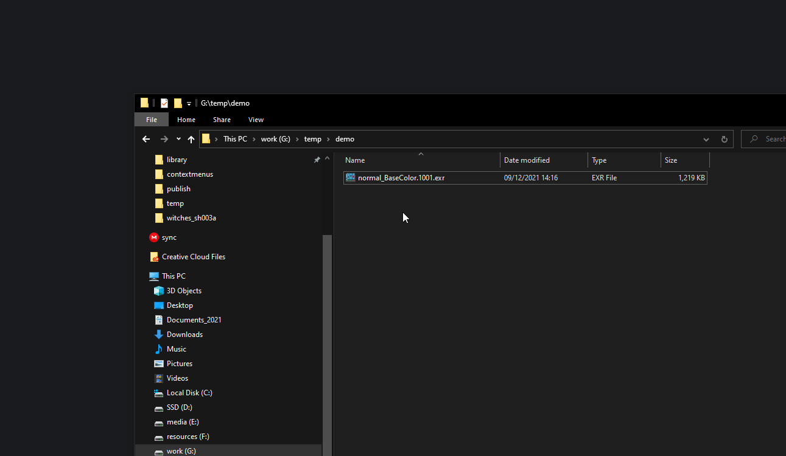

Creating custom context menu for Windows file explorer.
#######################################################

:description: Making tx, rescaling image, displaying alembic content all as fast as
          a right click can be.
:image: cover.jpg
:date-created: 2023-01-29 21:15
:date-modified: 2025-04-12 12:17
:category: tutorial
:tags: productivity, arnold, image-processing, windows
:authors: Liam Collod

.. role:: text-green
    :class: text-green

I had always been a fan of contextual menu in interfaces. They are a very fast
way to run various processes on a selected item. And at the same time you
don't have to remember which action you can run on the item, or how the
action was named. You right click and everything doable is
available a few pixels away from your cursor.

And I had come to the point where, while browsing my files in the
file-explorer, I found that I needed to run a specific tool on a file. And
then 10 min later again, and the next week again ... Each time I had to open
the tool (so depends how easy it is to find its executable on your system),
copy the path of the file, and give it to the tool. Huh ... too long I wish I
could automate that.

A bit of research, and of course you can. You probably noticed that some
applications you install doesn't refrain themselves for adding actions to the
context menu, so why not you ?

.. admonition:: Technical Level Required

    Beginner, no need to know how to code. Everything is provided and explained
    as if you were a regular artist who doesn't usually put his hands in
    Windows depths. But keep in mind the subject is not easy.

.. contents::

Why ?
-----

You might have clicked on this article because you already knew it sounded
like something you wanted to do at some point. But for the others why would
you even need to add new actions to the context menu ?

To get an example that will be familiar for the 3d artists out there let's take
the case of ``maketx``. If you are using Arnold you know what I'm going to
talk about. For every texture you use in your scene, Arnold will usually
generate a version of it in its own format called ``tx`` (nearly every
render-engine has its own). This process is
usually done automatically when you click render but there is multiple reasons
it can goes wrong, or might not just be the behavior you want. The
solution to fix it is to manually generate the tx files. To achieve that you
can use the ``maketx.exe`` tool that is found alongside the Arnold installation.

The particularity with that tool being that it is a `Command Line
Interface <https://en.wikipedia.org/wiki/Command-line_interface>`_, which mean
you dont need to go through an interface to execute actions inside.

At the end of this article, you could had something like this :

.. raw:: html

  <video muted loop autoplay style="width: 100%; height: 100%;">
    <source src="rmb.full_demo.mp4" type="video/mp4">
  </video>

.. important::

    This article explain the fundation that goes into editing the context-menu. The
    process is quite technical which is not the most easy to setup. Some other software
    already allow you to more easily edit the context menu like `Shell <https://github.com/moudey/Shell>`_.

Command Line Interfaces programs
--------------------------------

A Command Line Interface program is made to be interacted with from the command
line, and not from a graphical interface like most programs. If you are not familiar
with :abbr:`CLIs <Command Line Interfaces>`, they are going to look very unpleasant
to use compared to a :abbr:`GUI <Graphical User Interface>`. But their power
will be found in the flexibility they offer, especially for automatizing tasks.
:text-green:`It's like you were ordering the program to perform an action by describing it in
a sentence.`

This is will be useful in our case, because this means that by passing the
"right sentence" to maketx, he could generate a tx from the file that has been
selected from the right-click !

If you ever tried to double click on a .exe just to see a window open and
close immediately, it's probably because it was a CLI. By double clicking on it
you executed it, it execute the task it was made for (in our case nothing
because you didn't gave it any argument), and then close once finish.

To first see what's going on when you don't give it arguments, let's open the
command line. On Windows, this can be achieved using ``Win`` + ``R`` then typing
``cmd`` and enter. You can also just search for ``Command Prompt`` in the
Windows search bar.

Then to execute our program you need to pass the path to its executable.
Easiest way is just to drag and drop the executable from the file explorer
to the command prompt. You can also just copy and paste its path.

.. important::

    On Windows, make sure paths are always wrapped in double quotes like::

        "C:/Program Files/xyz/bin/myapp.exe"

    Otherwise when you have a whitespace it will understand 2 arguments instead of one !

.. admonition:: finding maketx
    :class: hint

    maketx program can be found in the ``bin/`` directory of your Arnold
    installation. Something like ``C:\Program Files\Autodesk\Arnold\maya2023\bin\maketx.exe``

    You can also get it using Python's `pip <https://pip.pypa.io/en/stable>`_. With
    pip installed on your machine you can do a::

        pip install OpenImageIO --target D:\wherever\you\want

    And maketx will be in ``D:\wherever\you\want\OpenImageIO\bin``.

Then press enter to start executing it.

.. image:: command-prompt-maketx.png
    :target: command-prompt-maketx.png
    :width: 80%
    :align: center
    :alt: Command prompt after executing maketx.exe

Without any argument, most CLI will just display their documentation. Which
we will anyway need to open at least one time to make sure we know what
arguments the tool expects.

.. hint::

    Most CLI will display their documentation if you just pass the
    ``--help`` argument after the path to the executable.

.. note::

    arguments are piece of text separated by a whitespace. For example, this
    command ``maketx.exe -u -v --format exr`` has 4 arguments, the last one being
    needed by the third one.

maketx.exe
==========

.. url-preview:: https://openimageio.readthedocs.io/en/latest/maketx.html#maketx
    :title: OpenImageIO - maketx
    :svg: oiio-icon.svg
    :svg-size: 50

    Official maketx documentation (Arnold version is slightly different).

Alright, how does maketx works ? You can see on the line ``Usage : maketx
[options] file...`` that it expect the path of the file to be provided last,
and before some options.

The options are listed just under, and there is a lot of them. Usually
options/arguments are documented but here we only have their name to guess
what they are doing.

But don't worry, no need for playing the guess game of which options does
what we want. How ? Well you know Arnold already auto-convert the tx files
for you, so it knows which options to use. And thankfully, the whole command
used to generate the tx file is actually embedded in the tx's metadata !

But how do I retrieve the tx's metadata ? Well, by using an other CLI that
we are going to see a bit later (oiiotool), I can retrieve it from any
existing tx that have been previously generated. Here is a line stored
in the metadata of a tx file :

.. code:: text

     Software: "OpenImageIO-Arnold 2.4.0dev : maketx G:/whatever/sources/FREDDY_Shoes/texturing/publish/textures-4k.v04\FREDDY_Shoes_Diffuse_Color_1001.exr --opaque-detect --constant-color-detect --monochrome-detect --fixnan box3 --oiio --attrib tiff:half 1 -v -u --unpremult --oiio --format exr"

Seems there is a lot of options used ! One important thing to keep in mind is
that **those options vary depending on what kind of texture you are converting
and how the "texture node" in the source DCC is configured.** The most notable
variable option being ``--colorconvert`` (explained later), used to convert the
input file to another colorspace that might or might not be specified.

.. note::

    You might have notice that in the above command the filepath is specified
    before the options, usually order matters, but here seems maketx don't care !
    Maybe because the documentation is incorrect or just both works ...

.. warning::

    You must be aware that the ``maketx.exe`` from the Arnold installation has
    been slightly modified from the "official" maketx of OpenImageIO I linked
    a bit above. It append
    default argument to the command, no matter if you already gave them.

    Those default argument are always :

    .. code:: shell

        --opaque-detect --constant-color-detect --monochrome-detect --fixnan box3 --oiio --attrib tiff:half 1

    And as such doesn't need to be provided again when calling maketx manually.

    *(at least for the 2.4.0dev version I'm using, older Arnold version might
    not append the same arguments)*

Anyway we have what we need, the whole command required to convert a file to tx.
We can now have a look at how to create the context menu !

Editing the registry: Basics
----------------------------

Unfortunately, there is no really simple and easy way to add actions to the context menu
(though there might be if you look for them on internet), at least for this article,
we will have to edit the `registry <https://en.wikipedia.org/wiki/Windows_Registry>`_.

To keep it simple see the registry as a file hierarchy like we use daily, but
instead of file, we are manipulating "keys" that have different values set on them.
You can access keys by their path, like you would do for a file.

If you ever have to use it, you know it's not easy to find what you are looking for.
Or you are probably aware that editing the wrong stuff inside can easily break
parts of your system.

To mitigate those issues we will be using ``.reg`` files. Instead of browsing
the registry Editor we specify how we want to edit in the file. The advantages are :

1.
    They allow for a reproducible process. That means that if your reformat your system,
    you don't have to remember which registry key you created. Just execute the reg file again.
2.
    You can easily create a copy of the initial reg file that does the inverse,
    meaning removing the keys instead of adding them.

.. danger::

    Keep in mind that editing the registry is always a risk, so it is
    recommended to `save a backup of it <https://support.microsoft.com/en-us/topic/how-to-back-up-and-restore-the-registry-in-windows-855140ad-e318-2a13-2829-d428a2ab0692>`_
    before any change.

Creating the .reg file
======================

.. admonition:: Documentation
    :class: note

    https://en.wikipedia.org/wiki/Windows_Registry#.REG_files

As a first step, create a blank new file like a ``.txt`` and just replace the
extension with ``.reg`` (you might need to display file extension in the View
menu of the file explorer if not set already).

Then right click and open the file with any text/code editor (make sure to not
click on it else you will be executing it !).

Just so you get an idea of the finished product, here is an example of what we
will be putting in that reg file :

.. include:: maketx.reg
    :code: ini

As mentioned previously, creating keys by their path, and setting values on those keys.

.. note::

    You can add comment lines by starting them with a semi-colon ``;``

On the first line, we always have to put this text :

.. code:: ini

    Windows Registry Editor Version 5.00

The next important step will be to determine the root location of the key to use.
This location will determine on which type of file explorer entities the action
in the context menu will appear.

Here are the few options available :

====================== ===============================================================================
All Files              ``HKEY_CURRENT_USER\Software\Classes\*\shell\``
By File Extension [1]_ ``HKEY_CURRENT_USER\Software\Classes\SystemFileAssociations\{EXTENSION}\shell``
Directories            ``HKEY_CURRENT_USER\Software\Classes\Directory\shell``
Directories Background ``HKEY_CURRENT_USER\Software\Classes\Directory\Background\shell``
Drive                  ``HKEY_CURRENT_USER\Software\Classes\Drive\shell``
====================== ===============================================================================

.. note::

    If you would like to make the context-menu action available to ALL users of
    the system you could replace ``HKEY_CURRENT_USER`` with
    ``HKEY_LOCAL_MACHINE``.

As maketx (and most CLI) is designed to work on files we need to choose between
the 2 first keys. As a lot of image format can be converted to maketx we are
going to play the lazy card and just assume we want to this option on all
file formats so we will be using the first root key.

Great, we have now the root path for each key. Now time to create the first key.
We just need a name for it (*special-character-free*). No need to think to hard,
we will be using just ``maketx``.

Let's put that into the reg file :

.. code:: ini

    Windows Registry Editor Version 5.00

    [HKEY_CURRENT_USER\Software\Classes\*\shell\makeTx]

You notice that I added a new key location ``shell`` after our root key. It's
needed by Windows. Now we can configure our key. We can start by configuring
which text will appear in the context-menu for this key :

.. code:: ini

    Windows Registry Editor Version 5.00

    [HKEY_CURRENT_USER\Software\Classes\*\shell\makeTx]
    "MUIVerb"="makeTx"

I could have put any sentence between the 2 double quotes, but I decided to
stay simple.

Then you might want to add a icon next to your action. It can be achieved like :

.. code:: ini

    Windows Registry Editor Version 5.00

    [HKEY_CURRENT_USER\Software\Classes\*\shell\makeTx]
    "MUIVerb"="makeTx"
    "icon"="F:\\blog\\demo-icon.ico"

But you have to keep in mind :

- You have to put an absolute path (starting from the drive letter, not relative)
- You have to escape backward slashes like ``\`` -> ``\\``
- You have to use an ``.ico`` file. There is plenty of online converter for it.
- If for whatever reason the path doesn't exists/is not valid, you will get a default "sheet" icon.

And finally the most important option, what is executed when clicking on the action !
We have to create a new key ``command`` and then configure it.
For the configuration we will pass a string as you would execute the program
from the command prompt.

.. code:: ini

    Windows Registry Editor Version 5.00

    [HKEY_CURRENT_USER\Software\Classes\*\shell\makeTx]
    "MUIVerb"="makeTx"
    "icon"="F:\\blog\\demo-icon.ico"

    [HKEY_CURRENT_USER\Software\Classes\*\shell\makeTx\command]
    @="D:\\resources\\maketx.exe"

If you remember what we tested previously, this will only display the documentation
of maketx, cause we doesn't provide any argument. But let's move step by step
and test what we already have.

Executing the .reg file
=======================

Save your reg file from your text/code editor and double click on it. Windows
will gift you 3 dialogs to accept, but that will be all you have to do.

As a safety, let's manually check in the registry if it was registered. Open the
``Registry Editor`` (you can use windows search). In the window that opens,
find the "current path" field, right under the menu bar. Inside paste
the path of the key we created and press enter.
The editor should directly browse to the key.

If you would want to delete what we did, you could just delete the ``makeTx``
key (but we will see an alternative later).

It's a good practice that when you follow this tutorial, you casually have a look
in the Registry Editor to check everything is updated as expected.

Aright in theory it should work, what about practice ? Well pick any file
in the file explorer (because remember we put it under ``*`` which work for
all file extensions) and right click on it. You should now see the ``makeTx``
action near the top !

Let's test it, click on it :

Well ... it just open and close. Not very useful ... But this is normal, remember
what I explained in the `Command Line Interfaces programs`_, the program execute
its task and then close. If we want to keep its result displayed we have to
open it from the command line. And that's a task for the next section !

Editing the registry: Advanced
------------------------------

The previous section allowed us to add a new simple action to the context menu,
that just execute the application we gave it. But we are still missing plenty
of use-cases, like how to keep the interface open in the case of a CLI, or even
more importantly, how do we pass the path of the file we right-clicked on, to
the command executed ?

Calling the command prompt
==========================

Let's address the issue we stopped the previous section at. As our tool is a CLI,
it close once finished. But we want to keep its result visible. Manually the solution
was to execute it from an existing command prompt window. And we will do exactly
the same for our context-menu action.

Get back to out .reg file and the last line where we define our command to execute.

To open the command prompt we simply need to prefix our command with
``cmd /k``, so we have:

.. code:: ini

    Windows Registry Editor Version 5.00

    [HKEY_CURRENT_USER\Software\Classes\*\shell\makeTx]
    "MUIVerb"="makeTx"
    "icon"="F:\\blog\\demo-icon.ico"

    [HKEY_CURRENT_USER\Software\Classes\*\shell\makeTx\command]
    @="cmd /k \"D:\\resources\\maketx.exe\""

By safety we also wrapped our path between escaped double quotes, to make sure
the command prompt doesn't complain.

Save the reg file and execute it again. Find a file again, and execute the
action in the context-menu as previously.

We now have a command prompt window that open and execute the maketx.exe program.
But as intended, the window stays open because it was not opened by maketx but
by us. Nice.

Retrieving the file selected in the command
===========================================

Probably the most interesting option for our context-menu. We selected a file
by right-clicking, this mean we want to execute a program on it, by passing the
path of this file to the program.

For now our makeTx action only open the documentation of the program cause it
doesn't receive any argument. By passing the path of the file it should now
start the conversion.

To retrieve it simple we will be using the ``%1`` variable (it simply retrieve
the first argument passed to the command line, which is the path of the file) :

.. code:: ini

    Windows Registry Editor Version 5.00

    [HKEY_CURRENT_USER\Software\Classes\*\shell\makeTx]
    "MUIVerb"="makeTx"
    "icon"="F:\\blog\\demo-icon.ico"

    [HKEY_CURRENT_USER\Software\Classes\*\shell\makeTx\command]
    @="cmd /k \"\"D:\\resources\\maketx.exe\" \"%1\"\""

Again we wrap it between escaped double-quotes by safety BUT we also now
double the first and last quotes, necessary when this more that one pair of quotes [4]_.
Else we will get a `very funky behavior <https://stackoverflow.com/a/15262019/13806195>`_.

Repeat the usual steps to tests, and you should now see the file right-clicked
properly converted to tx (if you selected an image format selected by maketx
of course).

Passing more arguments
======================

You remember at the beginning that I extracted the full command used by maketx
on an existing .tx file ? There was a lot of additional arguments used.
Let's add them. As on my side I am using maketx from the Arnold installation
I will remove all the argument that maketx will already add for me anyway
(explained at the beginning of the article).

.. code:: ini

    Windows Registry Editor Version 5.00

    [HKEY_CURRENT_USER\Software\Classes\*\shell\makeTx]
    "MUIVerb"="makeTx"
    "icon"="F:\\blog\\demo-icon.ico"

    [HKEY_CURRENT_USER\Software\Classes\*\shell\makeTx\command]
    @="cmd /k \"\"D:\\resources\\maketx.exe\" \"%1\"\" -v -u --unpremult --format exr"

No need to escape the argument this time.

Test again, you should mainly see much more info being displayed as we used the
``-v`` option which means "verbose".

And at that state we have a totally working command 🥳, but don't leave yet, we
still have a few improvements to make !

Creating a "uninstall" reg file
===============================

For now we have a single file that allow us to create the keys in the registry.
But what if we want the inverse, meaning removing them ? All program can be
installed and uninstalled, so it should be the same for our context-menu action.

As mentioned before you could manually dig into the registry to delete the key,
but if we took the time to create a reg file, it's not to end up browsing the
registry manually to revert it.

The solution is to create a new reg file that delete the keys instead of adding
them. To start just copy/paste the existing reg file we have been creating.
Also open it in your text/code editor. And now very simple edit, in front of
each key path, after the first bracket, add a minus character :

.. code:: ini

    Windows Registry Editor Version 5.00

    [-HKEY_CURRENT_USER\Software\Classes\*\shell\makeTx]
    "MUIVerb"="makeTx"
    "icon"="F:\\blog\\demo-icon.ico"

    [-HKEY_CURRENT_USER\Software\Classes\*\shell\makeTx\command]
    @="cmd /k \"\"D:\\resources\\maketx.exe\" \"%1\" -v -u --unpremult --format exr\""

That's about it. It's enough to tell Windows to remove the keys instead of creating them.
You could simplify the file by removing the line setting values but I will leave
them so I can remember exactly what I'm removing.

Now that you have 2 files (good idea to keep them side by side), **you will need
to remember that if you add a new key / edit an existing one in the "create" reg
file, you also need to propagate the changes in the "uninstall" reg file**.

And we end up with a pretty robust workflow, "install" your custom context-menu
in one double-click and "uninstall" it the same way ! Without having to remember
which key you added or manually browsing the registry editor.

.. note::

    I recommend to always execute the "delete" reg file before
    editing the "add" reg file. Else if you change a key name in the "add" reg file
    and propagate the change to the "delete" reg file, the previous key name will
    still be in the registry because you forgot to delete it !

Using environment variables for robustness
==========================================

In all the previous examples we have been using an absolute path to
``maketx.exe``. Let's imagine your directly picked the maketx located in your
Maya Arnold installation, or whatever other DCC. What happens if you uninstall
that version ? Well your command will break. You will have to edit the reg file
with the new maketx path and edit it again ...

    But wait ! I could just copy maketx.exe to one of my personal resources
    directory so I'm sure it will not be deleted when uninstalling Arnold !

And you'd be right, maketx is a standalone program that doesn't need anything
else to work so you could just copy it anywhere else. But what happens when
you want to upgrade your maketx version ? Or you move it. Well you
have to go find and update the reg file to execute it again. Not the
most annoying task, but we can do better.

Introducing `environment variables <https://en.wikipedia.org/wiki/Environment_variable>`_.
A system wide way to set and query values. I will not make a full tutorial
on them so we will skip to the essential. Feel free to browse the internet to learn
more about them.

0. In the Window search bar type "environment" and select "Edit Environment variable"
1. Select Edit
2. Create a new variable at user level
3. Fill the values, we will be naming it ``MAKETX``. (Do NOT wrap it in quotes
   like in the example picture).
4. "Ok" for all dialogs.

.. warning::

    Be careful when choosing a name for your environment variable. It's possible
    that a program will expect this variable name and use it. In our case
    ``MAKETX`` has a high chance of being expected by a program, but at the same
    time it would probably also expect the path to the maketx executable. So
    in a way it should not break anything.

And now to get the environment variable value in our command we need to use
the `batch <https://en.wikibooks.org/wiki/Windows_Batch_Scripting>`_ syntax
``%ENVVARNAME%`` :

.. code:: ini

    Windows Registry Editor Version 5.00

    [HKEY_CURRENT_USER\Software\Classes\*\shell\makeTx]
    "MUIVerb"="makeTx"
    "icon"="F:\\blog\\demo-icon.ico"

    [HKEY_CURRENT_USER\Software\Classes\*\shell\makeTx\command]
    @="cmd /k \"\"%%MAKETX%%\" \"%1\"\" -v -u --unpremult --oiio --format exr"

A lot going on the "escaping" side here (it is teh biggest source of issue) :

- the ``%`` need to be escaped by doubling it so the variable is resolved only
  when cmd dialog is opened.
- we again need to escape the variable MAKETX with quotes around it as it's a path.
  Like for ``%1``
- we need to double escape the first and last quotes in the whole command again
  (needed when there is more than 2 quotes in the command) [4]_

Same routine, save and test. Everything should just work like before.

Hopefully you should never have to get back to your reg file to edit it now.

Creating sub-menus
==================

One feature that you might want to use, would be to have nested menus. For
example the default "Open With" menu offer multiple options once hovered.

With our example it would be nice to have multiple maketx options, one for
Arnold, one for Renderman, one with a colorspace conversion, ...

.. code:: ini

    Windows Registry Editor Version 5.00

    [HKEY_CURRENT_USER\Software\Classes\*\shell\makeTx]
    "MUIVerb"="makeTx"
    "icon"="F:\\blog\\demo-icon.ico"
    "subCommands"=""

    [HKEY_CURRENT_USER\Software\Classes\*\shell\makeTx\shell\txconvert]
    "MUIVerb"="convert to .tx"
    [HKEY_CURRENT_USER\Software\Classes\*\shell\makeTx\shell\txconvert\command]
    @="cmd /k \"\"%%MAKETX%%\" \"%1\"\" -v -u --unpremult --oiio --format exr"

What happened ?

- Well first you can see our root key got a new value set with
  ``"subCommands"=""``.
- We then added a new sub-key. For that we took the root
  key path and added ``shell\`` + a new custom name for that key
- that new key can use the same options as the root key so I used
  ``MUIVerb`` again to set the text displayed in the interface.

I could create a new sub-key from it, and so on and so on ... but let's stop
here. Copy/paste the last key path and append ``\command`` as before then add
the command to execute.

And finally here is the full maketx example with 3 sub-commands :

.. code:: ini

    Windows Registry Editor Version 5.00

    [HKEY_CURRENT_USER\Software\Classes\*\shell\makeTx]
    "MUIVerb"="makeTx"
    "icon"="F:\\blog\\demo-icon.ico"
    "subCommands"=""

    [HKEY_CURRENT_USER\Software\Classes\*\shell\makeTx\shell\txconvert]
    "MUIVerb"="convert to .tx"
    [HKEY_CURRENT_USER\Software\Classes\*\shell\makeTx\shell\txconvert\command]
    @="cmd /k \"\"%%MAKETX%%\" \"%1\"\" -v -u --unpremult --format exr"

    [HKEY_CURRENT_USER\Software\Classes\*\shell\makeTx\shell\txconvertprman]
    "MUIVerb"="convert to Renderman .tx"
    [HKEY_CURRENT_USER\Software\Classes\*\shell\makeTx\shell\txconvertprman\command]
    @="cmd /k \"\"%%MAKETX%%\" \"%1\"\" --prman -v -u --unpremult --format exr"

    [HKEY_CURRENT_USER\Software\Classes\*\shell\makeTx\shell\txconvertsrgb]
    "MUIVerb"="convert to .tx - sRGB source"
    [HKEY_CURRENT_USER\Software\Classes\*\shell\makeTx\shell\txconvertsrgb\command]
    @="cmd /k \"\"%%MAKETX%%\" \"%1\"\" --colorconvert sRGB linear -v -u --unpremult --format exr"

.. warning::

    If you got your maketx executable from Arnold installation the second key
    with the ``--prman`` option will not work as Arnold always append ``--oiio``
    which conflict with ``--prman`` :(

.. admonition:: context-menu action sorting
    :class: note

    Menus are sorted alphabetically by key name. In the above example even
    if I first create ``txconvertsrgb``, it will still be displayed after
    ``txconvertprman``. A workaround for this would be to se a number prefix
    like ``001txconvertsrgb``, but this also mean you have to edit all your
    key when you want to insert a new one between existing ones.

.. admonition:: Nested context-menu limit
    :class: warning

    Unfortunately there is a limit of sub context-menu you can create from a
    root context menu. The root context-menu is the first key defining the
    ``subCommand=""`` property and then EVERY other context-menu under that
    root will be counted until you reach **the maximum of 16 menus**. [2]_

Auto-generating the .reg files
==============================

For the more technical person that will be reading this article. I already
simplified all the steps above by wrapping them up in python CLI.

.. url-preview:: https://github.com/MrLixm/frmb
    :title: MrLixm/frmb
    :image: https://opengraph.githubassets.com/89912c838f2d368aeff113c940042aba5a874cec841f77373e75706f667e835d/MrLixm/frmb

    Convert file structures to right-click context menu for Windows. - MrLixm/frmb

It allow to write the key structure as a json with a bunch of workflow optimizations,
like relative paths, variables, ... so the whole process should be much
faster and much less human-error prone.

.. admonition:: 2025 note
    :class: note

    However for friendlier workflow I have found latter that software like `Shell`_
    existed and already answered that problem. Frmb coudl still be useful thanks
    to its design around json file. Up to you.

Cool use cases ideas for context-menus
--------------------------------------

Because maketx is not the only program that is cool to have available has a right
click, here is a few ideas that could really boost your workflow !

.. admonition:: "%1" mistake
    :class: warning

    In some of the code snippet you will have below, you will sometime
    notice that the ``%1`` argument is not wrapped in quotes. This mean that
    if you pass a file with whitespaces to the first argument, it will break.

    So or you make sure none of your files have whitespaces, or you wrap the
    ``%1`` in quotes (that might need to be double if there is already quotes
    in the command).

    You can also use ``"%~1"`` that will remove the quotes but still work
    with whitespaces (tested and did not work properly for me). [8]_

maketx
=======

Even more of it !

txify entire folders
____________________

With what we saw we can quickly convert all the texture in a directory by selecting
them all, and running the context-menu. But we could also implement this by
selecting a directory and executing the context menu from it.

Of course maketx doesn't accept directories so we need to retrieve files from it.
We will be creating the usual intermediate batch file :

.. code:: batch

    @echo off

    for %%i in ("%1\*.exr", "%1\*.tiff", "%1\*.png") do (
        echo - processing %%i
        start "maketx" /b "%MAKETX%" %%i -v -u --unpremult --oiio --format exr
    )

What's going on :

- ``("%1\*.exr")`` we find all files with the .exr extension in the given directory
  (and we can ask multiple extensions separated by a comma)
- ``start`` we launch the maketx process in a new command prompt. They are launched
  "asynchronously" which mean all the command are started without waiting for the
  previous one to complete. Sometimes called **multi-threading**.
- ``"maketx"`` that new command prompt is named "maketx"
- ``\b`` we actually don't want to display this new command prompt.
  This also mean that all text outputs is logged in the current prompt in a pure
  asynchronous chaos (so you can omit it if you prefer)

You can try it without the ``start "maketx" \b`` and you will see that each
command will be executed one after the other which will take much more time.

The keys to add in the reg files can looks like this :

.. code:: ini

    [HKEY_CURRENT_USER\Software\Classes\Directory\shell\maketx\shell\convertall]
    "MUIVerb"="Convert all images to .tx"
    [HKEY_CURRENT_USER\Software\Classes\Directory\shell\maketx\shell\convertall\command]
    @="cmd /k \"\"F:\\softwares\\os\\config\\contextmenus\\maketx\\batch\\convert_dir.bat\" \"%1\"\""

If you wish to process the directory recursively, you can use the ``/R`` flag [5]_ :

.. code:: batch

    @echo off

    for /R "%1" %%i in (*.exr, *.tiff, *.png) do (
        echo - processing %%i
        start "maketx" /b "%MAKETX%" %%i -v -u --unpremult --oiio --format exr
    )

colorspace conversions
______________________

In the final maketx example you may have noticed I created an action that
assume the source texture is sRGB "Display" encoded and is converted to sRGB Linear.
It's pretty common to have colorspace conversion as all tx should be encoded
in the rendering colorspace.

To perform the colorspace conversion I used the ``--colorconvert sRGB linear`` argument.
The 2 "colorspaces" names I'm giving are builtins [6]_ but there is only 3 of
them so if you need anything different we will have to rely on
`OCIO <https://opencolorio.org/>`_. If you are not familiar with it, I'm not
going to explain it sorry, too long for this article.

Here is the command updated to perform colorspace conversions based on colorspace
stored in an OCIO configuration (example with the old ACES 1.2 one) :

.. code:: batch

    "%MAKETX%" "%1" --colorconfig "D:\whatever\ACES\config.ocio" --colorconvert "Utility - sRGB - Texture" "ACES - ACEScg" -v -u --unpremult --format exr

.. note::

    ``--colorconfig`` is not needed if the ``OCIO`` environment variable
    is already set properly [7]_

OIIO Tool
=========

I will start by the most useful of all (for a 3D artist at least). `oiiotool
<https://openimageio.readthedocs.io/en/latest/oiiotool.html#>`_ is the CLI
version of the OpenImageIO library and was designed to perform image-processing.

Just have a look at the documentation and the `multiple examples it includes
<https://openimageio.readthedocs.io/en/latest/oiiotool.html#oiiotool-tutorial-recipes>`_
to get an idea of how powerful it is.

As it could handle probably hundred of actions you want to perform from a
context menu, I will just show a few very useful of them.

.. admonition:: How to download it

    oiiotool is part of the `OpenImageIO code library <https://github.com/OpenImageIO/oiio>`_
    which doesn't offer straight-away pre-compiled binaries.

    Fortunately there is some workarounds :

    -
       It is shipped with the Arnold installation !
       You can find it in ``C:\Program Files\Autodesk\Arnold\maya{VERSION}\bin``
       It's a totally standalone builded application so you can copy it anywhere.

    -
       You can also get it using Python's `pip <https://pip.pypa.io/en/stable>`_. With
       pip installed on your machine you can do a::

            pip install OpenImageIO --target D:\wherever\you\want

       And oiiotool.exe will be in ``D:\wherever\you\want\OpenImageIO\bin``.

.. caution::

    The next examples assume you put the path to ``oiiotool.exe`` in an
    environment variable ``OIIOTOOL`` as shown previously.

Retrieving image statistic and metadata
_______________________________________

Especially useful for OpenEXR files. To check what is stored inside.

.. code:: ini

    Windows Registry Editor Version 5.00

    [HKEY_CURRENT_USER\Software\Classes\*\shell\OIIO_Tool]
    "MUIVerb"="OIIO Tool"
    "icon"="F:\\softwares\\os\\config\\contextmenus\\oiiotool\\oiiotool.ico"
    "subCommands"=""

    [HKEY_CURRENT_USER\Software\Classes\*\shell\OIIO_Tool\shell\oiioinfo]
    "MUIVerb"="Display Info"
    [HKEY_CURRENT_USER\Software\Classes\*\shell\OIIO_Tool\shell\oiioinfo\command]
    @="cmd /k %%OIIOTOOL%% --info -v \"%1\""

Rescaling textures
__________________

It is most common that you exported textures with large dimensions like
4096x4096 and that you need to resize them as you don't need that much pixels.

Again with oiiotool, as fast as right click can be !

This time setting this context-menu will be more complicated. If we were to
reuse the workflow we used previously we would set something like this :

.. code:: ini

    [HKEY_CURRENT_USER\Software\Classes\*\shell\OIIO_Tool\shell\oiiorescale2048]
    "MUIVerb"="rescale 2048"
    [HKEY_CURRENT_USER\Software\Classes\*\shell\OIIO_Tool\shell\oiiorescale2048\command]
    @="cmd /k %%OIIOTOOL%% -v \"\"%1\" --resize 2048x0 -o \"%~n1-2048%~x1\"\""

The issues is in the last argument of the command, where we need to pass the path
of the new file OIIO need to write. If we were to overwrite the existing file,
easy you can just give ``\"%1\"``. But here we want to create a new file.
The batch language has a special syntax to make path manipulation on variables.
Unfortunately the syntax doesn't work when called from ``cmd /k``.

.. admonition:: path manipulation in batch
    :class: hint

    https://en.wikibooks.org/wiki/Windows_Batch_Scripting#Percent_tilde

    Let's dissect ``%~n1-2048%~x1`` we are using here :

    - ``%~n1`` : the file name without path and extension, of the first argument (1)
    - ``-2048`` : the suffix we add to the filename.
    - ``%~x1``: File name extension (including the period) of the first argument (1)

We need a workaround to be able to use the full batch syntax. This workaround
could also be used if you need to execute more complex commands. So here we will
be using a ``.bat`` file to define our command, and the registry command will
just start the bat file.

.. tip::

    A batch file (``.bat``) is a text file defining a series of command
    to be executed in the order they are defined in. [3]_ Double clicking the file
    will execute it. You can edit its content with any text editor using
    ``Open With`` from the context menu.

Create a new ``.bat`` file (create a .txt and just rename the extension). Open
it with any text/code editor and inside paste the following :

.. code:: batch

    @echo off

    %OIIOTOOL% -v "%1" --resize %2x0 -o "%~n1-%2%~x1"

You can observe :

- we replace ``2048`` with ``%2`` which imply we will be using the
  2nd argument passed to the .bat to determine the size to rescale. With this we
  can use one .bat to rescale to any size !

- no need to escape quotes characters in bat files !

Save the .bat somewhere then let's get back to our .reg file :

.. code:: ini

    [HKEY_CURRENT_USER\Software\Classes\*\shell\OIIO_Tool\shell\oiiorescale2048]
    "MUIVerb"="rescale 2048"
    [HKEY_CURRENT_USER\Software\Classes\*\shell\OIIO_Tool\shell\oiiorescale2048\command]
    @="cmd /k \"\"F:\\blog\\path\\to\\oiiotool-rescale.bat\" \"%1\"\" 2048"

Don't forget to also escape the backward slashes in the path. You notice that
we just forward the path of the file selected as first argument of the bat, and
the second argument is indeed the size to use.

You can the just copy the above setup as much time as needed to have multiple
size options :

.. code:: ini

    [HKEY_CURRENT_USER\Software\Classes\*\shell\OIIO_Tool\shell\oiiorescale4096]
    "MUIVerb"="rescale 4096"
    [HKEY_CURRENT_USER\Software\Classes\*\shell\OIIO_Tool\shell\oiiorescale4096\command]
    @="cmd /k \"\"F:\\blog\\path\\to\\oiiotool-rescale.bat\" \"%1\"\" 4096"

    [HKEY_CURRENT_USER\Software\Classes\*\shell\OIIO_Tool\shell\oiiorescale2048]
    "MUIVerb"="rescale 2048"
    [HKEY_CURRENT_USER\Software\Classes\*\shell\OIIO_Tool\shell\oiiorescale2048\command]
    @="cmd /k \"\"F:\\blog\\path\\to\\oiiotool-rescale.bat\" \"%1\"\" 2048"

    [HKEY_CURRENT_USER\Software\Classes\*\shell\OIIO_Tool\shell\oiiorescale1024]
    "MUIVerb"="rescale 1024"
    [HKEY_CURRENT_USER\Software\Classes\*\shell\OIIO_Tool\shell\oiiorescale1024\command]
    @="cmd /k \"\"F:\\blog\\path\\to\\oiiotool-rescale.bat\" \"%1\"\" 1024"

    ...

.. tip::

    As you know, using cmd will open a new command prompt every time, that you
    need to manually close. This can be annoying when processing dozens
    of textures. Actually nothing prevent you to directly start the .bat
    without the ``cmd /k``. You will just not be able to know if the the rescaling
    failed.

Converting images to .ico
_________________________

You saw that we needed to create ``.ico`` file to give pretty icon to our
context-menus, and it's annoying to go on some random website to convert your
images. Let's automatize it too !

As previously, in 2 part with a .bat :

.. code:: batch

    @echo off
    %OIIOTOOL% -v -i "%1" --fit 256x256 --dup --resize 128x0 --dup --resize 64x0 --dup --resize 48x0 --dup --resize 32x0 --dup --resize 24x0 --dup --resize 16x0 --siappendall -o "%~n1.ico"

.. code:: ini

    [HKEY_CURRENT_USER\Software\Classes\*\shell\OIIO_Tool\shell\oiioicon]
    "MUIVerb"="convert to .ico"
    [HKEY_CURRENT_USER\Software\Classes\*\shell\OIIO_Tool\shell\oiioicon\command]
    @="cmd /k \"\"F:\\blog\\path\\to\\oiiotool-ico-convert.bat\" \"%1\"\""

The only tricky part was to know the ico format store multiple versions of
the same image at different scales, but again OIIO make that pretty easy !

Convert .tx back to another format
__________________________________

If you ever only received/find that there only the tx left for your asset, you
can use oiitool to convert them to a more readable format !

Here is just the .bat file where I convert them back to EXR :

.. code:: batch

    @echo off

    set "target_file=%~n1.exr"

    if exist %target_file% (
        echo "Destination file already exists : %target_file%"
        set /P override_target=^> do you want to override it (y/n):
        if not %override_target% == "y" (
          exit /b
        )
    )

    %OIIOTOOL% -v -i "%1" --unmip -o %target_file%

Few notes :

-
    This time I check that the target file doesn't already exists, we never know !
    If it exists I ask the user if he wants to overwrite it else I exit.

- I use ``--unmip`` because the tx is mipmapped and I don't care about keeping them.

I let you create the keys in the reg file (also you could add it to the maketx
menu if this is more logical to you).

ABCInfo
=======

Next one : retrieving information about an Alembic file without even opening
it in a DCC. We will be using a CLI called ``abcinfo.exe``. *This CLI can only
be found in Houdini installation* :

.. code:: text

    C:\Program Files\Side Effects Software\Houdini {VERSION}\bin\abcinfo.exe"

The tool is not standalone, meaning you can't just copy it somewhere. I
recommend to as always set an environment variable to it that you can easily
update when you update your Houdini version.

.. code:: ini

    Windows Registry Editor Version 5.00

    [HKEY_CURRENT_USER\Software\Classes\SystemFileAssociations\.abc\shell\abcinfo]
    "MUIVerb"="abcinfo"
    "icon"="%ABCINFO%"
    "subCommands"=""

    [HKEY_CURRENT_USER\Software\Classes\SystemFileAssociations\.abc\shell\abcinfo\shell\001abcinfo]
    "MUIVerb"="abcinfo"
    [HKEY_CURRENT_USER\Software\Classes\SystemFileAssociations\.abc\shell\abcinfo\shell\001abcinfo\command]
    @="cmd /k \"\"%%ABCINFO%%\" \"%1\"\""

    [HKEY_CURRENT_USER\Software\Classes\SystemFileAssociations\.abc\shell\abcinfo\shell\002abcinfo_verbose]
    "MUIVerb"="abcinfo verbose"
    [HKEY_CURRENT_USER\Software\Classes\SystemFileAssociations\.abc\shell\abcinfo\shell\002abcinfo_verbose\command]
    @="cmd /k \"\"%%ABCINFO%%\" -v \"%1\"\""

This time no need to put it in ``Classes\*``, we only need it for ``.abc``. I
created 2 commands, one which give most of the time the info I need, another one
that really give the maximum of info about the file.

You can also notice that for the icon we gave the path to a abcinfo.exe ! Windows will
use the icon packed in the .exe (if there is one). And we also leave the environment
variable that still work just fine.

ffmpeg
======

One of the most famous CLI. Powering most of the video-processing applications,
`ffmpeg <https://ffmpeg.org/>`_ is an invaluable resource for anything video-related.

As for oiiotool, the use-case for it are hundred and I will only show a few of them.
But at the opposite of oiiotool, `finding a compiled version <https://www.gyan.dev/ffmpeg/builds/#release-builds>`_
is much easier. Download it somewhere an create an environment variable
(I picked the very original ``FFMPEG`` for the name)

video to gif
____________

An important problem while converting video to gif is disk size. GIF are cools,
but can become very heavy if not optimized, and most website have file size limitations.

So when doing a gif we always try to find a good quality/size compromise which
is achieved by tweaking various parameters : resolution, fps, dithering, ...

You could make a bunch of context-menu action with various "preset" of optimization
but you will always find yourself with a specific case that need to be under a
certain size, ...

So here we will be doing something new : we will ask the user for input on variables
for the conversion.

Generating optimized GIFs will require a pretty complex command. We will
create a .bat file to store it, and call the batch file from the context menu.

.. code:: batch

    @echo off

    set ask_user=1
    if not "%~2" == "" (
        set ask_user=%2
    )

    if %ask_user% equ 0 (
        set framerate=%3
    ) else (
        set /P framerate=- Target framerate:
    )

    if %ask_user% equ 0 (
        set scale_divide=%4
    ) else (
        set /P scale_divide=- Target Size Divider:
    )

    set "file_suffix="
    if %ask_user% equ 0 (
        if not "%~5" == "" (
            set file_suffix=%5
        )
    ) else (
        set /P "file_suffix=- File name suffix (optional):"
    )

    set "dithering=sierra2_4a"
    if %ask_user% equ 0 (
        if not "%~6" == "" (
            set dithering=%6
        )
    ) else (
        echo " # DITHERING methods"
        echo "     none"
        echo " # higher scale = less visible dotted pattern but more banding"
        echo "     bayer:bayer_scale=0"
        echo "     bayer:bayer_scale=1"
        echo "     bayer:bayer_scale=2"
        echo "     bayer:bayer_scale=3"
        echo "     bayer:bayer_scale=4"
        echo "     bayer:bayer_scale=5"
        echo " # (popular) lighter than bayer"
        echo "     floyd_steinberg"
        echo " # even lighter, very pronounced banding"
        echo "     sierra2"
        echo " # (default) heavy, subttle dot pattern with few banding."
        echo "     sierra2_4a"
        set /P dithering=- Dithering method:
    )

    set "output=%~n1%file_suffix%.gif"
    set "filter_graph=fps=%framerate%,scale=iw/%scale_divide%:-1:flags=lanczos,split[s0][s1];[s0]palettegen[p];[s1][p]paletteuse=dither=%dithering%"

    :: -y : overwite existing, else use -n
    %FFMPEG% -y -i "%1" -threads 0 -loop 0 -vf %filter_graph% %output%

But we make sure the script can still be used without having to enter a manual
input. It's achieved by checking if there is a second argument provided and if
that argument equal one. With that bat we can then create the following reg file :

.. code:: ini

    Windows Registry Editor Version 5.00

    [HKEY_CURRENT_USER\Software\Classes\*\shell\ffmpeg]
    "MUIVerb"="ffmpeg"
    "icon"="F:\\softwares\\os\\config\\contextmenus\\ffmpeg\\ffmpeg.ico"
    "subCommands"=""

    [HKEY_CURRENT_USER\Software\Classes\*\shell\ffmpeg\shell\001togif_ask]
    "MUIVerb"="convert video to .gif - interactive"
    [HKEY_CURRENT_USER\Software\Classes\*\shell\ffmpeg\shell\001togif_ask\command]
    @="cmd /k \"F:\\softwares\\os\\config\\contextmenus\\ffmpeg\\ffmpeg-togif.bat\" %1 1"

    [HKEY_CURRENT_USER\Software\Classes\*\shell\ffmpeg\shell\002togif_presets]
    "MUIVerb"="convert video to .gif [presets]"
    "subCommands"=""

    [HKEY_CURRENT_USER\Software\Classes\*\shell\ffmpeg\shell\002togif_presets\shell\003togif502sierra]
    "MUIVerb"="convert video to .gif - fps:50 size:/2 dithering:sierra2_4a"
    [HKEY_CURRENT_USER\Software\Classes\*\shell\ffmpeg\shell\002togif_presets\shell\003togif502sierra\command]
    @="cmd /k \"\"F:\\softwares\\os\\config\\contextmenus\\ffmpeg\\ffmpeg-togif.bat\" %1 0 50 2 \"\"\" sierra2_4a"

    [HKEY_CURRENT_USER\Software\Classes\*\shell\ffmpeg\shell\002togif_presets\shell\004togif501sierra]
    "MUIVerb"="convert video to .gif - fps:50 size:/1 dithering:sierra2_4a"
    [HKEY_CURRENT_USER\Software\Classes\*\shell\ffmpeg\shell\002togif_presets\shell\004togif501sierra\command]
    @="cmd /k \"\"F:\\softwares\\os\\config\\contextmenus\\ffmpeg\\ffmpeg-togif.bat\" %1 0 50 1 \"\"\" sierra2_4a"

    [HKEY_CURRENT_USER\Software\Classes\*\shell\ffmpeg\shell\002togif_presets\shell\005togif501floyd]
    "MUIVerb"="convert video to .gif - fps:50 size:/1 dithering:floyd_steinberg"
    [HKEY_CURRENT_USER\Software\Classes\*\shell\ffmpeg\shell\002togif_presets\shell\005togif501floyd\command]
    @="cmd /k \"\"F:\\softwares\\os\\config\\contextmenus\\ffmpeg\\ffmpeg-togif.bat\" %1 0 50 1 \"\"\" floyd_steinberg"

    [HKEY_CURRENT_USER\Software\Classes\*\shell\ffmpeg\shell\002togif_presets\shell\006togif242sierra]
    "MUIVerb"="convert video to .gif - fps:24 size:/2 dithering:sierra2_4a"
    [HKEY_CURRENT_USER\Software\Classes\*\shell\ffmpeg\shell\002togif_presets\shell\006togif242sierra\command]
    @="cmd /k \"\"F:\\softwares\\os\\config\\contextmenus\\ffmpeg\\ffmpeg-togif.bat\" %1 0 24 2 \"\"\" sierra2_4a"

    [HKEY_CURRENT_USER\Software\Classes\*\shell\ffmpeg\shell\002togif_presets\shell\007togif241sierra]
    "MUIVerb"="convert video to .gif - fps:24 size:/1 dithering:sierra2_4a"
    [HKEY_CURRENT_USER\Software\Classes\*\shell\ffmpeg\shell\002togif_presets\shell\007togif241sierra\command]
    @="cmd /k \"\"F:\\softwares\\os\\config\\contextmenus\\ffmpeg\\ffmpeg-togif.bat\" %1 0 24 1 \"\"\" sierra2_4a"

    [HKEY_CURRENT_USER\Software\Classes\*\shell\ffmpeg\shell\002togif_presets\shell\008togif241floyd]
    "MUIVerb"="convert video to .gif - fps:24 size:/1 dithering:floyd_steinberg"
    [HKEY_CURRENT_USER\Software\Classes\*\shell\ffmpeg\shell\002togif_presets\shell\008togif241floyd\command]
    @="cmd /k \"\"F:\\softwares\\os\\config\\contextmenus\\ffmpeg\\ffmpeg-togif.bat\" %1 0 24 1 \"\"\" floyd_steinberg"

You can quickly see why we need an option to let he user give what parameter
he needs. Else we end up with dozens of actions to cover most of the possibilities.
I ended-up offering 6 presets for now. I think there is room to optimize them
but did not spend the time to test what combinaison could be the most versatile.

Also remember that we are limited to max 16 keys and I'm already using 6
of them with just "presets" + 1 for the interactive + 1 for creating a
sub-menu for presets !

optimized mp4 videos
____________________

One reason you migh want to use ffmpeg is to convert to one video format to another.
You produced a "master" video, witht he highest quality possible, and you now
want to share it on the web, which require encoding it in more optimized and
light-weight formats.

ffmpeg is a hell of a tool with hundred of argument, The most difficult part
is finding which argument you need to build your command. As I'm more a ffmpeg
novice I took advice from more experienced users by using this guide :
https://academysoftwarefoundation.github.io/EncodingGuidelines/
(which have the advantage of focusing on color-accuracy for vfx).

Let's take the same workflow we used for gif conversion. Here is the
intermediate batch file :

.. include:: ffmpeg-mp4-optimize.bat
    :code: batch

Much more control than the gif workflow. The reg file then looks like this
(extending the reg file used for gif)

.. code:: ini

    [HKEY_CURRENT_USER\Software\Classes\*\shell\ffmpeg\shell\009mp4_ask]
    "MUIVerb"="convert source to optimized .mp4 - interactive"
    [HKEY_CURRENT_USER\Software\Classes\*\shell\ffmpeg\shell\009mp4_ask\command]
    @="cmd /k \"F:\\softwares\\os\\config\\contextmenus\\ffmpeg\\ffmpeg-mp4-optimize.bat\" %1 1"

    [HKEY_CURRENT_USER\Software\Classes\*\shell\ffmpeg\shell\010mp4_presets]
    "MUIVerb"="convert source to optimized .mp4 [presets]"
    "subCommands"=""

    [HKEY_CURRENT_USER\Software\Classes\*\shell\ffmpeg\shell\010mp4_presets\shell\011mp4_preset2]
    "MUIVerb"="convert .mp4 - fps:24 size:1920 quality:medium:film:18"
    [HKEY_CURRENT_USER\Software\Classes\*\shell\ffmpeg\shell\010mp4_presets\shell\011mp4_preset2\command]
    @="cmd /k \"F:\\softwares\\os\\config\\contextmenus\\ffmpeg\\ffmpeg-mp4-optimize.bat\" %1 0 24 medium film 18 1920 -opti"

    [HKEY_CURRENT_USER\Software\Classes\*\shell\ffmpeg\shell\010mp4_presets\shell\012mp4_preset1]
    "MUIVerb"="convert .mp4 - fps:24 size:1920 quality:slower:film:12"
    [HKEY_CURRENT_USER\Software\Classes\*\shell\ffmpeg\shell\010mp4_presets\shell\012mp4_preset1\command]
    @="cmd /k \"F:\\softwares\\os\\config\\contextmenus\\ffmpeg\\ffmpeg-mp4-optimize.bat\" %1 0 24 slower film 12 1920 -opti"

    [HKEY_CURRENT_USER\Software\Classes\*\shell\ffmpeg\shell\010mp4_presets\shell\013mp4_preset3]
    "MUIVerb"="convert .mp4 - fps:24 size:1920 quality:fast:film:23"
    [HKEY_CURRENT_USER\Software\Classes\*\shell\ffmpeg\shell\010mp4_presets\shell\013mp4_preset3\command]
    @="cmd /k \"F:\\softwares\\os\\config\\contextmenus\\ffmpeg\\ffmpeg-mp4-optimize.bat\" %1 0 24 fast film 23 1920 -opti"

image sequence to video
_______________________

.. note::

    This kind of more complex script would be `better written in python
    <https://github.com/jedypod/generate-dailies>`_ but I'm
    offering a Windows built-in alternative for less technical people.

And now the ultimate example, combining oiiotool and ffmpeg. The pitch is :
We have an image sequence of renders, our final scene shot with a bunch of frames.
We have been working properly and have been rendering ``.exr`` to have maximum
control for post-production. But we want to quickly check those EXRs before getting
them in our post-prod software. And as you know finding an image viewer reading
image sequence can be quite complicated. Or you just really want a video to
share with your client.

ffmpeg is directly capable of ingesting image sequences and turning them to a
video. But support for  exr is pretty limited, and even more for color-management.
The solution is to use oiiotool to produce an image sequence that is "ready-to-go"
for ffmpeg.

This behavior is described in the previous shared website
https://academysoftwarefoundation.github.io/EncodingGuidelines/EncodingOverview.html#color-space-conversion--
which also provide valuable informations for color management of the destination video.

But if now we think about the technical implementation, how do we pass
multiple files as argument to our .bat/ffmpeg ? Well it would have been convenient
that the user select the frame of the sequence that he wants to render to video,
and only those frames are converted. But this is impossible. The reason being
that the context menu is never aware of multiple files selected. If you select
multiple files and execute a context-menu action on them, Windows will execute
the command individually on each file.

If we look at what ffmpeg expect for image-sequences, we can see that luckly
for us it doesn't expect a list of file path, but a single one with a frame
token. This mean the user would only need to select one file, and just replace
the frame number by the token.

Unfortunately there is no way of automatizing the detection of the frame pattern
easily with the resources we are using since the beginning (you could with
Python for example). To keep it simple we will let the user handle that and
ask him to manually replace the frame number in the file name.

.. include:: ffmpeg-seq-to-video.bat
    :code: batch

We reuse most of the stuff we wrote in the previous section for mp4
optimization. We now just ask even more the user

Few notes :

- A temporary folder is used to write the oiio image sequence that is then reused
  for ffmpeg. It got deleted at the end of the process.
- The user have to set the OCIO environment variable before, or you could
  improve the script by also asking the path to the ocio config to use.
- The output video is name like the initial source file. This coudl be improved
  but it's the most simple solution and is not a big deal.

Again, on your own to write the registry file, nothing new here !

Creating directory hierarchies
==============================

Another common use case that doesn't involve any external program this time !
Just creating directories. Imagine you are working in your project's directory
and there is always that folder structure you always need to recreate. Let's
make it possible in one right-click.

To make it easy to update our arborescence we will be using ``.bat`` files again.
But this time we will not get a path to a file as argument, but a path to the
initial directory to create the hierarchy from.

Let's consider I want to create the whole hierarchy for an individual 3d asset :

.. code:: batch

    @echo off

    MD "%1\assetName"

    MD "%1\assetName\modeling"
    MD "%1\assetName\modeling\work"
    MD "%1\assetName\modeling\publish"

    MD "%1\assetName\rig"
    MD "%1\assetName\rig\work"
    MD "%1\assetName\rig\publish"

    MD "%1\assetName\texturing"
    MD "%1\assetName\texturing\work"
    MD "%1\assetName\texturing\publish"

    MD "%1\assetName\lookdev"
    MD "%1\assetName\lookdev\work"
    MD "%1\assetName\lookdev\publish"

Very simple, it use ``MD`` command which means "MakeDirectory" and just give it
the absolute directory path to create.

And here is the reg file :

.. code:: ini

    Windows Registry Editor Version 5.00

    [HKEY_CURRENT_USER\Software\Classes\Directory\shell\vfxProjectTemplates]
    "MUIVerb"="VFX Projects Hierarchies"
    "subCommands"=""

    [HKEY_CURRENT_USER\Software\Classes\Directory\shell\vfxProjectTemplates\shell\001asset]
    "MUIVerb"="create asset template"
    [HKEY_CURRENT_USER\Software\Classes\Directory\shell\vfxProjectTemplates\shell\001asset\command]
    @="\"\"F:\\softwares\\os\\config\\contextmenus\\dir_hierarchies\\batch\\asset_template.bat\" \"%1\"\""

I use ``HKEY_CURRENT_USER\Software\Classes\Directory\shell`` to make the menu
appear when we right-click on a directory but I could also have used
``HKEY_CURRENT_USER\Software\Classes\Directory\Background\shell``
as a root key so it appear when you right click on the background of the file
explorer.

Starting different version of the same DCC
==========================================

Maybe you are working on multiple projects at the same time, requiring different
software versions to be used. And you really would like to just double-click on
your file to launch it. Well with what we learned you could at least create a
context-menu to open the selected file in the given DCC version.

Here is an example with Maya :

.. code:: ini

    Windows Registry Editor Version 5.00

    [HKEY_CURRENT_USER\Software\Classes\SystemFileAssociations\.ma\shell\mayaopen]
    "MUIVerb"="abcinfo"
    "icon"="C:\\Program Files\\Autodesk\\Maya2023\\bin\\maya.exe"
    "subCommands"=""

    [HKEY_CURRENT_USER\Software\\Classes\SystemFileAssociations\.ma\shell\mayaopen\shell\maya2023]
    "MUIVerb"="Open in Maya 2023"
    [HKEY_CURRENT_USER\Software\Classes\SystemFileAssociations\.ma\shell\mayaopen\shell\maya2023\command]
    @="\"\"C:\\Program Files\\Autodesk\\Maya2023\\bin\\maya.exe\" -file \"%1\"\""

    [HKEY_CURRENT_USER\Software\Classes\SystemFileAssociations\.ma\shell\mayaopen\shell\maya2020]
    "MUIVerb"="Open in Maya 2020"
    [HKEY_CURRENT_USER\Software\Classes\SystemFileAssociations\.ma\shell\mayaopen\shell\maya2020\command]
    @="\"\"C:\\Program Files\\Autodesk\\Maya2020\\bin\\maya.exe\" -file \"%1\"\""

..

    Wait I see you are giving argument to Maya, this mean it's a CLI ?!

Yes it is ! It's a CLI, opening a GUI. For every .exe try to call
``myDCC.exe --help`` and see what are the available options.

Nothing prevent you to instead of calling the .exe, calling a .bat that call
the .exe but set a bunch of environment variable before, ... There is plenty
of cool workflow optimizations you could perform with customized context menus !

Troubleshooting
---------------

Most of the time it will be a character escaping issue.

- Making sure paths in the reg files have their backslashes escaped. Example :
    ``C:\test\test.bat`` -> ``C:\\test\\test.bat``

- Making sure paths in the reg files are wrapped between double quotes. Example :
    ``C:\\test\\test.bat`` -> ``\"C:\\test\\test.bat\"``

- When you have more than 1 pair of quote in your command line, you will need to
  double escape them. Example :

    .. code:: batch

        @="cmd /k \"F:\\softwares\\ffmpeg.bat\" \"D:\\project\\specificvideo.mp4\""

    need to be converted to

    .. code:: batch

        @="cmd /k \"\"F:\\softwares\\ffmpeg.bat\" \"D:\\project\\specificvideo.mp4\"\""

    By doubling the first and last double-quote.

    More on that here : https://ss64.com/nt/syntax-esc.html

Those rules are for the commands in the reg files. Not for batch files !

Do not hesitate to join the discord linked below and ask, if you have any more issue.

Changelog
---------

-
    ``13-07-2023``: fixed some ``%1`` argument not wrapped in quotes. Thanks to Slava.

-

    ``12-04-2025``:

    - more hints to install maketx.exe and oiiotool.exe
    - linked to friendlier alternative software "Shell"

References
----------

.. [1] https://stackoverflow.com/a/47745854/13806195
.. [2] https://stackoverflow.com/questions/48625223/is-there-a-maximum-right-click-context-menu-items-limit
.. [3] https://en.wikipedia.org/wiki/Batch_file
.. [4] https://ss64.com/nt/syntax-esc.html
.. [5] https://ss64.com/nt/for_r.html
.. [6] https://openimageio.readthedocs.io/en/latest/maketx.html#cmdoption-colorconvert
.. [7] https://openimageio.readthedocs.io/en/latest/maketx.html#cmdoption-colorconfig
.. [8] https://en.wikibooks.org/wiki/Windows_Batch_Scripting#Percent_tilde