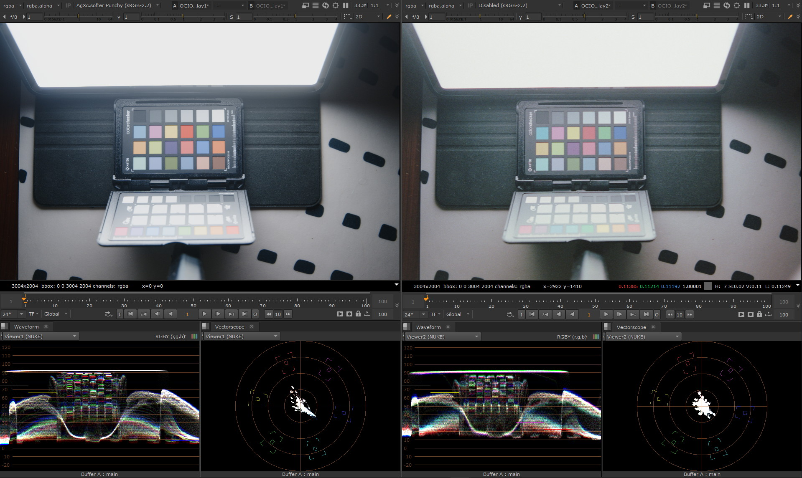

film-vs-digital asset chkpad1
#############################

:description: assets for comparison of film photography rendering against arbitrary digital photography rendering
:image: cover.jpg
:image-alt: Screenshot of Nuke software that show the film picture next to the digital picture. The scene is a color-checker on the floor; illuminated by an Ipad.
:date-created: 2024-07-31T16:54
:authors: Liam Collod
:category: asset
:tags: film-photography, color-science

    Digital image generated using AgXc-v1.0.0 image-rendering

- Instructions and details provided in a README.md file.
- Assets are shared "as is" without any guarantee
- For licensing inquirees please `contact me <../../contact.html>`_ .

You can download the assets there:

.. url-preview:: https://mega.nz/folder/eoJAGKBD#PQsZEtGSODSQSWpfnnnUaw
    :title: chkpad1 download
    :svg: ../../.static/icons/mega.svg
    :svg-size: 64

    .zip hosted on mega.nz

.. caution::

    Please share the link to this website and not the link to the mega download
    as it could be replaced in the future.