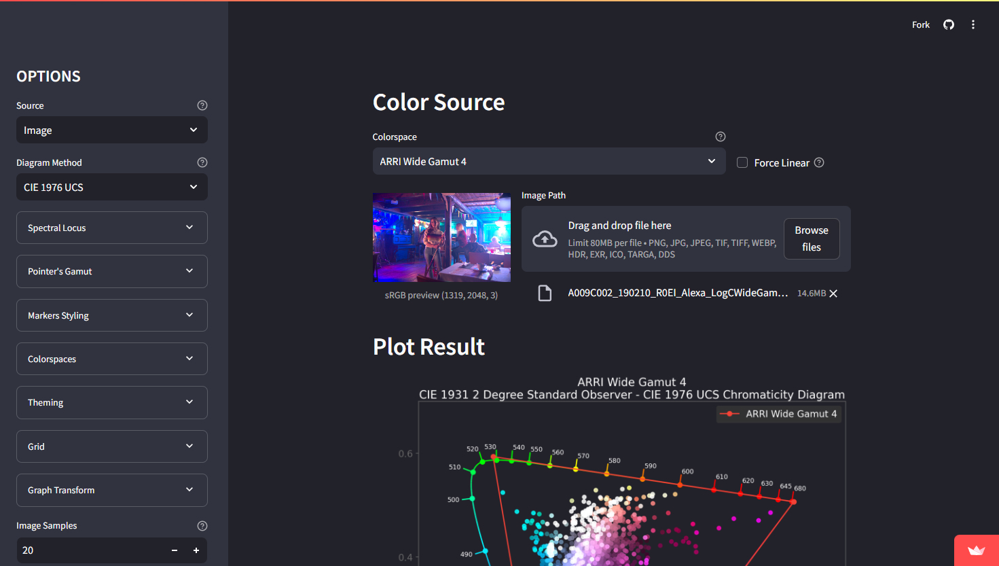

# Colour Plotting

:description: Web-app to plot colors, images and colorspaces in graphs.
:image: colour-plotting-thumbnail.jpg
:date-created: 2023-06-26T12:46
:authors: Liam Collod
:category: software
:tags: color-science

.. url-preview:: https://colour-plotting.streamlit.app/
    :title: Colour-science Plotting · Streamlit
    :image: colour-plotting-cover.jpg

!!! warning
    Streamlit (the hosting site) will automatically put the app to sleep if it wasn't
    used by anyone for some time. When that happens you need to awake the app by
    clicking on the suggested button (this can take a minute).

## Usage

You can toggle between 2 plotting mode at the top left: Color and Image, this determine
what you want to plot.

!!! warning
    When using images please be cautious with the size of the image you upload.
    An image that is too heavy risk of crashing the server, especially if a lot of
    people are using the app (memory is shared).

    You can [contact me](../../contact.html) if the server crash and need a restart.

!!! hint
    You can check the code at <https://github.com/MrLixm/streamlit-colour-plotting>
