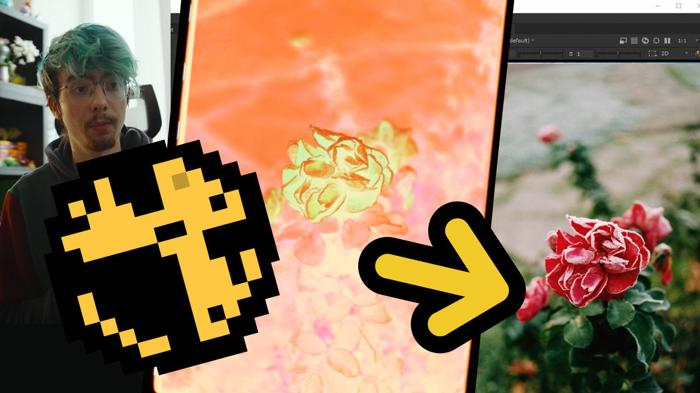
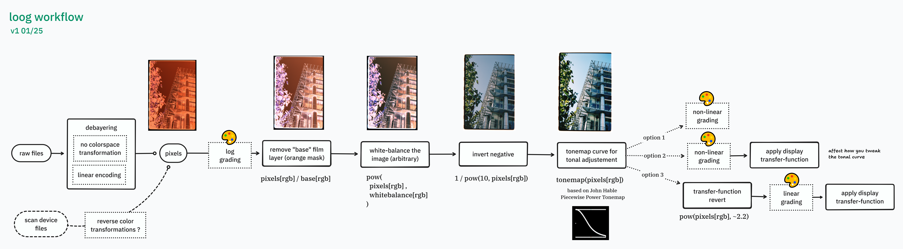

My unusual film scanning workflow
#################################

:description: Reviewing the software workflow I have been using for the past 2024 year to convert scanned negative to positive images.
:image: thumbnail.jpg
:date-created: 2025-01-10T12:00
:authors: Liam Collod
:category: learning
:tags: film-photography

It's been a while since I have done any kind of video but I thought my workflow
for scanning negatives was interesting enough that it deserved some presentation.
And even if not it was an interesting experience to make and leaves for me a formalized
trace of what is usually pretty volatile.

You can check the presentation on YouTube:

    click the image to be redirected to youtube

Let me provide you a quick overview of the video and my workflow. You can split it in
3 sections:

1. the software-abstracted imaging pipeline called "Loog"
2. its software application in professional VFX software *Nuke*
3. workflow use-case and image-processing scripts

Loog is the most important concept and you can find it
detailed at https://github.com/MrLixm/image-processing-lxm/tree/main/plugins/loog

    image-processing operations corresponding to the loog workflow