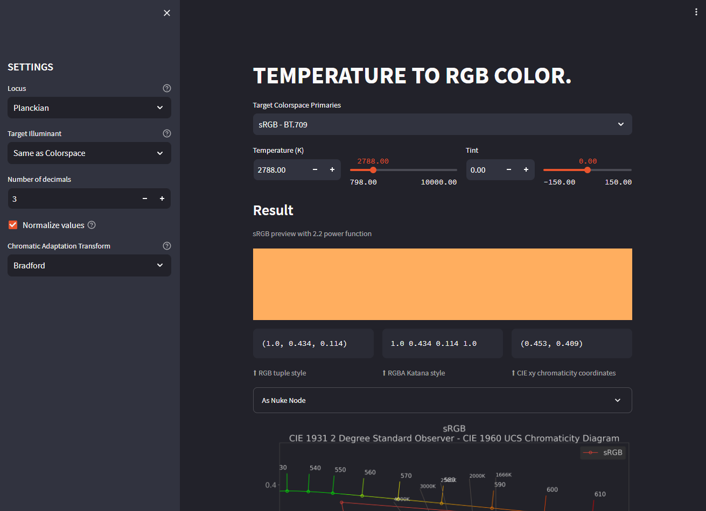

Temperature To RGB
##################

:description: Web-app for converting Kelvin temperature to RGB colorspaces.
:image: temperature-to-rgb-thumbnail.jpg
:date-created: 2021-04-05T10:37
:authors: Liam Collod
:category: software
:tags: color-science

.. url-preview:: https://mrlixm-temperature2rgb.streamlit.app
    :title: Temperature2RGB · Streamlit
    :image: screenshot-overview.png

.. warning::

    Streamlit (the hosting site) will automatically put the app to sleep if it wasn't
    used by anyone for some time. When that happens you need to awake the app by
    clicking on the suggested button (this can take a minute).

.. hint::

    You can check the code at https://github.com/MrLixm/Streamlit_Temperature2RGB
