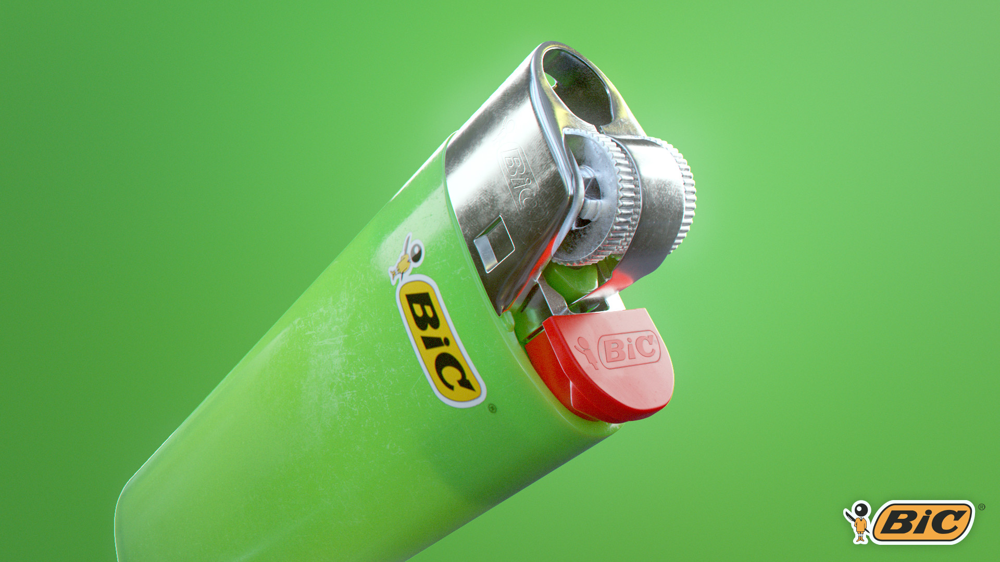
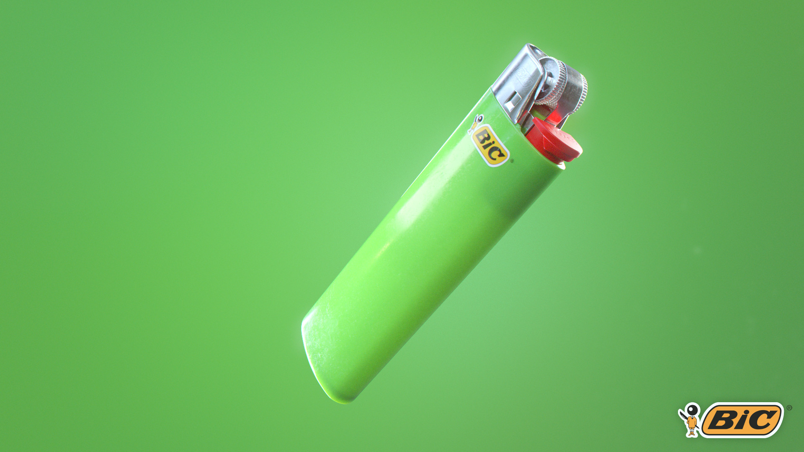
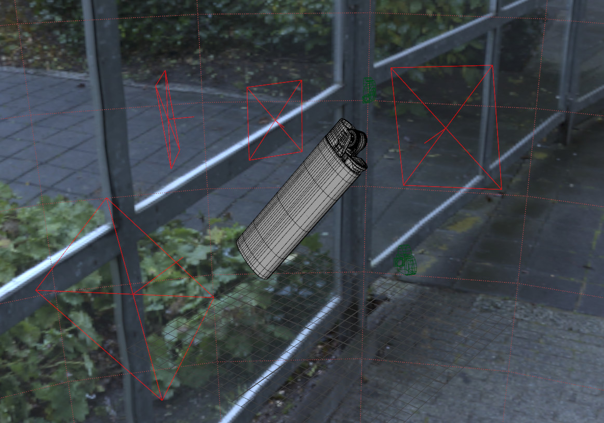
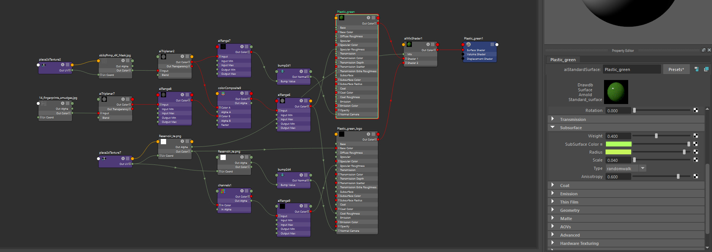
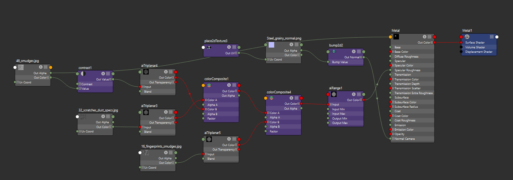

# BIC Lighter

:image: render.jpg
:date-created: 2018-11-09T22:31
:description: A school-work shading practice.
:software: Maya,Arnold,Photoshop

A school-work shading practice.

Surfacing is mainly node based, making mostly use of surface imperfection textures.
Some details (engraving, decals) are uv-based.

The original author of the 3d model is a classmate as I didn't get time to finish mine
for the assignment.

<section id="post-main">
<figure>

</figure>
<figure>

</figure>
<figure id="breakdown-progress">
  <video muted loop autoplay controls>
    <source src="anim.mp4" type="video/mp4">
  </video>
  <figcaption>A short animation that I actually made in 2026 when I found back some old renders I never used.</figcaption>
</figure>
<figure>
  
  <figcaption>Maya viewport.</figcaption>
</figure>
<figure>
  
  <figcaption>Green plastic material hypershade screenshot.</figcaption>
</figure>
<figure>
  
  <figcaption>Metal material hypershade screenshot.</figcaption>
</figure>
</section>
