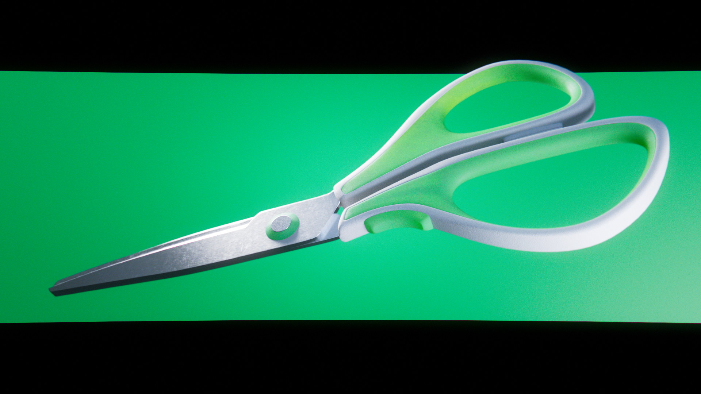
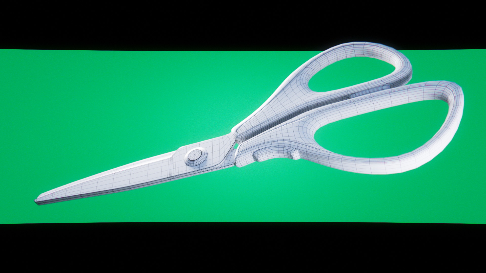
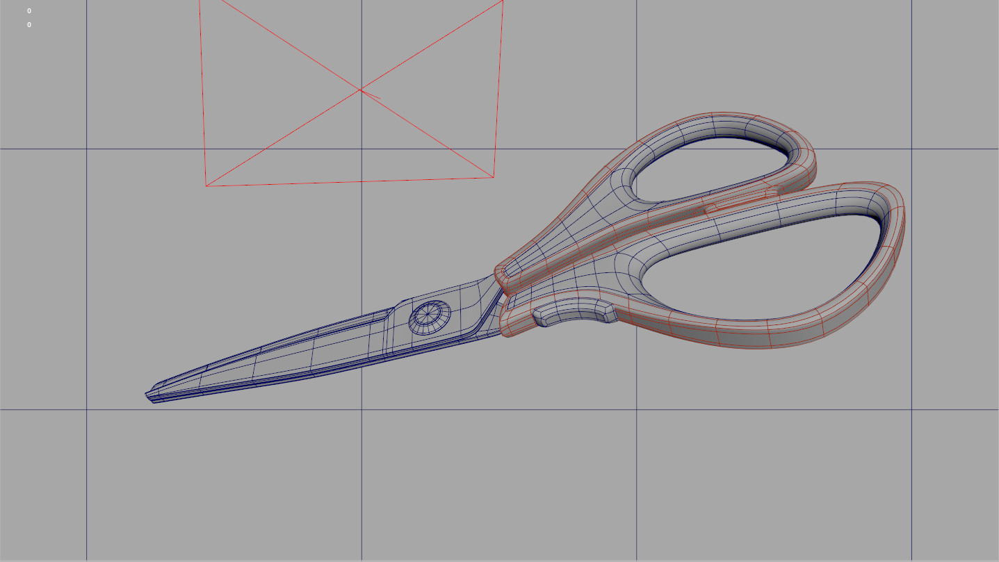

# Green Scissors

:image: render.jpg
:date-created: 2018-11-09T22:05
:description: A school-work modeling and shading practice.
:software: Maya,Arnold,Nuke

A school assignement from 2017.

The main objective was modeling practice, but I also spent extra time on the lookdev to practice with Arnold.

Post-processing in Nuke.

<section id="post-main">
<figure>
    
</figure>
<figure>
    
</figure>
<figure>
    
    <figcaption>Screenshot of the scene Maya viewport with the wireframe enabled.</figcaption>
</figure>
</section>
