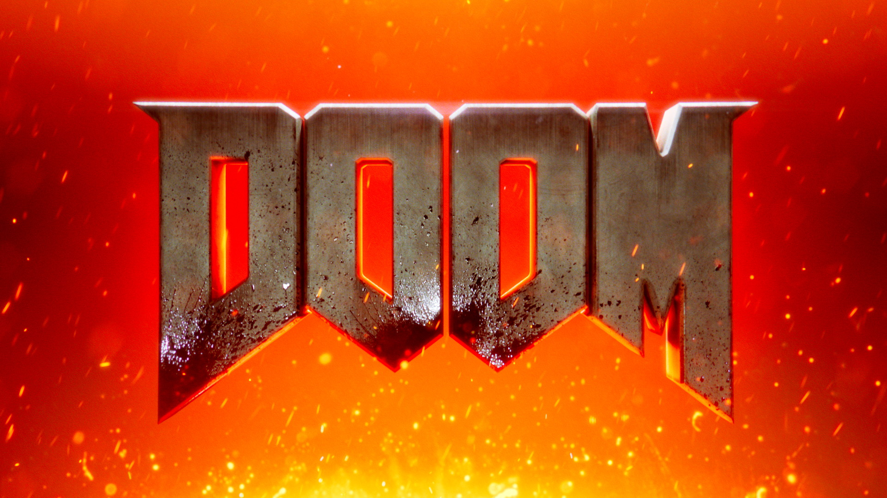
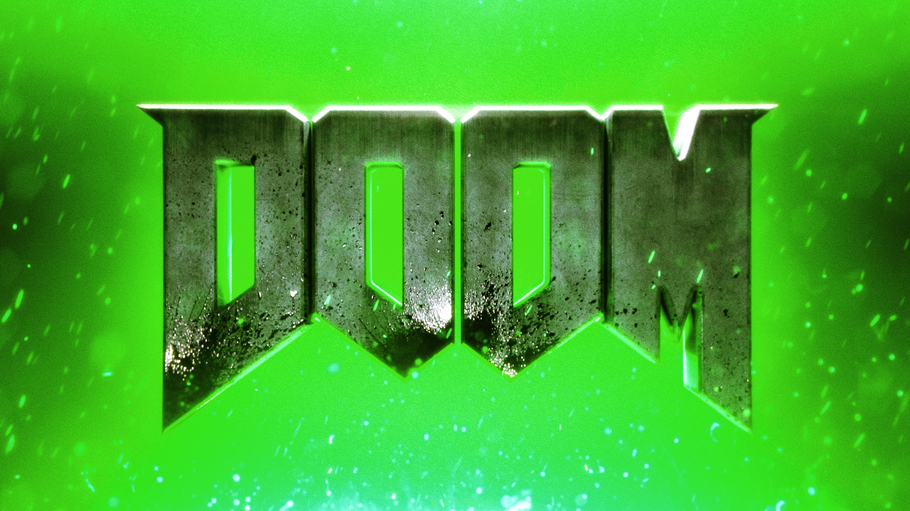
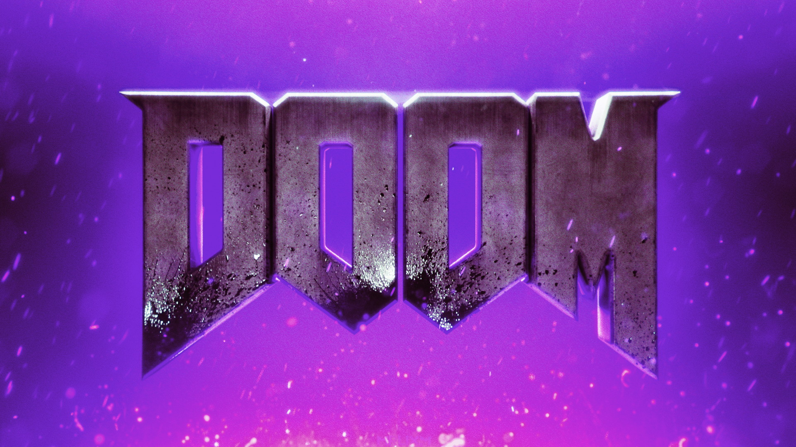
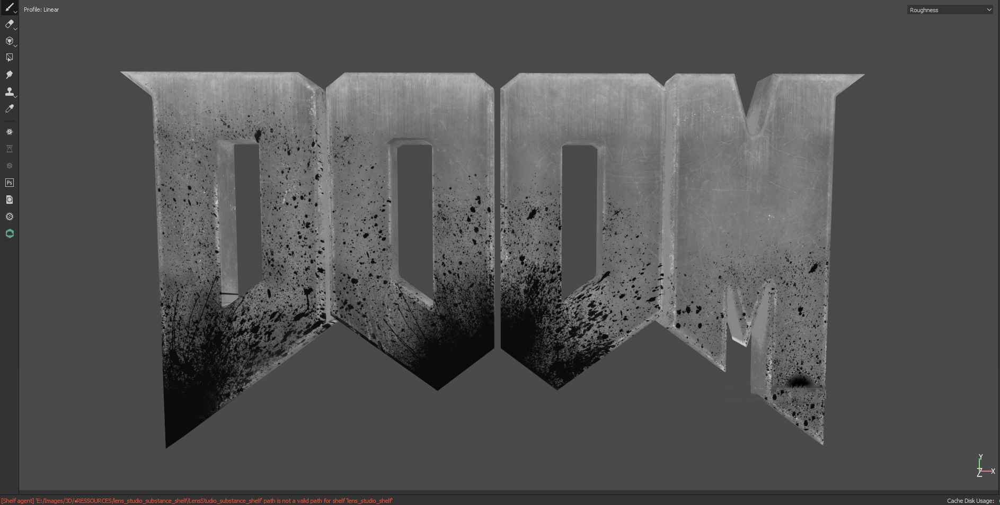
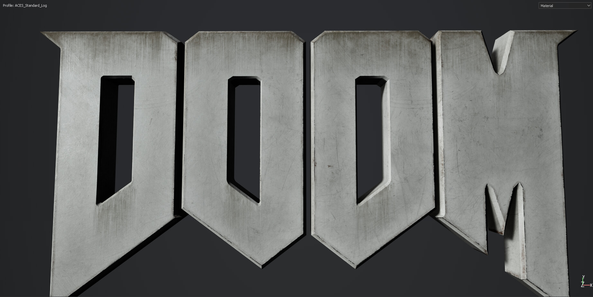
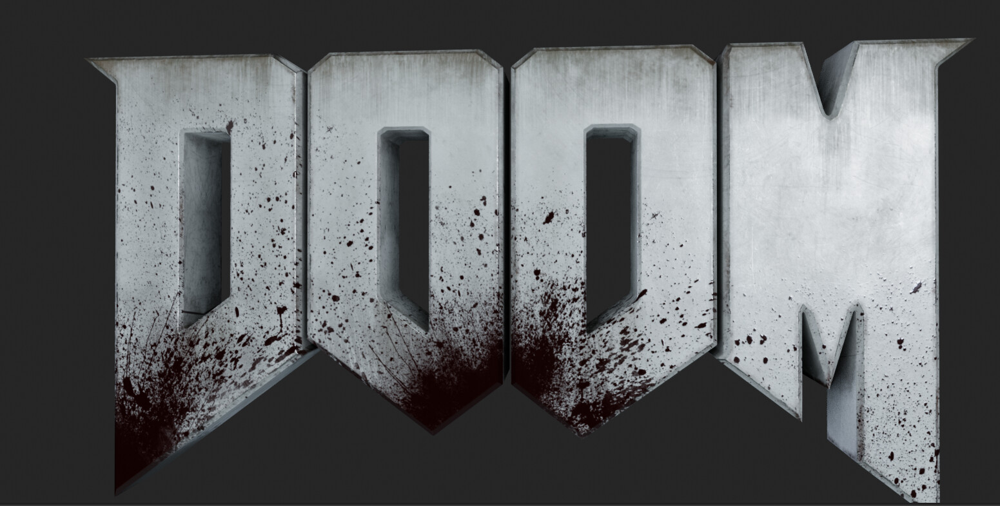
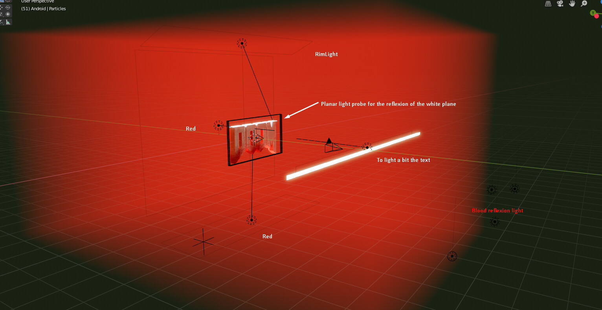

# DOOM Wallpaper

:image: render.jpg
:date-created: 2019-06-12T17:54
:description: Hyped by the E3 and the latest trailer from Doom I decided to make this wallpaper.
:software: Blender,Substance-Painter,Nuke,EEVEE,Megascans

Hyped by the E3 and the latest trailer from Doom I decided to make this wallpaper.

- Modeling : Blender
- Texturing: SubstancePainter (blood from Megascans)
- Rendering: EEVEE
- Compositing: Nuke
- color variants quickly edited in Photoshop

<section id="post-main">
<figure>
    
</figure>
<figure>
    
    <figcaption>Green variant because I like green.</figcaption>
</figure>
<figure>
    
    <figcaption>Purple variant because it pairs nicely with green.</figcaption>
</figure>
<figure>
    
    <figcaption>Compositing breakdown (Nuke).</figcaption>
</figure>
<figure>
    
    <figcaption>Texturing breakdown (Substance Painter).</figcaption>
</figure>
<figure>
    
    <figcaption>Substance Painter viewport (without blood).</figcaption>
</figure>
<figure>
    
    <figcaption>Blender EEVEE viewport.</figcaption>
</figure>
<figure>
    
    <figcaption>Blender EEVEE viewport for the final scene.</figcaption>
</figure>
</section>
