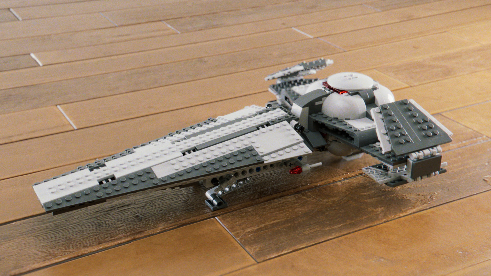
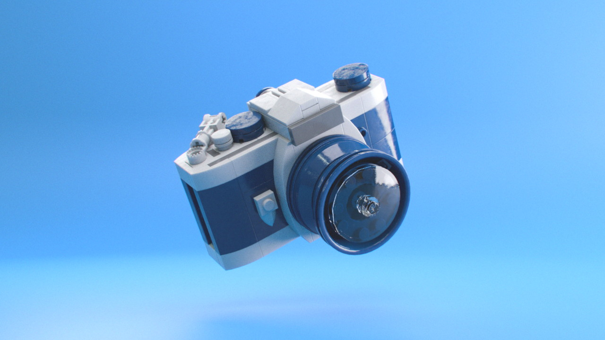
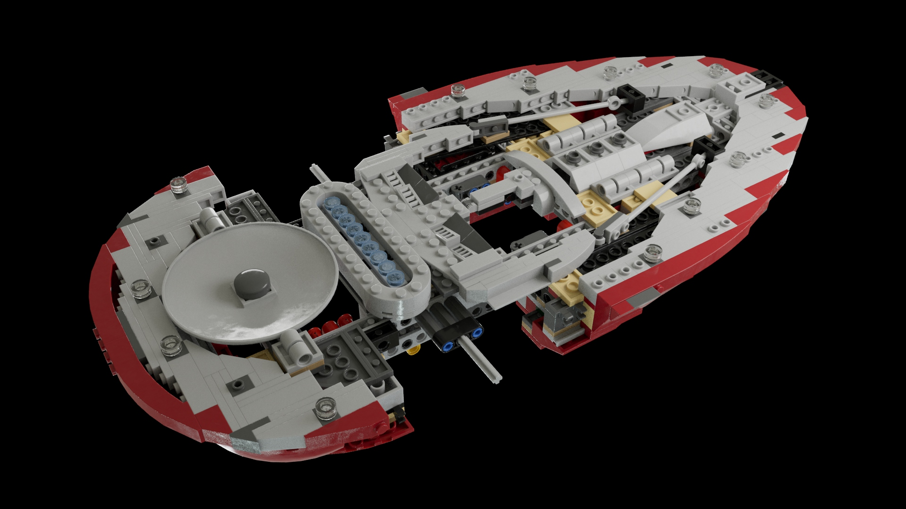
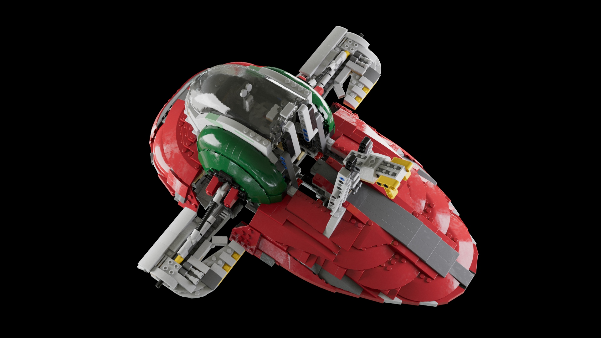
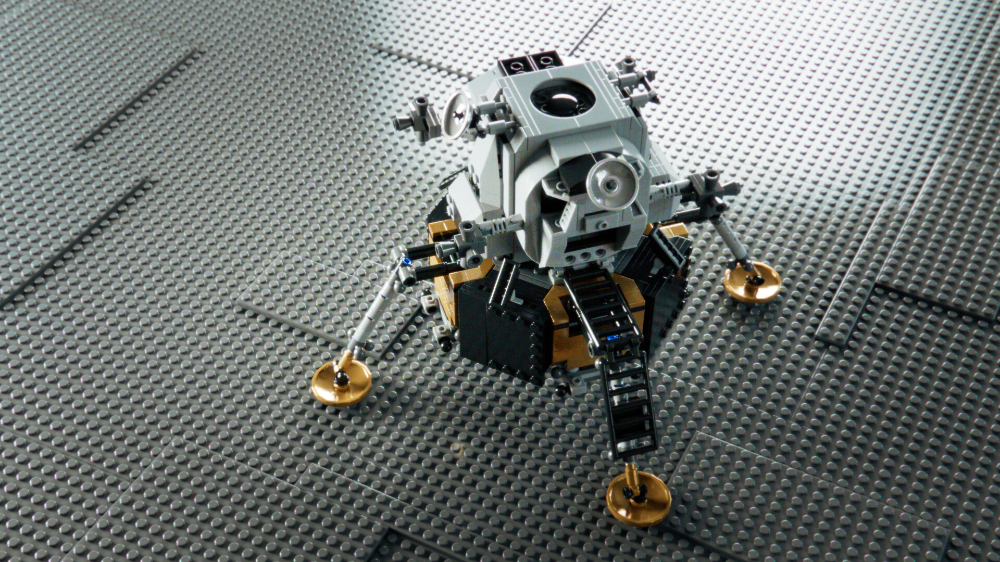

# Lego BrickIt models

:image: render.slaveI.jpg
:date-created: 2019-01-05T20:21
:description: Having fun with the BrickIt plugin in Maya.
:software: Maya,Arnold,AfterEffects,Nuke

I bought the BrickIt plugin for Maya from Wizix and made those models. The plugin provides
a library of parts and you have to assemble the model yourself by following the official
lego instructions. Very fun to use, had a blast building those.

Maya and Arnold for the renders. Mix of Nuke and After effect for post-processing.

<section id="post-main">
<figure>
    
    <figcaption>SlaveI ship from StarWars</figcaption>
</figure>
<figure>
    
    <figcaption>Darth Maul's Infiltrator ship from StarWars</figcaption>
</figure>
<figure>
    
    <figcaption>A cute camera model based on the instructions of  ChrisMcVeigh</figcaption>
</figure>
<figure>
    
    <figcaption>work in progress for the SlaveI model</figcaption>
</figure>
<figure>
    
    <figcaption>work in progress for the SlaveI model</figcaption>
</figure>
<figure>
    
    <figcaption>A work in progress of the Apollo moon landing module.</figcaption>
</figure>
</section>
