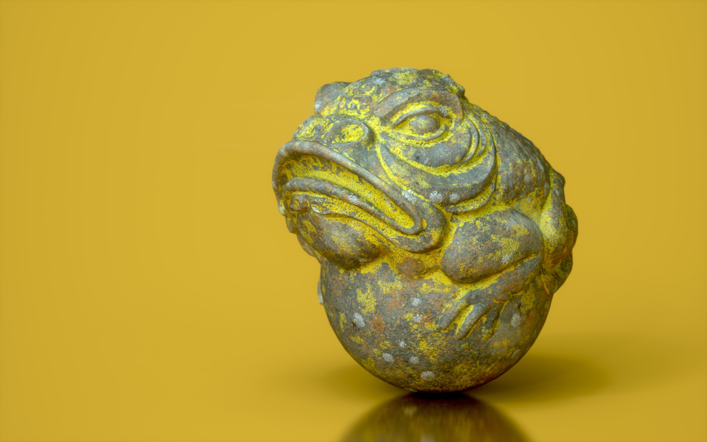
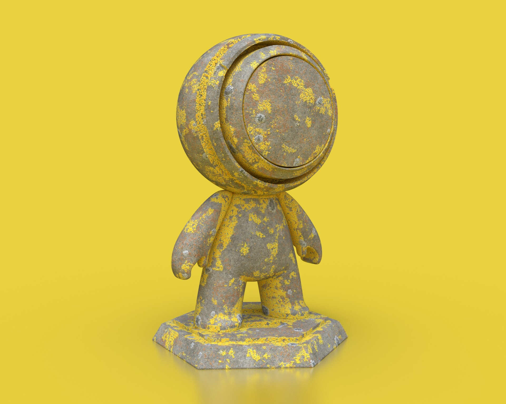
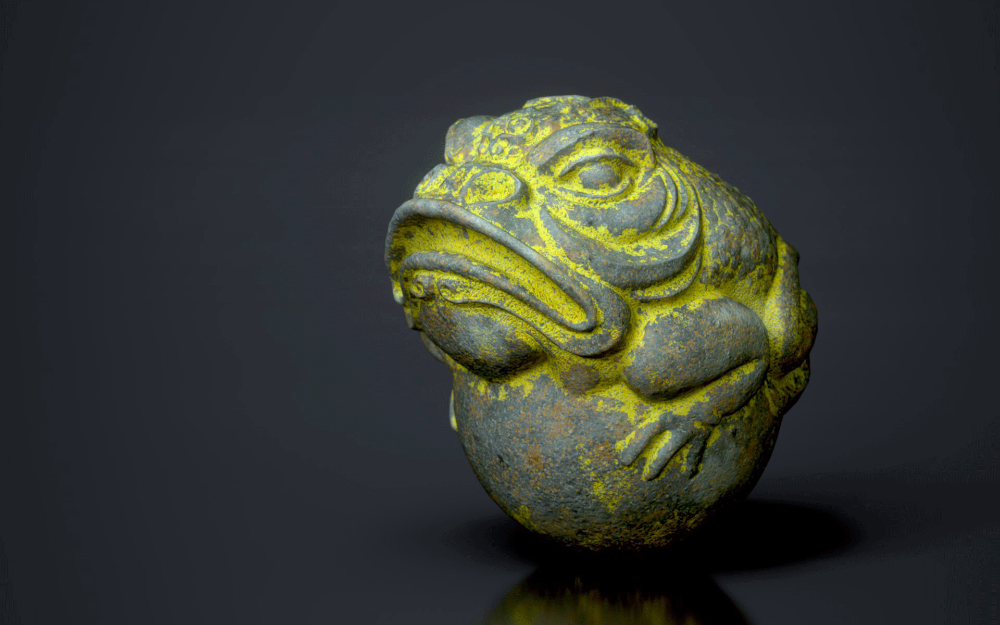
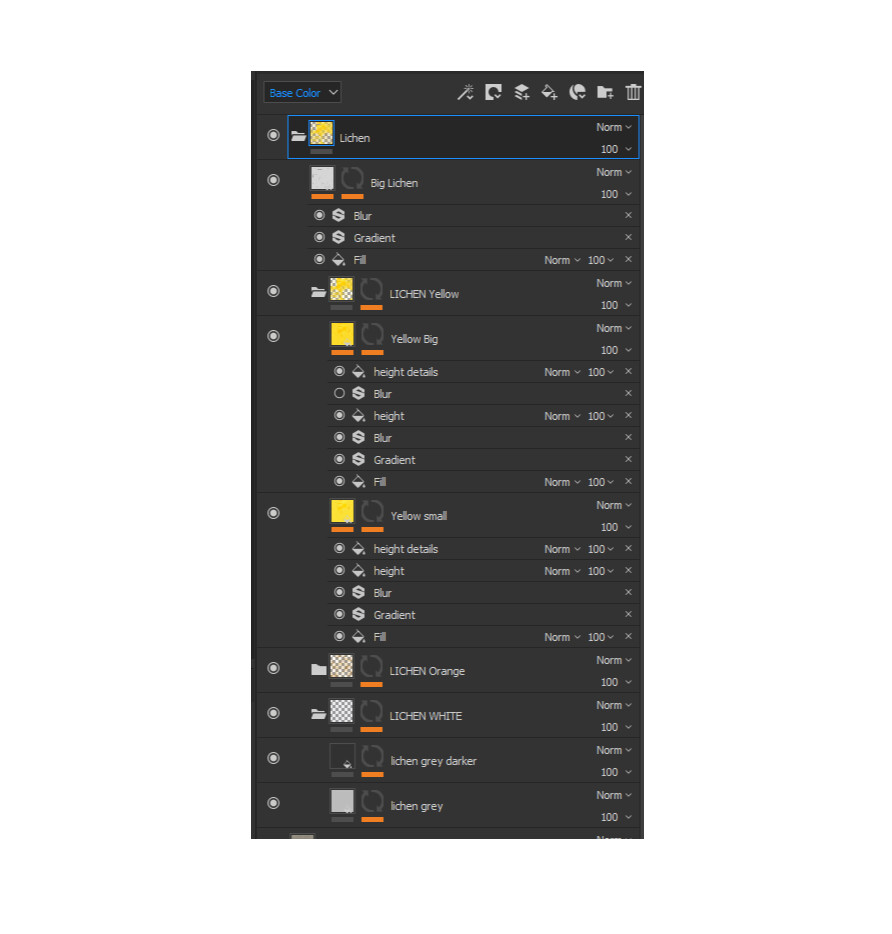

# Lichen Smart Material

:image: render.jpg
:date-created: 2019-02-08T21:05
:description: Lichen rock surface smart material for Substance Painter.
:software: SubstancePainter

Lichen smartmaterial for Substance Painter (to use with the version above 2017.2).

> <https://substance3d.adobe.com/community-assets/assets/1b402fd83b5b41387c5712d40a649aaf247aa48d>

Render made with Iray using SP samples models. Rock material not included.
There are 4 different groups that correspond to 4 different lichen types.
Each one has a mask with a fill layer to change the opacity.

<section id="post-main">
<figure>
    
</figure>
<figure>
    
</figure>
<figure>
    
</figure>
<figure>
    
</figure>
</section>
