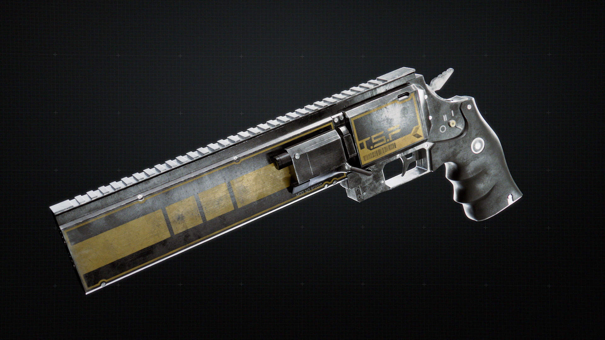
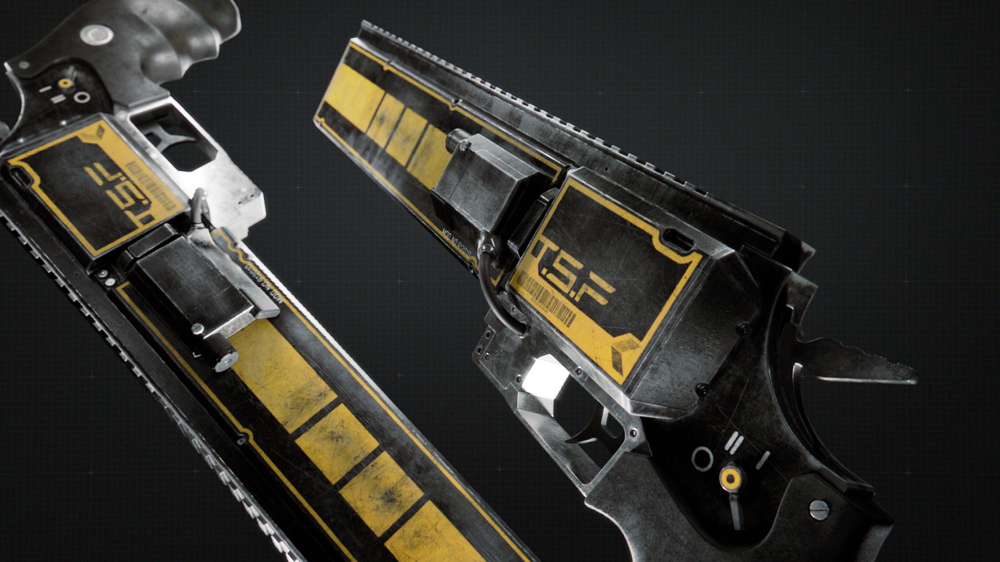
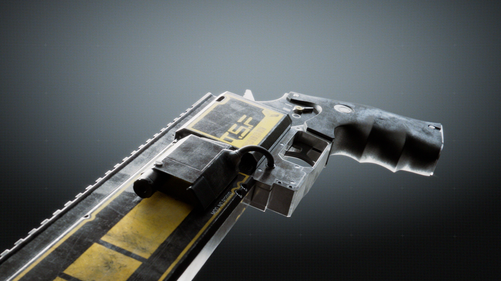
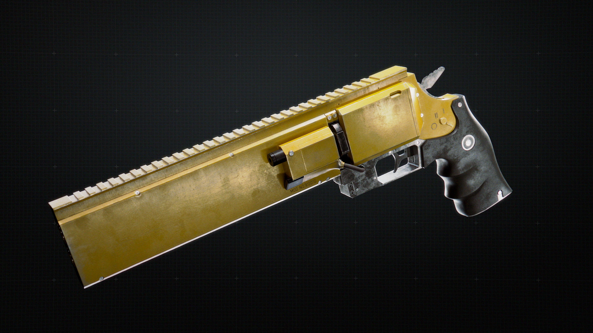
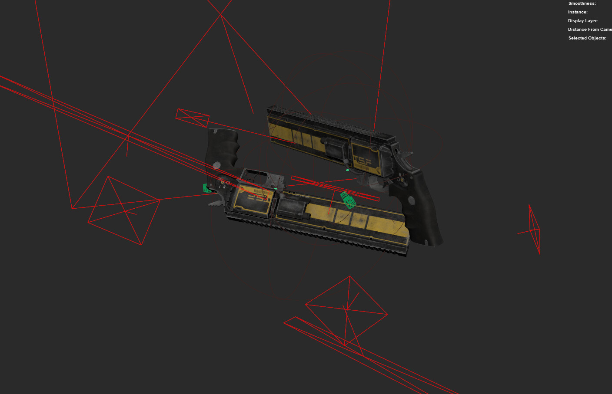
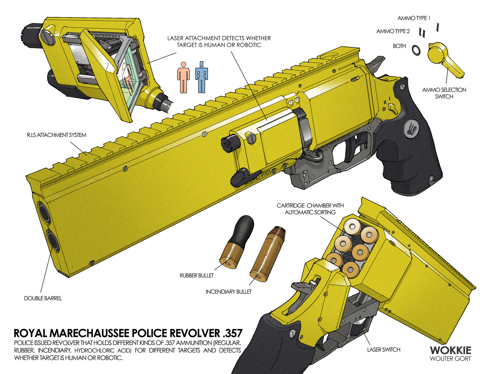

# Scifi Revolver

:image: render.jpg
:date-created: 2019-05-27T19:27
:description: Gun asset done as part of a large environment project.
:software: Maya,Arnold,SubstancePainter,Nuke

A gun prop I did for a school environment project.
Took me a bit more than 2 weeks.

Based on an original concept by Woter Gort.

.. url-preview:: https://www.artstation.com/artwork/mDNQ9
    :title: Artwork Royal Marechaussee Police Revolver
    :image: concept.jpg

    by Wouter Gort

- Modeling in Maya.
- Textured in SubstancePainter using textures from Quixel (2x 4k maps + 1x 2k map for the handle).
- Compositing done in Nuke.

Thanks again to the Wizix's Discord community for the feedback on this project. 

<section id="post-main">
<figure>
    
</figure>
<figure>
    
</figure>
<figure>
    
</figure>
<figure>
    
    <figcaption>With the same color-schema as the original concept.</figcaption>
</figure>
<figure>
    
    <figcaption>Shaded preview in the Substance Painter viewport.</figcaption>
</figure>
<figure>
    
    <figcaption>Screenshot of the Maya viewport.</figcaption>
</figure>
<figure>
    
    <figcaption>The original concept by Woter Gort</figcaption>
</figure>
</section>
