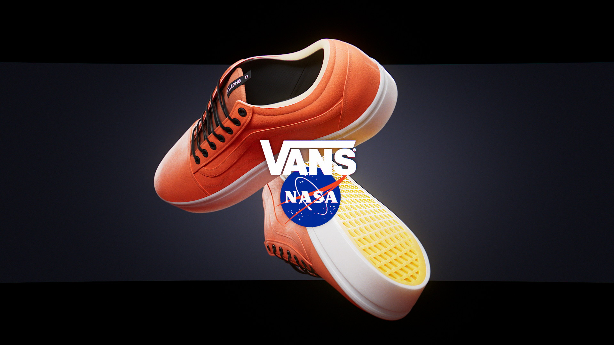
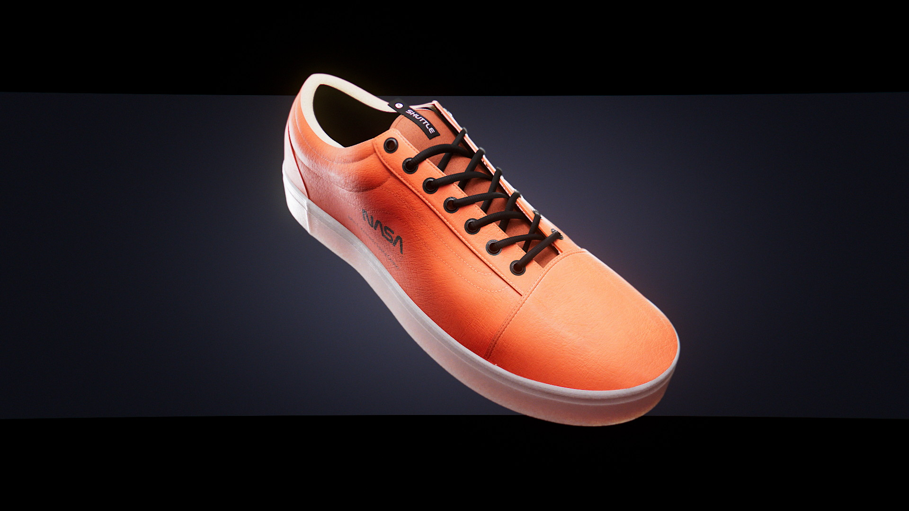
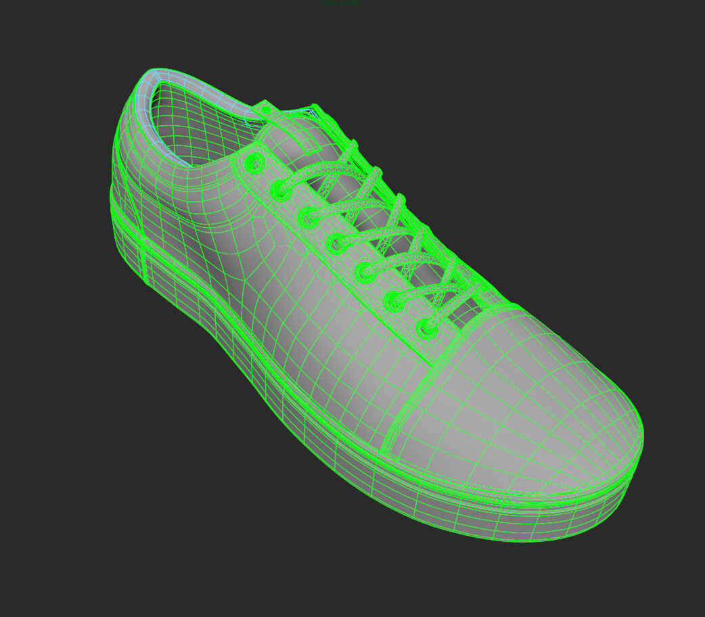
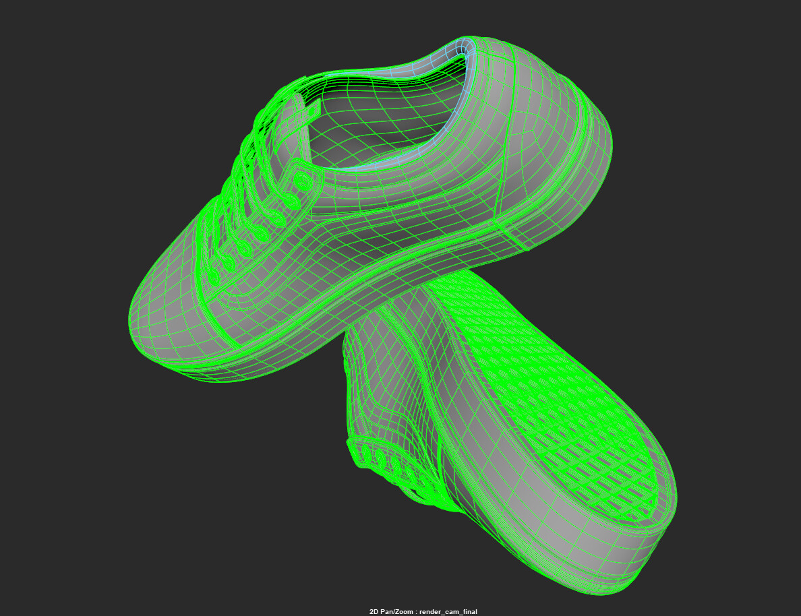
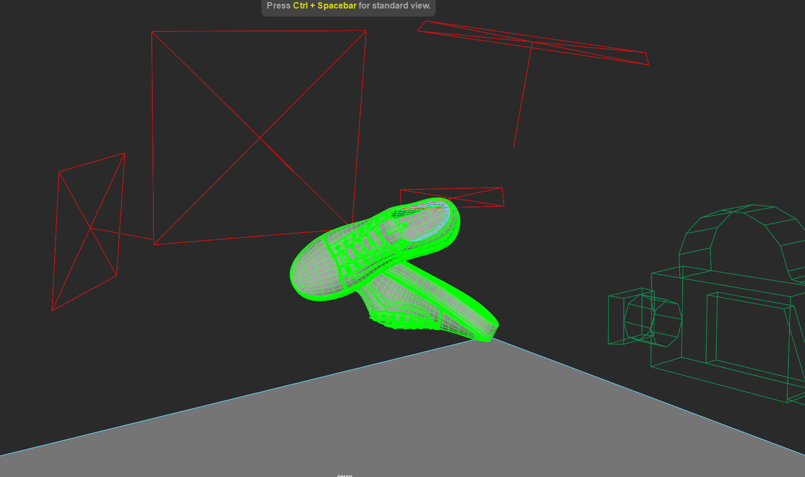
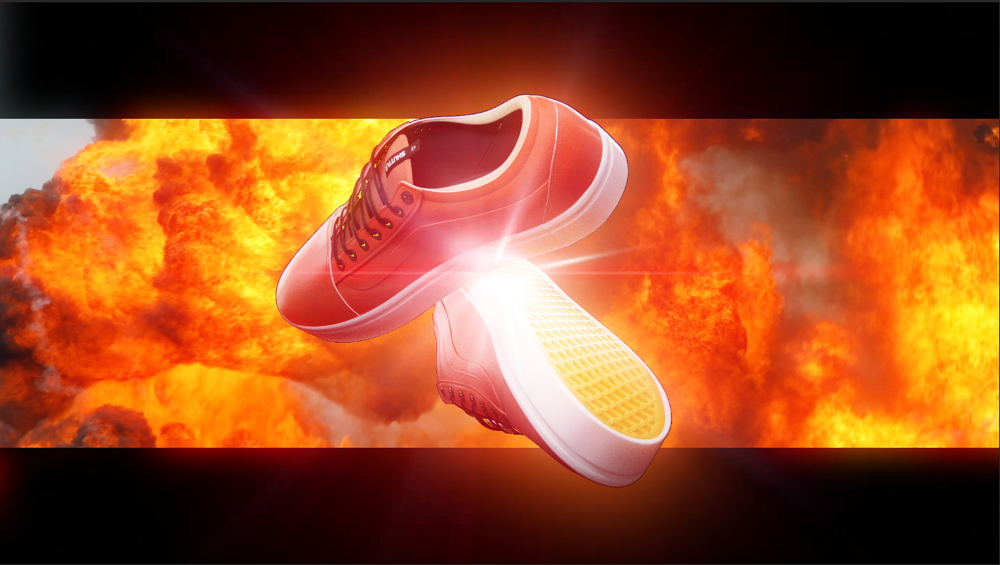

# VANS Nasa Shoes

:image: render.jpg
:date-created: 2019-09-27T23:37
:description: A full cg reproduction of a shoe model.
:software: Maya,Arnold,Substance-Painter,Nuke

A project for a school assignment that took about  3 months in March 2019.

Responsible for all aspects.

- Modelling done in Maya using the curve & birail workflow.
- Texturing done with Substance Painter (stitches)
- Lookdev in Arnold with mostly triplanar. I am clearly not satistied with the lookdev, but I couldn't spend more time on it.
- Post-processing in Nuke.

<section id="post-main">
<figure>
    
</figure>
<figure>
    
</figure>
<figure>
    
</figure>
<figure>
    
</figure>
<figure>
    
</figure>
<figure>
    
    <figcaption>I think I lost all control at some point.</figcaption>
</figure>
</section>
