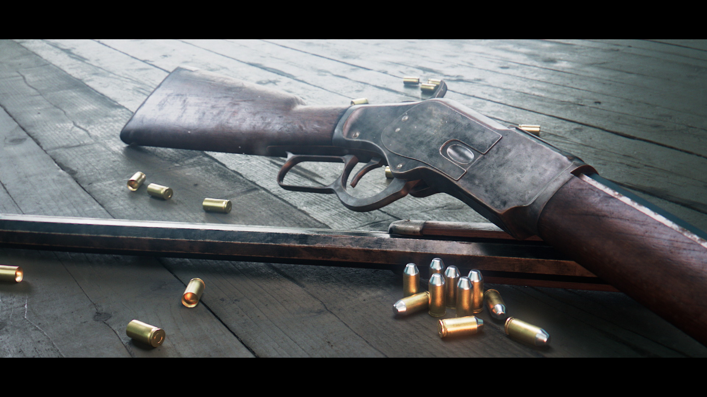
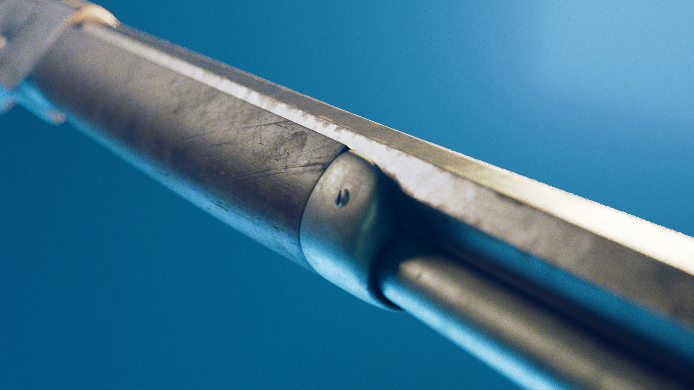
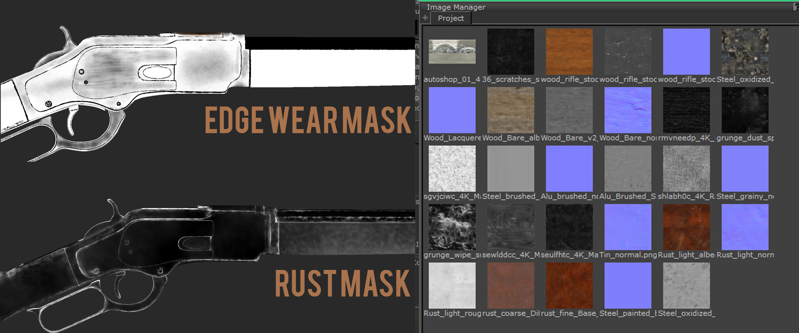
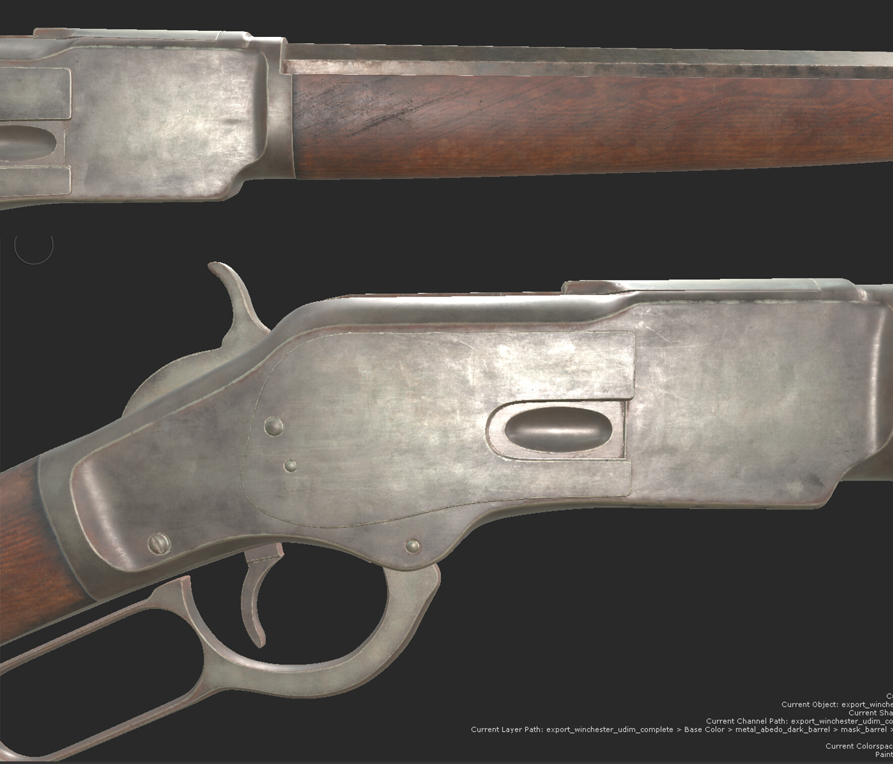
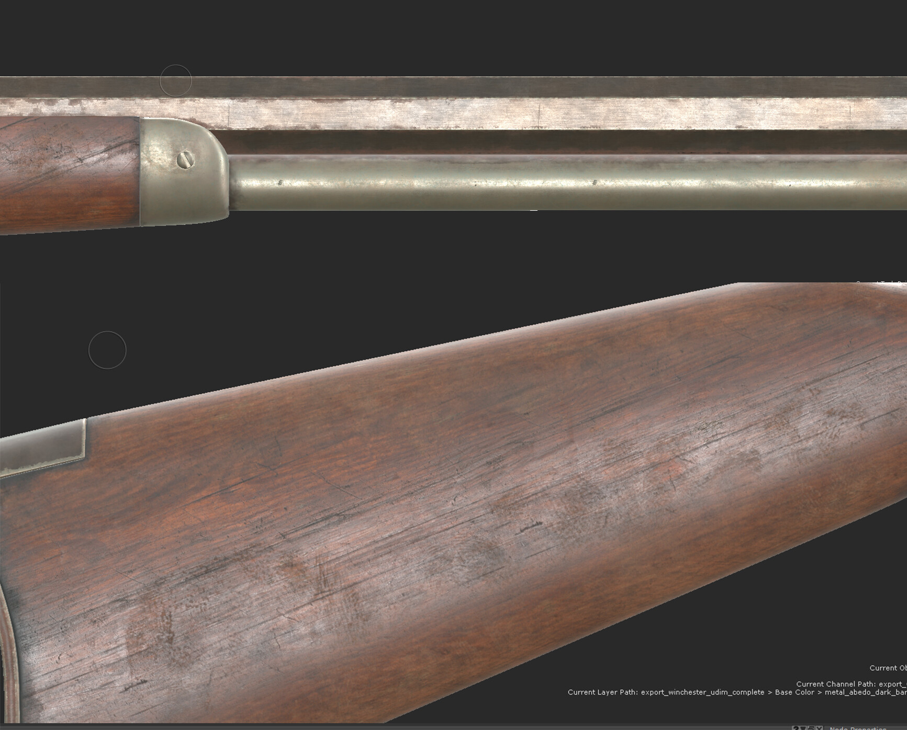
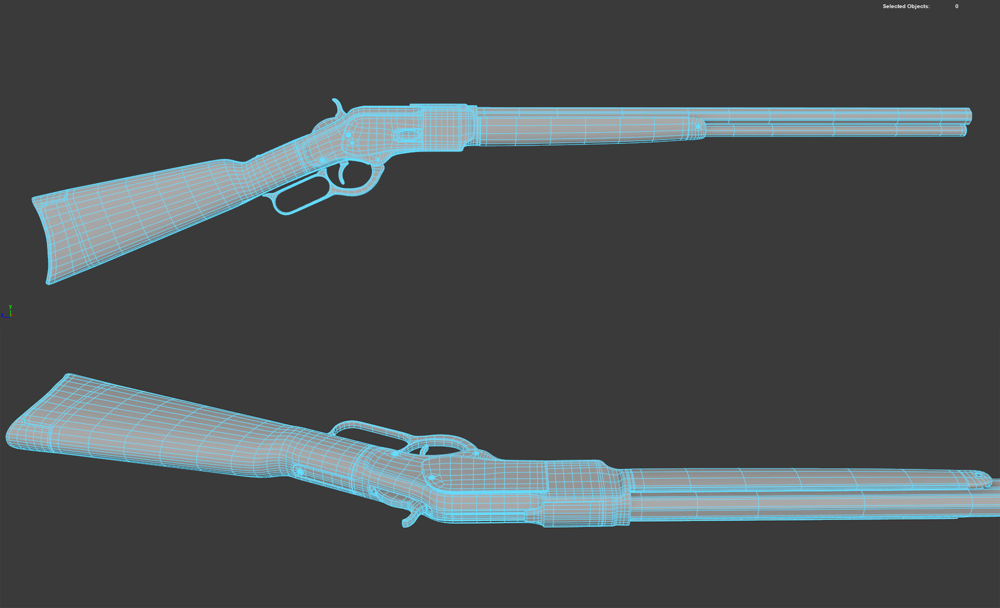
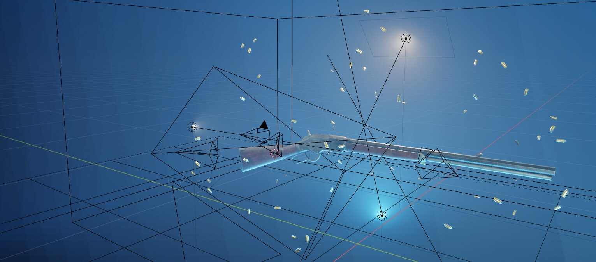
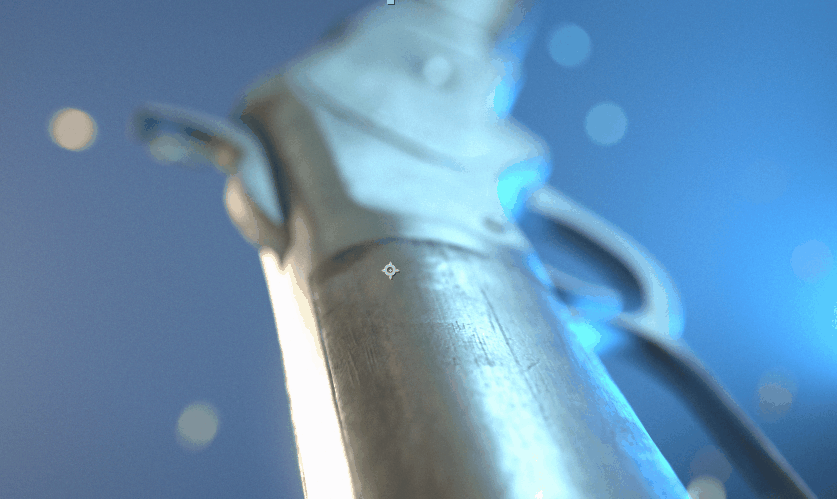
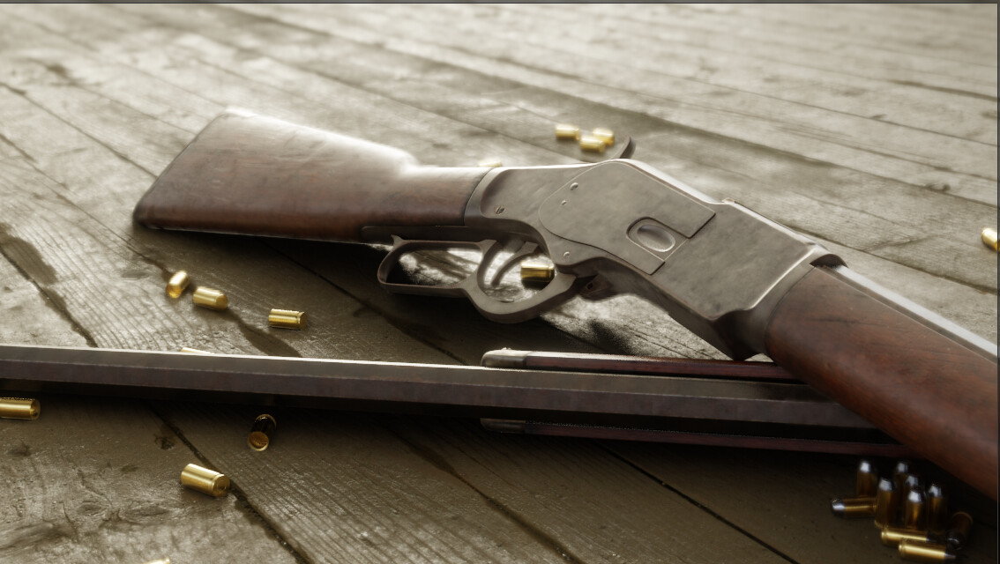

# Winchester 1873

:image: render.jpg
:date-created: 2019-02-20T21:11
:description: Winchester 1873 full aspect cg shot for a school assignment.
:software: Maya,Arnold,Mari,Blender,EEVEE,After-Effects,Nuke,Megascans

Winchester 1873 cg model, reponsible for all aspects.

School project I'm making since November 2018.

- modeling: Maya, subd and quad-only
- texturing: Mari, metalness workflow with textures from megascans, Substance Source, and other textures packs.
- rendering: Blender EEVEE for the animations, Arnold for static shots.
- post-processing: AfterEffect (EEVEE renders), Nuke (arnold shots)

I used Blender's EEVEE due to the short time I had. I wanted to make a quick animation to showcase the texturing work, but I only had one weekend.
Hence, me ending up picking EEVEE which speedup render times but also the lookdev process.

Some of my first renders with the ACES workflow.

Huge thanks to the Wizix discord community for the feedback.

<section id="post-main">
<figure>
    
    <figcaption>key-art (Arnold + Nuke)(this is actually an improved version I did 2 years later)</figcaption>
</figure>
<figure>
  <video muted loop autoplay controls>
    <source src="anim.mp4" type="video/mp4">
  </video>
  <figcaption>Animation (EEVEE)</figcaption>
</figure>
<figure>
  <video muted loop autoplay controls>
    <source src="anim.close.mp4" type="video/mp4">
  </video>
  <figcaption>Animation (EEVEE)</figcaption>
</figure>
<figure>
    
    <figcaption>Close-up render (Arnold + Nuke)</figcaption>
</figure>
<figure>
    
    <figcaption>Some of the textures and mask used in Mari.</figcaption>
</figure>
<figure>
    
    <figcaption>The model in the Mari viewport with full shading.</figcaption>
</figure>
<figure>
    
    <figcaption>The model in the Mari viewport with full shading.</figcaption>
</figure>
<figure>
    
    <figcaption>The model wireframe in Maya.</figcaption>
</figure>
<figure>
    
    <figcaption>The animated scene EEVEE viewport (~25fps with a GTX1080).</figcaption>
</figure>
<figure>
    
    <figcaption>ACES / sRGB comparison where clipped/overexposed values are visible on the sRGB version.</figcaption>
</figure>
<figure>
    
    <figcaption>EEVEE composition test for the key render.</figcaption>
</figure>
</section>
