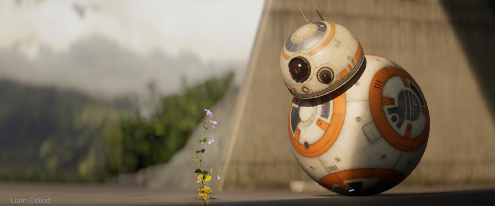
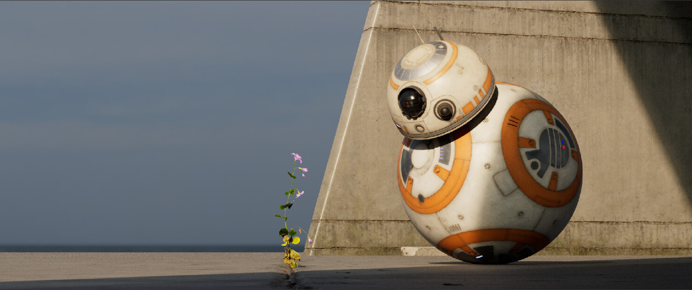
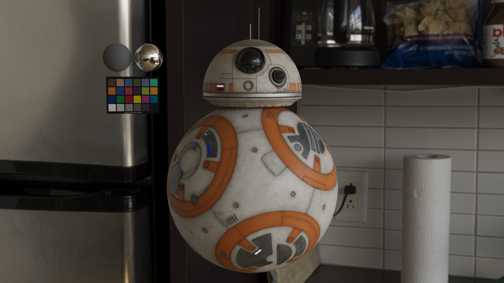

# Give me the plant

:image: render.jpg
:date-created: 2020-12-20 20:30
:description: A small star-wars themed personal project.
:software: Katana,Mari,Nuke,3Delight,Megascans,Maya

Hyper quick render done in one day for a Discord contest.

The bb8 was an old Mari texturing project that I decided to reuse (was not responsible for the modelling).
Megascans was a life-saver for such a short deadline.
I used a solid amount of compositing to make it look good, god bless depth of field ! 

This was also my first project with [3delight](https://www.3delight.com/),
which was very straight forward to learn !

<section id="post-main">
<figure>
    
</figure>
<figure>
    
    <figcaption>The raw render out of 3delight.</figcaption>
</figure>
<figure>
    
    <figcaption>A snapshot of the lookdev with 3Delight.</figcaption>
</figure>
</section>