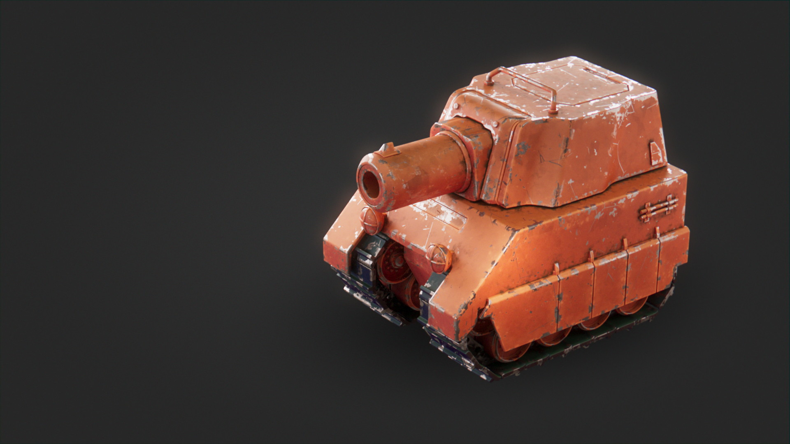
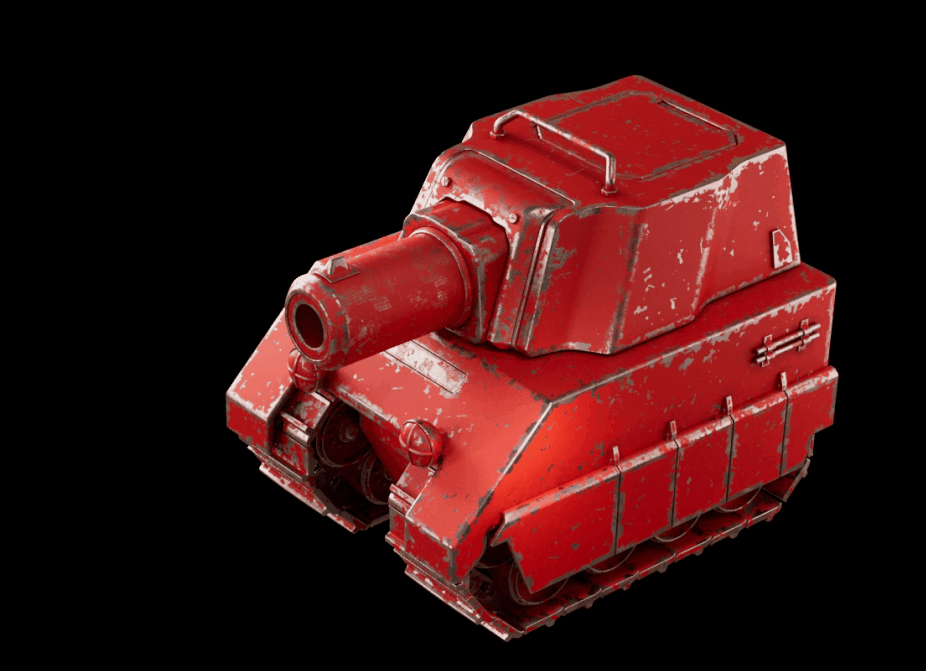
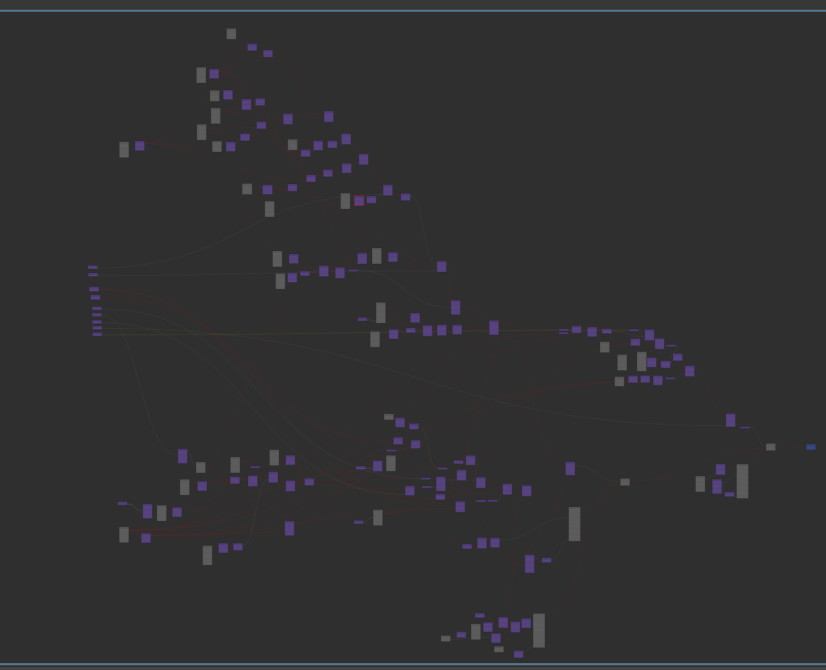
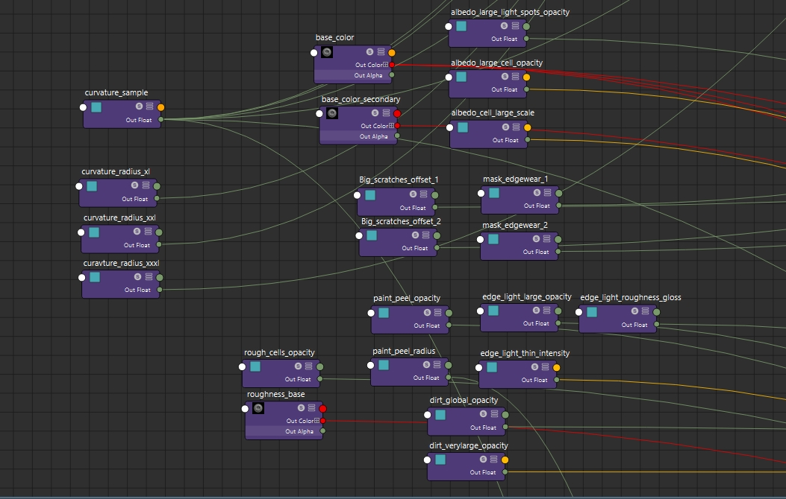
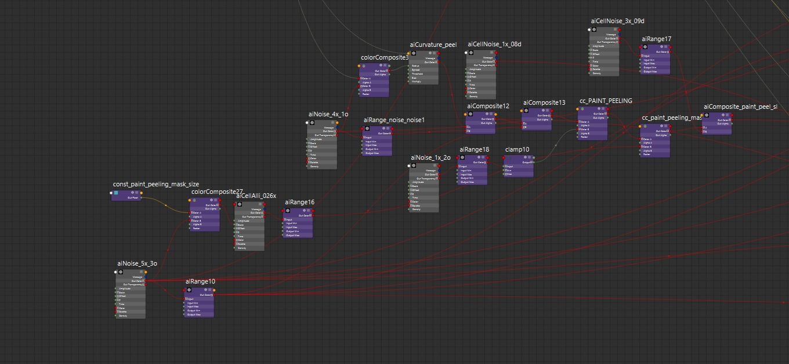

# Procedural-only Shader Experiment

:image: thumbnail.jpg
:date-created: 2020-07-07T00:54
:description: Creating a fully procedural tank material in Arnold.
:software: Maya,Arnold

This project was originally started for a Wizix's contest. I tried to create a kind of stylized material for a tank model in Maya.

Instead of making something straightforward I ended up with a challenge for myself by doing an advanced material with 0 image texture used.
The material is a huge mess of nodes which make it very heavy for rendering. So this was
rather just a fun experiment than an actually production-ready asset.

Tank model by Wizix

<section id="post-main">
<figure>
    
</figure>
<figure>
    
    <figcaption>Lookdev progress.</figcaption>
</figure>
<figure>
    
    <figcaption>The whole nodegraph overview.</figcaption>
</figure>
<figure>
    
    <figcaption>All the inputs nodes that control the look.</figcaption>
</figure>
<figure>
    
    <figcaption>A random section of the nodegraph.</figcaption>
</figure>
</section>
