# 2020 Projects

:image: thumbnail.jpg
:date-created: 2020-09-29 22:34
:description: Various project I did through the last year, mostly unfinished.
:software: Maya,Blender,Substance-Painter,Redshift,Arnold,Davinci-Resolve,Nuke,Photoshop

Various project I did through the last year (2019-2020). A mix of school projects, or unfinished personal projects
which I was still kinda happy with the final result.

<section id="post-main">
<figure>
    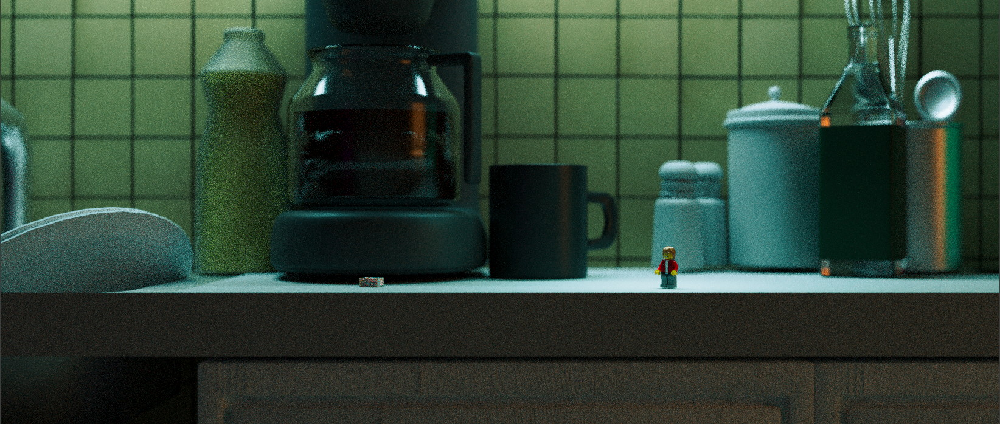
    <figcaption>A concept render for a never started project (Blender).</figcaption>
</figure>
<figure>
    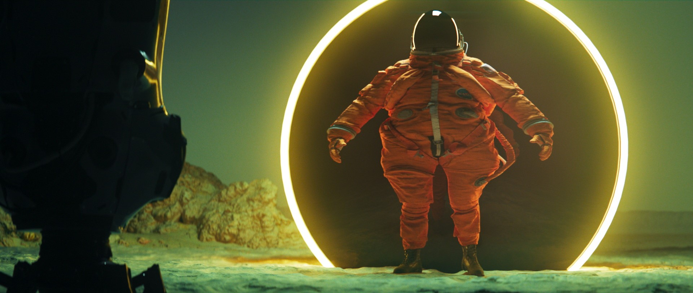
    <figcaption>School exercice to test Resolve. Some motion-design "dailies" vibes.</figcaption>
</figure>
<figure>
    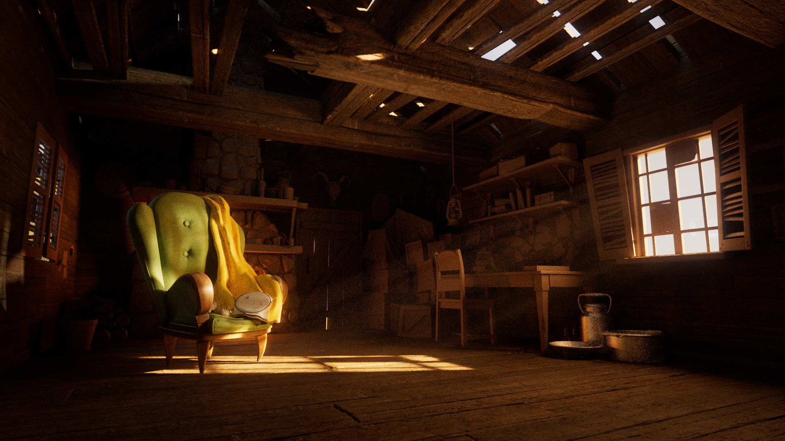
    <figcaption>A Redshift lighting project for one of the famous free Pixar scene. There's not one single props that is textured except for the chair and the cabin wooden structure.</figcaption>
</figure>
<figure>
    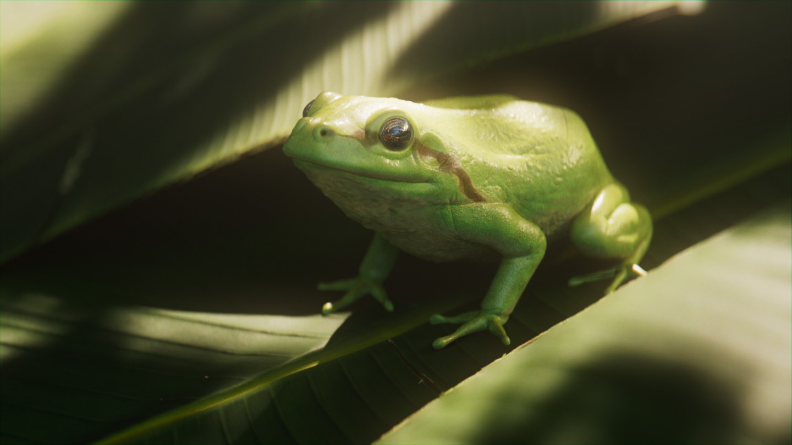
    <figcaption>A school project where we had to sculpt in Zbrush and render a realistic animal. Photoshop did the trick to replace the texturing 🙈.</figcaption>
</figure>
<figure>
    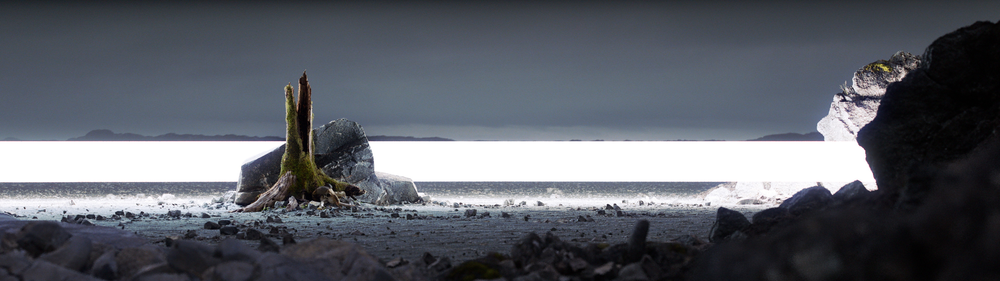
    <figcaption>Personal, nearly-finished project where I had fun with Megascans assets (Redshift + Maya).</figcaption>
</figure>
<figure>
    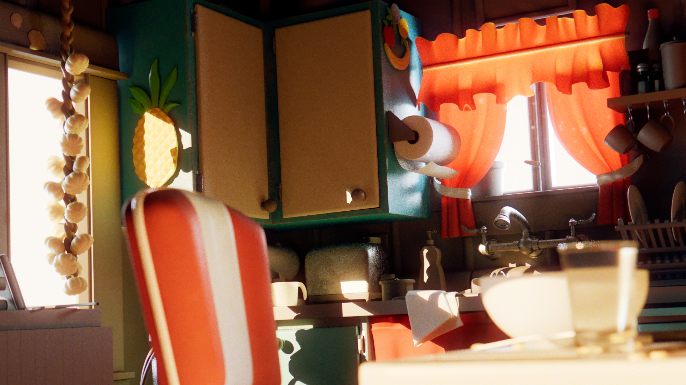
    <figcaption>Lighting exercice on the famous Pixar kitchen scene.</figcaption>
</figure>

    <figure>
        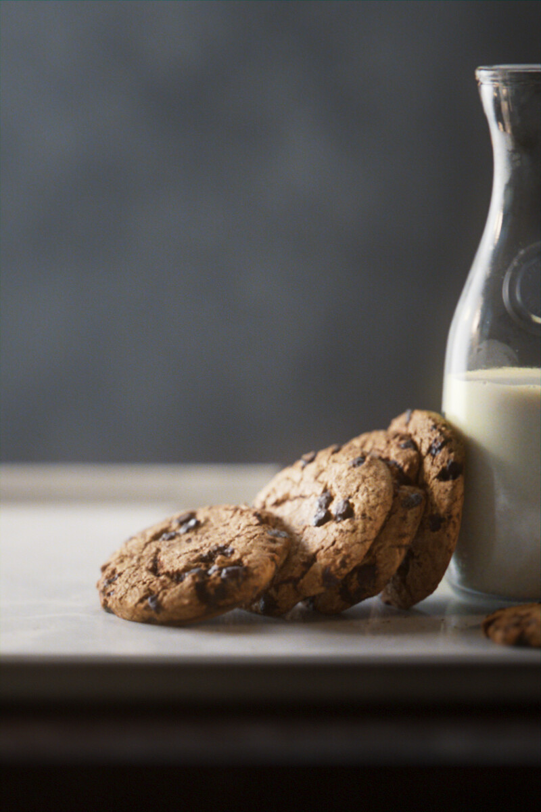
        <figcaption>Yet another re-lighting exercice from <a href="https://renderman.pixar.com/cookies-and-milk">a free Pixar scene.</a></figcaption>
    </figure>
    <figure>
        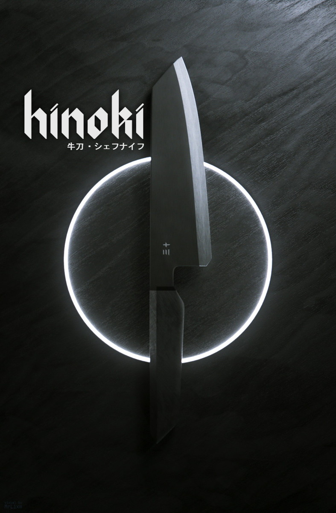
        <figcaption>A fake advertisment of a real brand for a Japanase cooking knife.</figcaption>
    </figure>

<figure>
    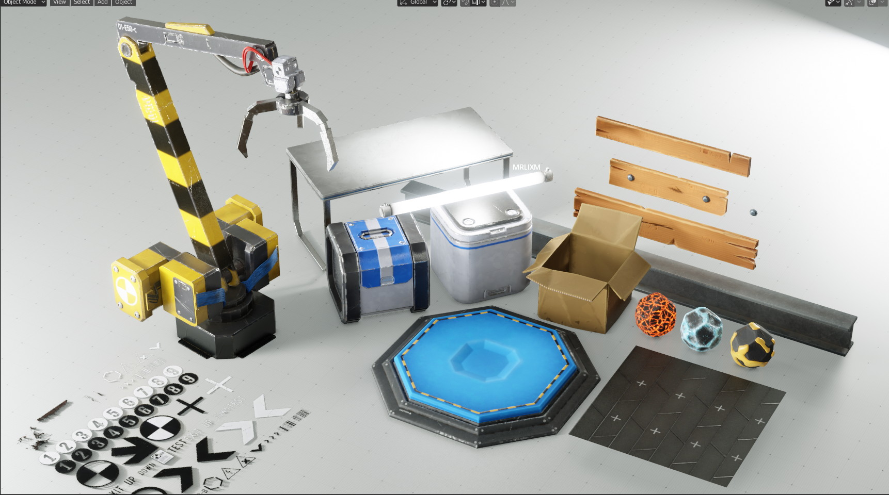
    <figcaption>Some sci-fi assets made for a small video-game.</figcaption>
</figure>
<figure>
    <video controls width="100%">
      <source src="./mattepainting.mp4" type="video/mp4" />
    </video>
    <figcaption>School project, first time doing 2.5D mattepainting with Nuke and Photoshop. This is a layered Photoshop composition where each alyer have been reprojected on 3d geometry.</figcaption>
</figure>
<figure>
    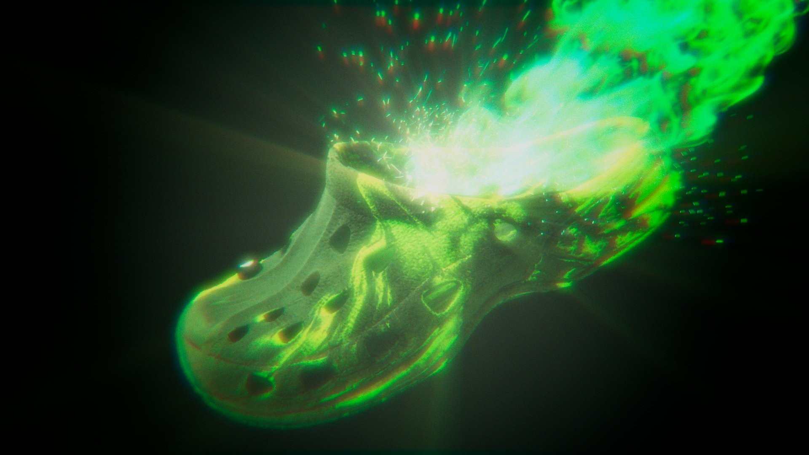
    <figcaption>
    The Ultimate Crocs experience ™, some of my first test with Nuke 
    (yes you might have notice older projects were already using Nuke, 
    but it's because I actually I reopened them, took the original renders and redid the post-processing with Nuke).
    </figcaption>
</figure>

    <figure>
        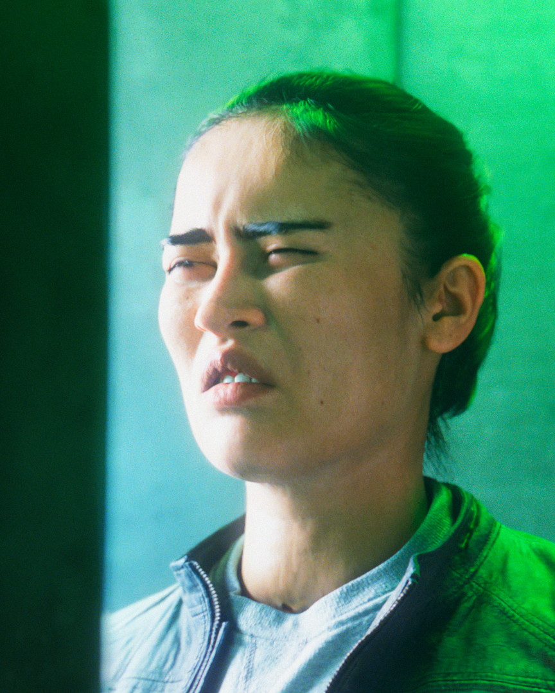
        <figcaption>School work, model is a free scan. (visual representation of people looking at discord light theme)</figcaption>
    </figure>
    <figure>
        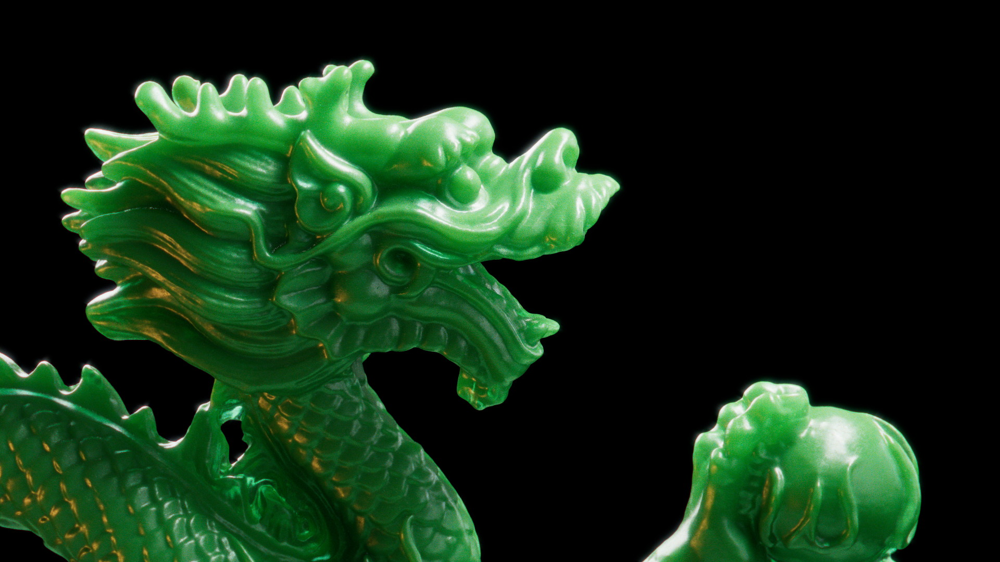
        <figcaption>Test render for the Redshift SSS, this green is so beautiful..</figcaption>
    </figure>

<figure>
    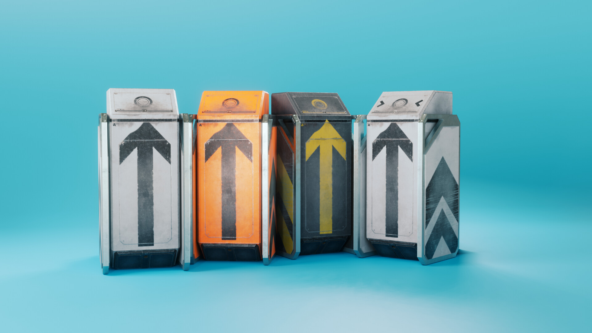
    <figcaption>Took me one week to make to not be visible in the final render (that is just below).</figcaption>
</figure>
<figure>
    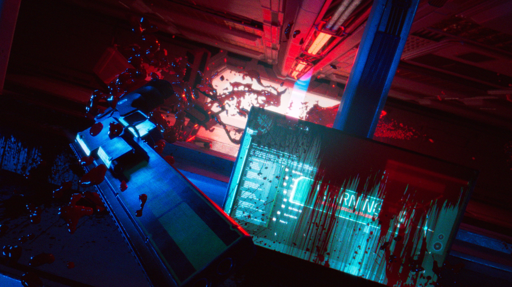
    <figcaption>This was my school 2nd year final project. There was so much energy put into this, I was so much tired that I guess I got lost at the end and the final render is not that great.</figcaption>
</figure>
<figure>
    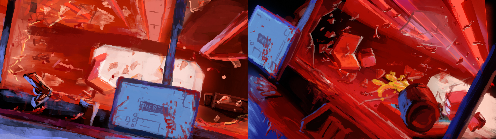
    <figcaption>The concept art I draw for the previous project.</figcaption>
</figure>
</section>