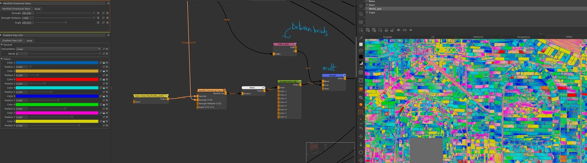
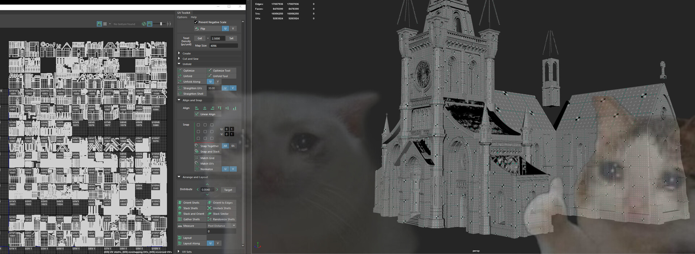
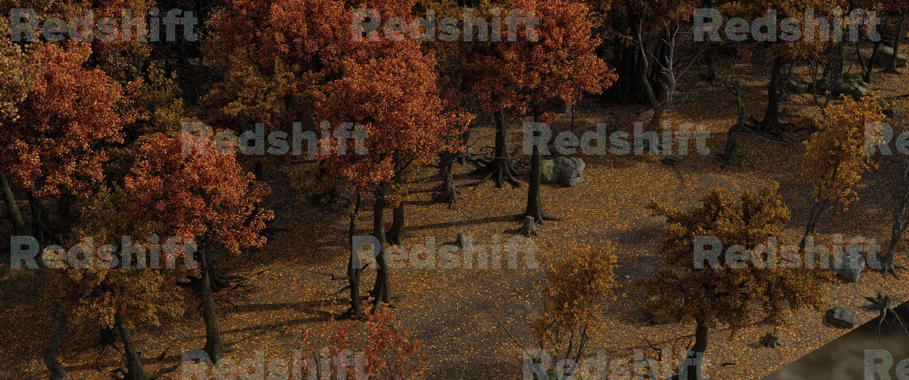

# Witches (2021)

:image: thumbnail.jpg
:date-created: 2021-09-24 18:38
:description: Witches is the second animated shot-movie project I worked on at CpasDec.
:software: Katana,Redshift,Mari,Substance-Designer,Maya,Nuke

Witches is the second animated shot-movie project I worked on at CpasDec.

CpasDec was the temporary association we created with a bunch of school team-mates
to collaborate with Stim studio on the creation of 3 short-movies in one year.

This was the longest project and as such the one where we had the most polished images.
The production was especially interesting considering we had access to Katana for
assembly, lookdev and lighting. Katana was kind of scary because of the amount of support
it required to have a usable workflow, but I think ended up really making the whole
project a lot smoother.

The full software stack was:

- Maya: modeling, animation, layout
- XGen: grooming
- Mari: texturing
- Substance Painter: less important texturing
- Houdini: fx
- Katana: lookdev, lighting
- Redshift: render-engine
- Nuke: compositing
- Davinci Resolve: grading

I was personally responsible for:

- set surfacing supervision, set surfacing, tertiary characters surfacing.
- shot lighting and compositing
- misceleanous TD tasks (day-to-day scripting, some tools, Katana templates).

You can watch the full short-movie [on YouTube here](https://www.youtube.com/watch?v=BMbsicE5qJE).

As a bonus you can also check [the collection of shitposting](../../../blog/prod_goes_wrong) we did during the production.

<section id="post-main">
<figure>
    <video autoplay loop controls width="100%" poster="thumbnail.jpg">
      <source src="./SH003A.mp4" type="video/mp4" />
    </video>
    <figcaption>SH003A - responsible for lighting and compositing.</figcaption>
</figure>
<figure>
    <video autoplay loop controls width="100%" poster="thumbnail.jpg">
      <source src="./SH011A.mp4" type="video/mp4" />
    </video>
    <figcaption>SH011A - responsible for lighting and compositing.</figcaption>
</figure>
<figure>
    <video autoplay loop controls width="100%">
      <source src="./SH086-90-92.mp4" type="video/mp4" />
    </video>
    <figcaption>SH086,90,92 - responsible for lighting, compositing and environment instancing.</figcaption>
</figure>
<figure>
    <video autoplay loop controls width="100%">
      <source src="./SH103A.mp4" type="video/mp4" />
    </video>
    <figcaption>SH103A - responsible for set-assembly, lighting and compositing. This was a very tricky shot with a lot of cheating. It was rendered as a single frame and I had to give the illusion of movement in comp.</figcaption>
</figure>
<figure>
    <video autoplay loop controls width="100%">
      <source src="./cathedral_base.mp4" type="video/mp4" />
    </video>
    <figcaption>cathedral - responsible for UVs, texturing and lookdev.</figcaption>
</figure>
<figure>
    <video autoplay loop controls width="100%">
      <source src="./cathedral_close.mp4" type="video/mp4" />
    </video>
    <figcaption>cathedral - responsible for UVs, texturing and lookdev.</figcaption>
</figure>
<figure>
    
    <figcaption>Breakdown of the cathedral texturing in Mari. How I manage to get non-tilling color variations on the bricks (with Extension Pack plugin).</figcaption>
</figure>
<figure>
    
    <figcaption>Near final cathedral UVs. This was lot of fun hahahahahaha</figcaption>
</figure>
<figure>
    
    <figcaption>Some Katana instancing done for the forest sequence. The instancing was coming from Houdini and I had to assemble it back in Katana.</figcaption>
</figure>
<figure>
    <video autoplay loop controls width="100%">
      <source src="./SH080a.mp4" type="video/mp4" />
    </video>
    <figcaption>SH080A - responsible for some set surfacing and supervision.</figcaption>
</figure>
<figure>
    <video autoplay loop controls width="100%">
      <source src="./gate.mp4" type="video/mp4" />
    </video>
    <figcaption>gate - responsible for UVs, texturing and lookdev.</figcaption>
</figure>
<figure>
    <video autoplay loop controls width="100%">
      <source src="./tableCircle.mp4" type="video/mp4" />
    </video>
    <figcaption>tableCircle - responsible for all aspects.</figcaption>
</figure>
<figure>
    <video autoplay loop controls width="100%">
      <source src="./wheatBucket.mp4" type="video/mp4" />
    </video>
    <figcaption>wheatBucket - responsible for UVs, texturing and lookdev.</figcaption>
</figure>
<figure>
    <video autoplay loop controls width="100%">
      <source src="./executioner.mp4" type="video/mp4" />
    </video>
    <figcaption>Executioner - responsible for UVs, texturing and lookdev.</figcaption>
</figure>
<figure>
    <video autoplay loop controls width="100%">
      <source src="./placehouses.mp4" type="video/mp4" />
    </video>
    <figcaption>Results of using my Mari procedural texturing template I created for all the houses.</figcaption>
</figure>
<figure>
    <video autoplay loop controls width="100%">
      <source src="./placehouse03-base.mp4" type="video/mp4" />
    </video>
    <figcaption>placehouse03 - responsible for UVs, texturing and lookdev.</figcaption>
</figure>
<figure>
    <video autoplay loop controls width="100%">
      <source src="./mari_placeHouses_template.mp4" type="video/mp4" />
    </video>
    <figcaption>An overview of the Mari texturing template for the houses.</figcaption>
</figure>
<figure>
    <video autoplay loop controls width="100%">
      <source src="./td_template_lighting.mp4" type="video/mp4" />
    </video>
    <figcaption>An overview of the Katana shot lighting template I made.</figcaption>
</figure>
</section>