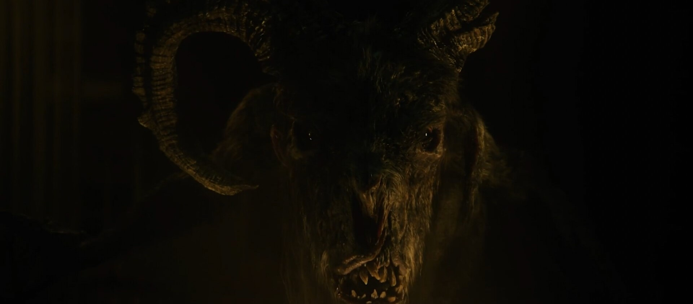
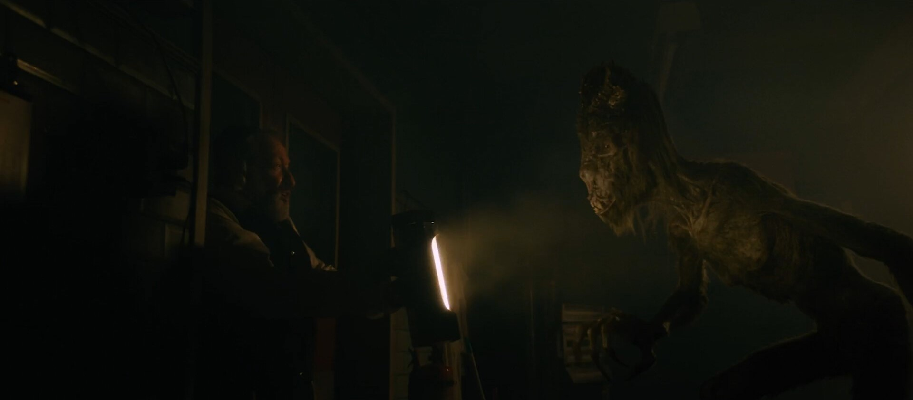
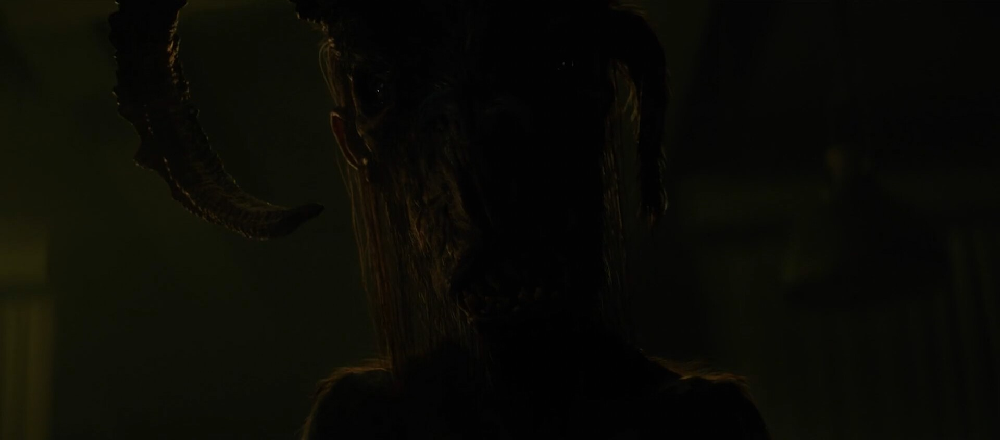
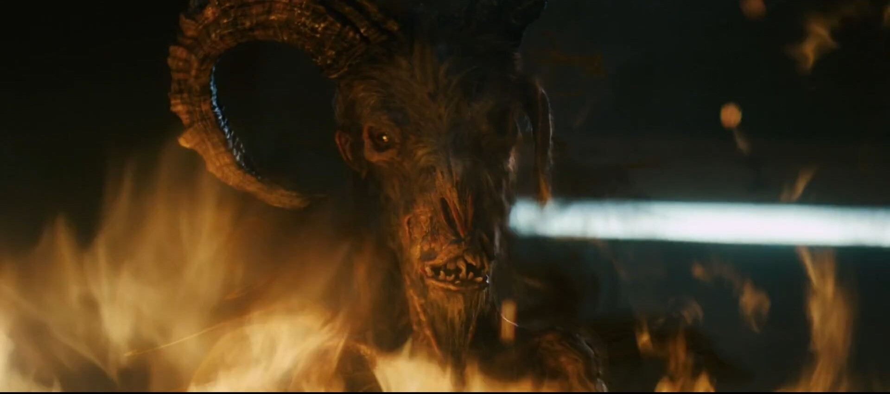
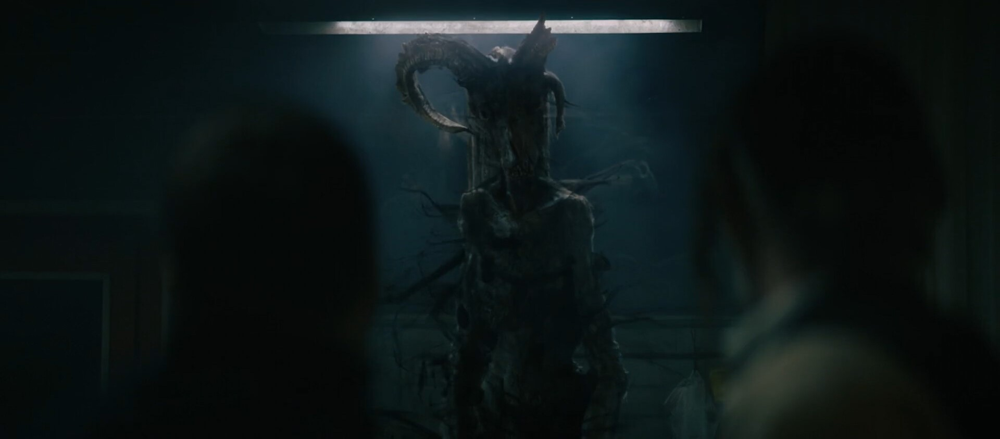

# The Offering (2023)

:image: screenshot-sh-flames.jpg
:date-created: 2023-06-23 20:33
:description: My first movie credit ! A classical horror movie with a sick humanoid goat monster.
:software: Katana,Arnold

My first movie credit ! A classical horror movie with a sick humanoid goat monster. 
I was working as a Lighting TD at WWFX UK for this project and was responsible for lighting on most of the shots with the creature.
A bit sad that the screenshots clip are so compressed, but you know dark films and video codec compression ...

As we were a pretty small team here was everyone at *WORLDWIDE FX UK* for this project:

- VFX Supervisor: RAN MANOLOV, MILEN PISKULIYSKI
- Senior Producer: MARIANO MELMAN CARRARA
- VFX Production Coordinator: BRECHJE HOOGERS
- 2D Supervisor: LEONARDO PAOLINI
- Art direction: RAN MANOLOV
- Modelling: LEANDRO BENIGNO, IAN NAVARRO GUTIERREZ
- Texturing: FAYE MANTZOURANI, MILEN PISKULIYSKI
- Lighting TD: KLEISI BEGAJ, LIAM COLLOD
- Matchmove & Tracking: VICTOR FARAG
- Paint & Roto: KIRTAN TAAK, MICHAEL CASAL
- Compositing: MARK MILLENA, KIRTAN TAAK, MICHAEL CASAL
- System Administrator: ASHLEY JAMES

.. url-preview:: https://www.imdb.com/title/tt13103732
    :title: The Offering (2022) - IMDb
    :image: movie-poster.jpg

    The Offering: Directed by Oliver Park. With Nick Blood, Emily Wiseman, Paul Kaye, Allan Corduner. A family struggling with loss find themselves at the mercy of an ancient demon trying to destroy them from the inside.
    

<section id="post-main" markdown="1">
<figure>
    <video controls width="100%" poster="breakdown.thumbnail.jpg">
      <source src="./breakdown.mp4" type="video/mp4" />
    </video>
    <figcaption>Official Breakdown by WorldWideFX UK</figcaption>
</figure>

<figure>
    
    <figcaption>One of the close-up shots</figcaption>
</figure>

!!! warning

    STRONG FLASHING LIGHT IN THE BELOW VIDEO

<figure>
    <video controls loop width="100%" poster="screenshot-sh-close.jpg">
      <source src="./seq-lamp.mp4" type="video/mp4" />
    </video>
    <figcaption>The first creature reveal shot</figcaption>
</figure>

<figure>
    
    <figcaption>The torchlight was a mesh light with a geo generated from matchmove</figcaption>
</figure>

<figure>
    <video autoplay loop controls width="100%">
      <source src="./seq-raise.mp4" type="video/mp4" />
    </video>
    <figcaption>Some pretty silouhette; my lighting was much brigther but the compositor did real good here.</figcaption>
</figure>

<figure>
    
    <figcaption>When she smile back at you 🥰</figcaption>
</figure>

<figure>
    <video autoplay loop controls width="100%">
      <source src="./seq-found-footage.mp4" type="video/mp4" />
    </video>
    <figcaption>I think this was the fastest lighting I did haha.</figcaption>
</figure>

<figure>
    <video autoplay loop controls width="100%">
      <source src="./seq-flames.mp4" type="video/mp4" />
    </video>
    <figcaption>Used lights with animated transform on this one to fake the flames movement. Lights were constrained to animated locators created in Maya with a noise expression (to get live preview).</figcaption>
</figure>

<figure>
    
    <figcaption>Through the fire and flames 🤘</figcaption>
</figure>

<figure>
    <video autoplay loop controls width="100%">
      <source src="./seq-neon.mp4" type="video/mp4" />
    </video>
</figure>

<figure>
    
</figure>

<figure>
    <video autoplay loop controls width="100%">
      <source src="./seq-wall.mp4" type="video/mp4" />
    </video>
    <figcaption>I remember this shot being much more tricky to get right; especially considering the wall interraction that required shadow catching.</figcaption>
</figure>

</section>

