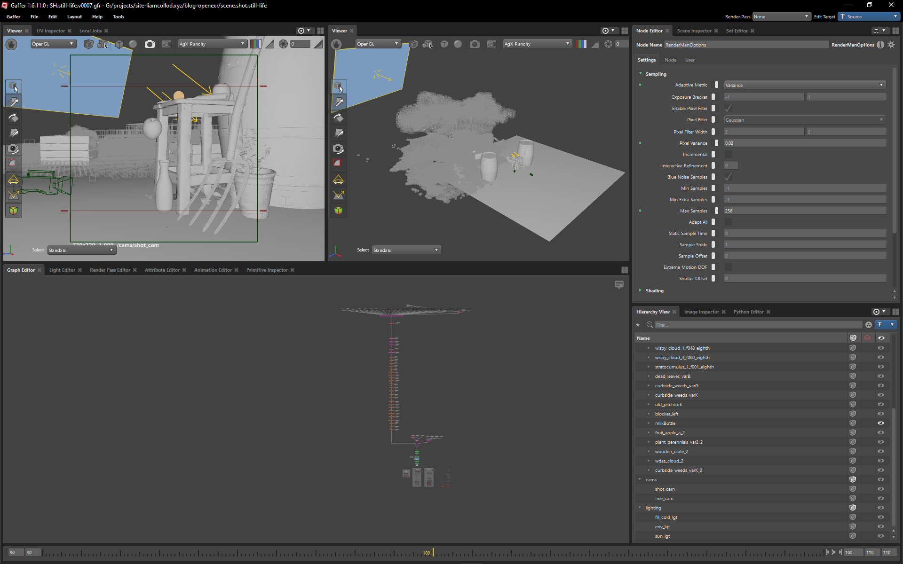

# The Cloud-Farm

:description: My first personal project since a long time.
:image: main.jpg
:date-created: 2026-01-30T00:08
:stylesheets: +cloud-farm.css
:software: Gaffer,RenderMan,Megascans,Nuke

My last personal 3d project was 5 years ago. Not anymore ! It all started from a
technical [blog post](../../../blog/openexr-2026) and the need to understand more
some concept with practice. Then find way to illustrate those concepts to others.
But where do you even start ? And even how ? All the software I learnt to use for my
job are behind paywalls. Blender ? It doesn't support the specific feature I need
to showcase. I found my answer in [Gaffer](https://www.gafferhq.org/)
which I had on my todo list since forever.
Paired with [RenderMan](https://renderman.pixar.com/) and there goes my software
workflow for 0€.
Still what do I want to show ? How do I even craft the assets ? I went with the most
time-saving solution: relying on Megascans. And the dumbest way possible, no concept,
no planning, just assembling pre-made asset together until I get something interesting.
My only constraints were that I had to have some volumetrics and a motion-blurred
object. And slowly, a concept appeared: up-in the sky they are harvesting clouds...
a cloud farm !

**Credits:**

- photogrametric assets: [Quixel Megascans](https://quixel.com/megascans/home/)
- clouds: [Samuel Krug](https://www.artstation.com/samk_9632); [Disney Animation](https://www.disneyanimation.com/resources/clouds/)
- milk bottle: [Harsh Agrawal](https://renderman.pixar.com/cookies-and-milk)

**Download:**

If you want to play with it, or use it for testing purposes you can download the source
render:

<a href="render.exr" download="cloud-farm.liamcollod.deep.exr">render.exr (8.7MB)</a>

It's a half-float deep exr with the usual RGBA channels and the 2 extra Z channels for
deep.

The above .exr file is licensed under the following terms:

You are free to use the file provided "as is" without warranty of any kind, as long as:

- you are an individual human being
- you are not any of a misogynist, racist, fascist, terf, queerphobe,
  bigot, antisemitic, islamophobe, genocide-denialer, history-negasionist piece of shit.
- you do not support any individual or entities matching the previous criterias.
- the .exr file is not used for the purpose of training or improving machine learning
  algorithms.
- you include this page url as a credit next to any work making use of the .exr file.

<section id="post-main">

<h2 id="breakdown"><a href="#breakdown">breakdown</a></h2>

<figure id="breakdown-progress">
  <video muted loop autoplay controls>
    <source src="breakdown.progress.mp4" type="video/mp4">
  </video>
  <figcaption>progress as seen through my <abbr title="Interactive Preview Render">IPR</abbr> window</figcaption>
</figure>
<figure>
  
  <figcaption>Screenshot of the scene in Gaffer; with a probably very non-optimized node-graph layout.</figcaption>
</figure>

</section>