# archives

:image: thumbnail.png
:date-created: 2018-01-01T00:00
:description: An archive of my old (cringe) cg work.
:software: Blender,Photoshop,Maya,Substance-Painter,QuixelDDO

Welcome to the archives, where I dumped anything that I considered too old or too
cringe :emoji:(neocat-nervous).

I started digital art with Blender around 2014 when I got my first personal computer.
Wild times, Blender was the only serious creative software I had. I was doing some
shitty graphic design on PowerPoint and shitty video editing on Windows Movie Maker.

It was around that time that I started to play my first online multiplayer videogame:
World Of Tanks. There was some very cringe fanart and post of me haunting the WoT french forums
(that I learned were now closed and wiped out ...).

Then around 2015 I got introduced by a friend to
the Call Of Duty "GFX" community which opened me to a whole new world of graphic-design.
It introduced me to piracy to get better software and gave me a community to build
motivation for projects. So most of my 3D work during those period was mixing 3D
logo/text with 2D elements rather than proper cg scene.

I then ended up joining other gaming communities around Rainbow Six Siege and PUBG.

During all those times my 3D skill were very primitive, so I mostly relied on people
extracting 3d models and textures from video-games.

<section id="post-main" markdown="1">

## 2014

Those are probably my first ever Blender animations. They were YouTube intros for someone with a magic-related channel.
I remember stitching the clips together in Windows Movie Maker.

    <figure>
        <video loop controls width="100%" poster="2014.intro.mv-wall.thumbnail.jpg">
          <source src="2014.intro.mv-wall.mp4" type="video/mp4" />
        </video>
    </figure>
    <figure>
        <video loop controls width="100%">
          <source src="2014.intro.mv-tunnel.mp4" type="video/mp4" />
        </video>
    </figure>

## 2015

    <figure>
        <video autoplay loop controls muted width="100%">
          <source src="2015.kirwa-intro.1.mp4" type="video/mp4" />
        </video>
        <figcaption>Somehow my only Blender goal was making shitty intros for YouTube channels.</figcaption>
    </figure>
    <figure>
        <video autoplay loop controls muted width="100%">
          <source src="2015.kirwa-intro.2.mp4" type="video/mp4" />
        </video>
        <figcaption>I think I also made the logo which is just a wolf photo with its background removed and a painting effect applied, all in PowerPoint.</figcaption>
    </figure>

    <figure>
        <video autoplay loop controls muted width="100%">
          <source src="2015.tank.mp4" type="video/mp4" />
        </video>
        <figcaption>Not me stealing game models to make shitty video, probably learnt to scatter shit in Blender that day and thought it would looks cool with a tank.</figcaption>
    </figure>
    <figure>
        <video autoplay loop controls muted width="100%">
          <source src="2015.tchoumi.mp4" type="video/mp4" />
        </video>
        <figcaption>Another WoT Youtuber intro yayyy. I doubt Movie Maker was able to make the effects at the end, so I assume I discovered some other crappy software since.</figcaption>
    </figure>

<figure markdown="1">
<video loop controls muted width="100%" preload="metadata">
  <source src="2015.blender-random-rec.mp4" type="video/mp4" />
</video>
<figcaption markdown="1">
OMFG WHAT IS THIS TIME CAPSULE; PEAK 2015 LIAM CONTENT. Yes I was a little obssessed with World Of Tanks, how'd you found out ?
Fucking Skype running in background and rocking Blender version 2.75 :emoji:(neocat-woozy)
</figcaption>
</figure>

## 2016

This is when the cringe levels get a bit lower, even if I'm still in my CoD GFX era.

<figure>
    <video loop controls muted width="100%" poster="2016.quixel-grenade.thumbnail.jpg">
      <source src="2016.quixel-grenade.mp4" type="video/mp4" />
    </video>
    <figcaption>
    This is my first 3d model I textured with a professional software (that I also paid): 
    <a href="https://web.archive.org/web/20150301032206/http://quixel.se/ddo">Quixel DDO</a>.
    It was a super slow plugin for Photoshop, but with really great material library.
    </figcaption>
</figure>

    <figure>
        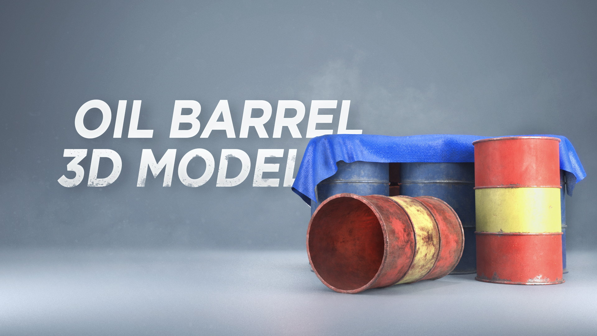
        <figcaption>One a few asset I fully made from scracth and that I tried to sell online.</figcaption>
    </figure>
    <figure>
        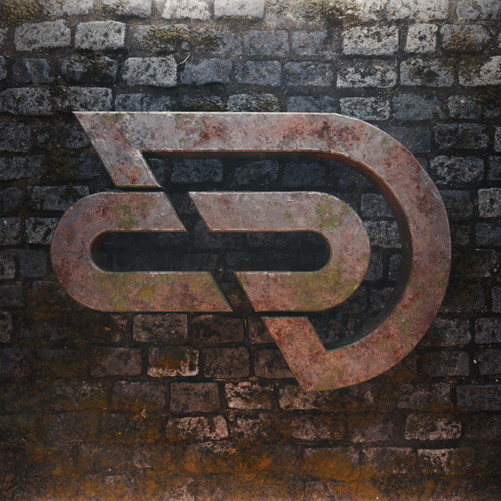
        <figcaption>A 3d logo for another CoD team. Ground texture was picked online, but I textured all the logo myself.</figcaption>
    </figure>

<figure>
    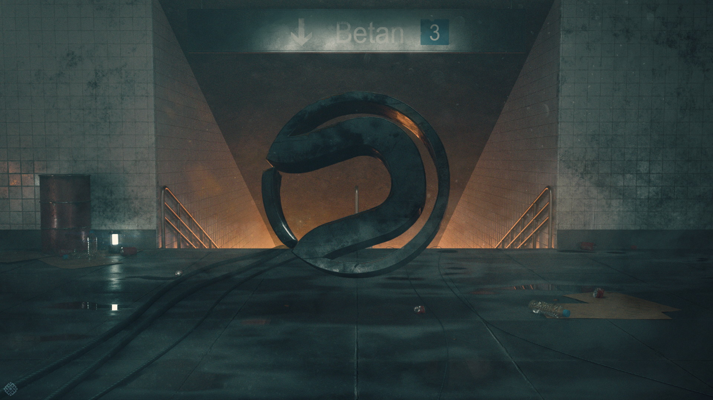
    <figcaption>A rare instance of a full 3d scene made for some CoD team player. 
    I think it was one of the firt times I used Substance Designer to create some textures.
    </figcaption>
</figure>

    <figure>
        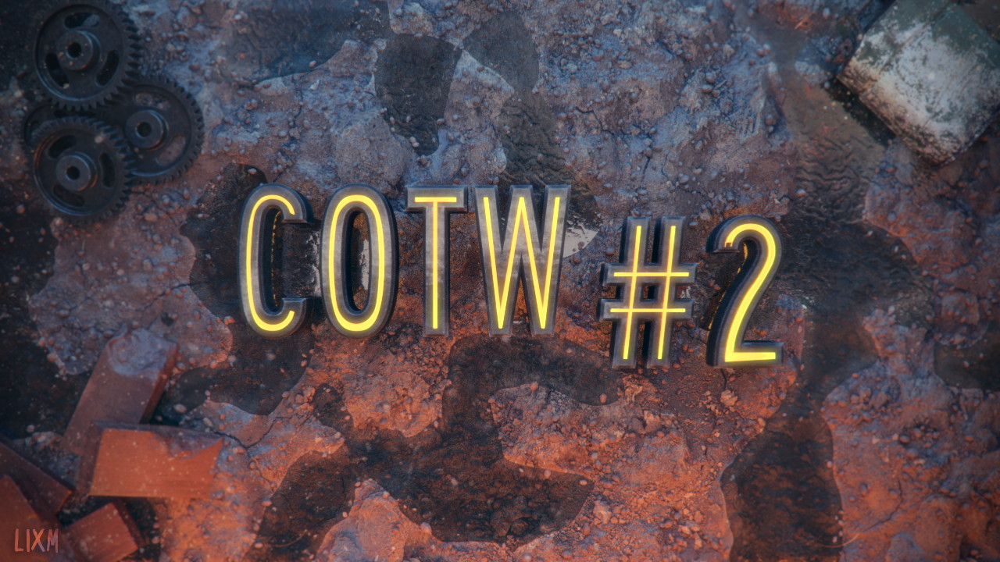
        <figcaption>A fully 3d YouTube thumbnail.</figcaption>
    </figure>
    <figure>
        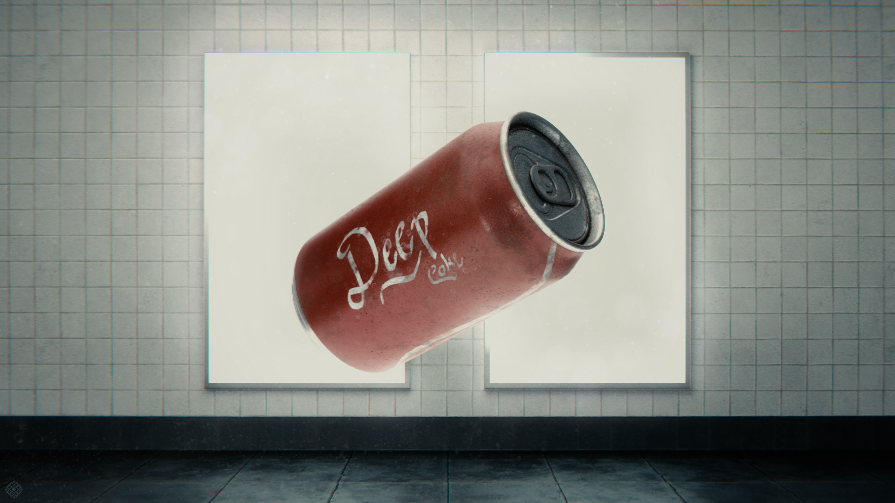
        <figcaption>A random scene I made for a friend.</figcaption>
    </figure>

    <figure>
        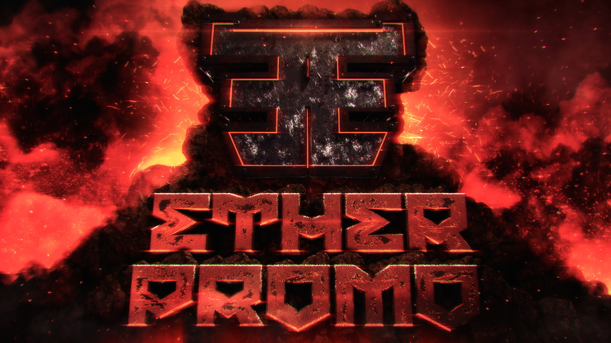
        <figcaption>A YouTube thumbnail for a CoD channel.</figcaption>
    </figure>
    <figure>
        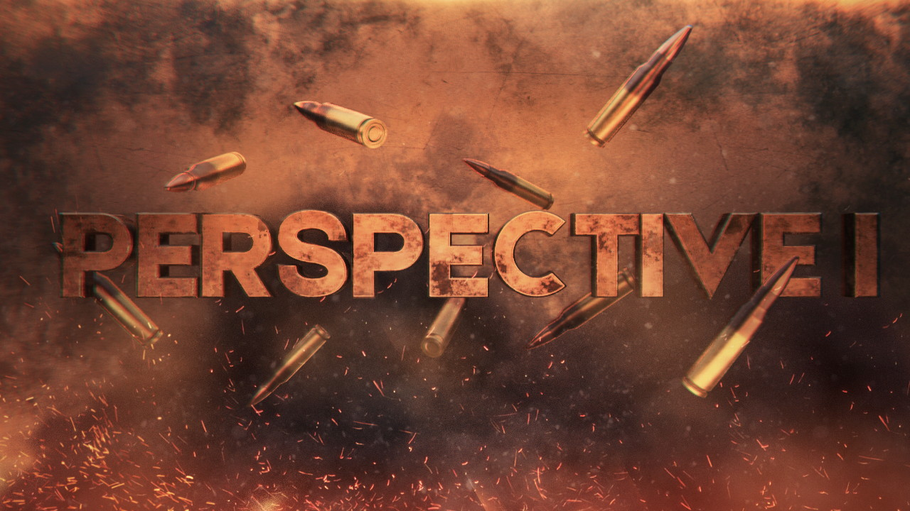
        <figcaption>Another CoD YouTube video thumbnail.</figcaption>
    </figure>

<figure>
    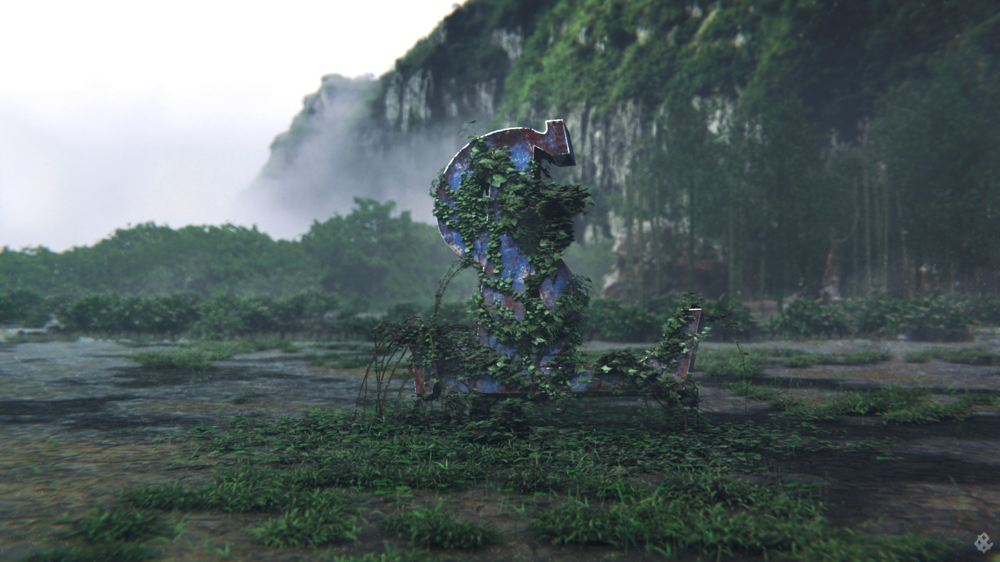
    <figcaption>My first outside environment ! It was a wallpaper for a CoD team. Ivy was generated with <a href="https://graphics.uni-konstanz.de/~luft/ivy_generator/">Ivy Generator</a></figcaption>
</figure>
<figure>
    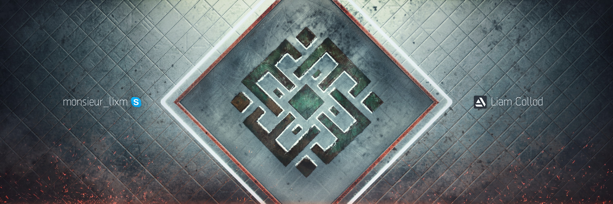
    <figcaption>A banner for myself, yes when Skype was my main communication platform 💀</figcaption>
</figure>

## 2017

<figure>
    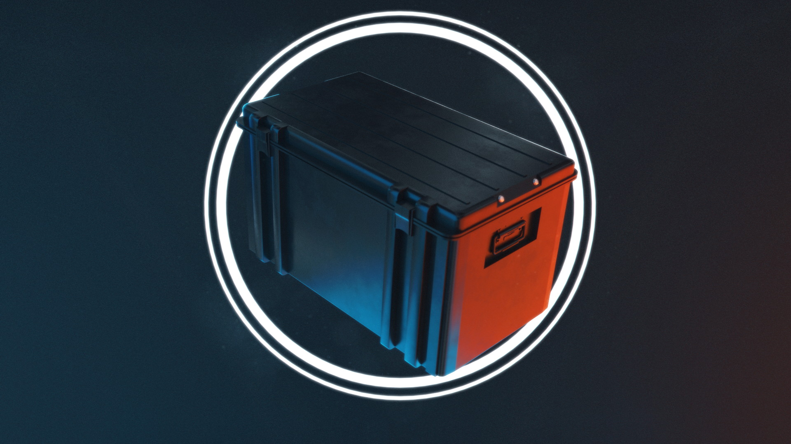
    <figcaption>A CSGO themed wallpaper that was probably a one-day thingy.</figcaption>
</figure>

<figure>
    
    <figcaption>This fucker was my final year high-school project; some kind of magnetic mechanism to shoot the balls in pinball machines.</figcaption>
</figure>

    <figure>
        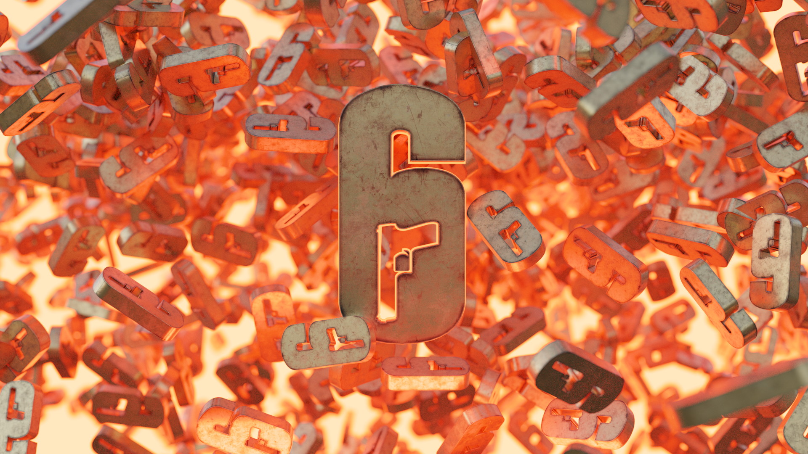
        <figcaption>A Rainbow Six Siege themed wallpaper. Logo texturing was made in Quixel DDO.</figcaption>
    </figure>
    <figure>
        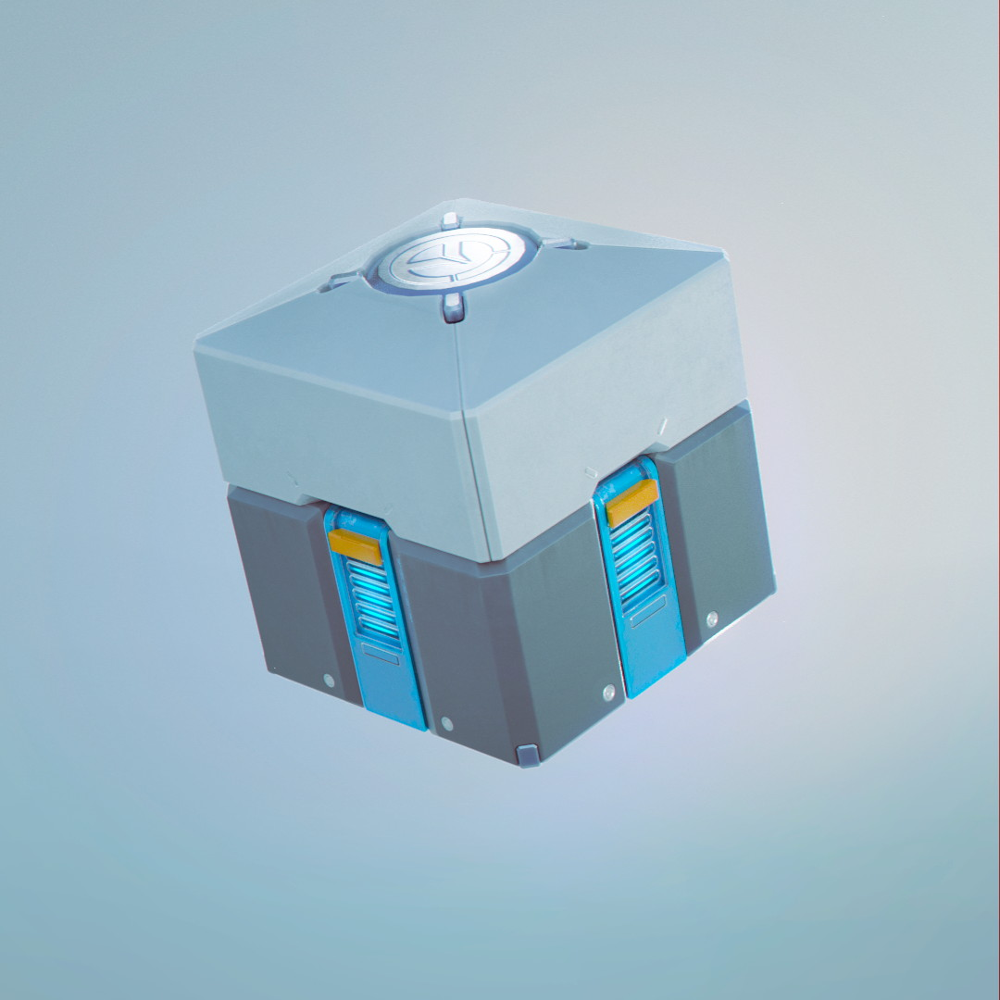
        <figcaption>One of my first school 3d assignment where I learned to use Maya.</figcaption>
    </figure>

    <figure>
        <video autoplay loop controls muted width="100%">
          <source src="2017.barrel.mp4" type="video/mp4" />
        </video>
        <figcaption>Another boring and simple asset because I didn't like modeling and preferred texturing.</figcaption>
    </figure>
    <figure>
        <video autoplay loop controls muted width="100%">
          <source src="2017.spooky-ball.mp4" type="video/mp4" />
        </video>
        <figcaption>A "spooky" themed render for Halloween where I did some basic simulation effects in Blender.</figcaption>
    </figure>

## 2018

    <figure>
        <video autoplay loop controls width="100%">
          <source src="2018.fx-fire.mp4" type="video/mp4" />
        </video>
        <figcaption>
        This was a school exercice where we had to create a fire FX with Maya native tools.
        I quickly throwed some Megascans assets around to make a quick environment.
        </figcaption>
    </figure>
    <figure>
        <video autoplay loop controls width="100%">
          <source src="2018.arrow-logo.mp4" type="video/mp4" />
        </video>
        <figcaption>An animated logo for someone.</figcaption>
    </figure>

    <figure>
        <video autoplay loop controls width="100%">
          <source src="2018.pubgfr-logo.mp4" type="video/mp4" />
        </video>
        <figcaption>A simple animated logo for a Discord server.</figcaption>
    </figure>
    <figure>
        <video autoplay loop controls width="100%">
          <source src="2018.sdb10k.mp4" type="video/mp4" />
        </video>
        <figcaption>Another simple motion-design for a Discord server.</figcaption>
    </figure>

    <figure>
        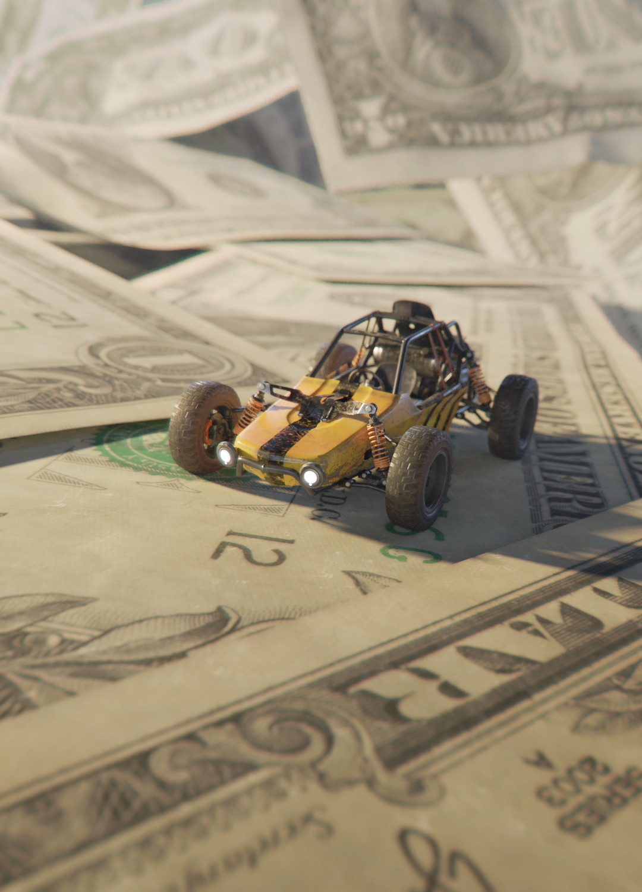
        <figcaption>What idea do I even had in mind here ? If you don't recognize it, the vehicule is the buggy from the PUBG videogame.</figcaption>
    </figure>
    <figure>
        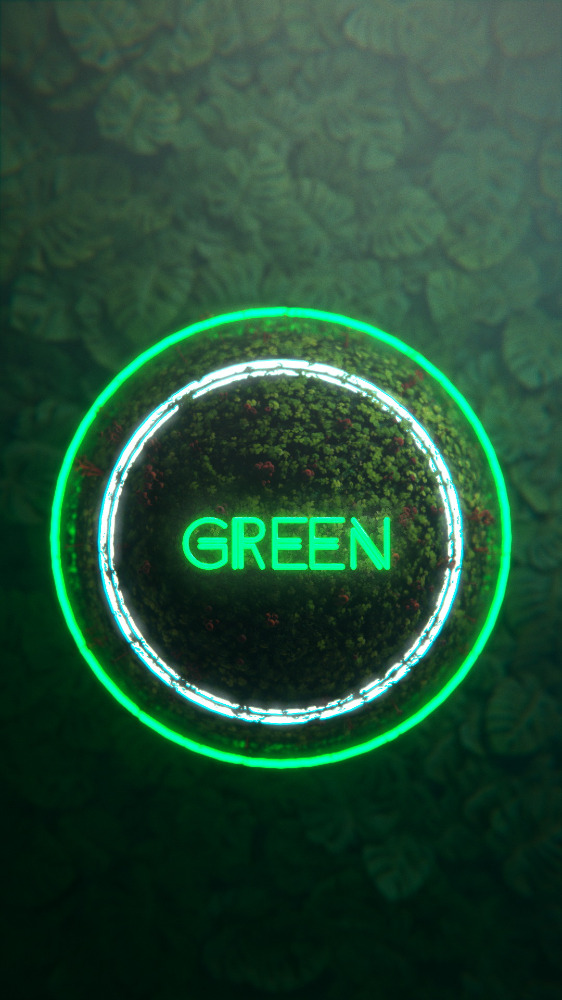
        <figcaption>Random abstract shitty render.</figcaption>
    </figure>

## 2019

    <figure>
        <video autoplay loop controls width="100%">
          <source src="2019.flavqnc-logo.mp4" type="video/mp4" />
        </video>
        <figcaption>An animated logo commission for someone.</figcaption>
    </figure>
    <figure>
        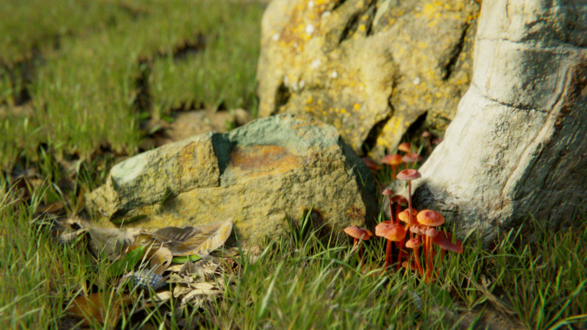
        <figcaption>A small nature scene I created as part of Blender EEVEE and Megascans tutorial.</figcaption>
    </figure>

</section>
